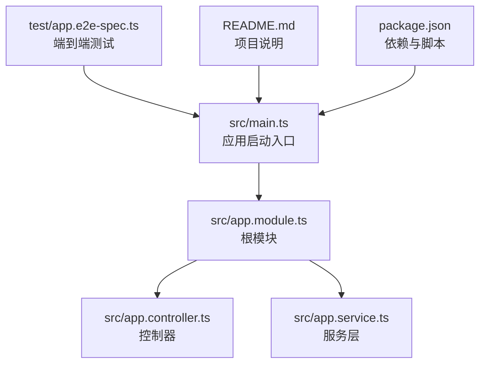
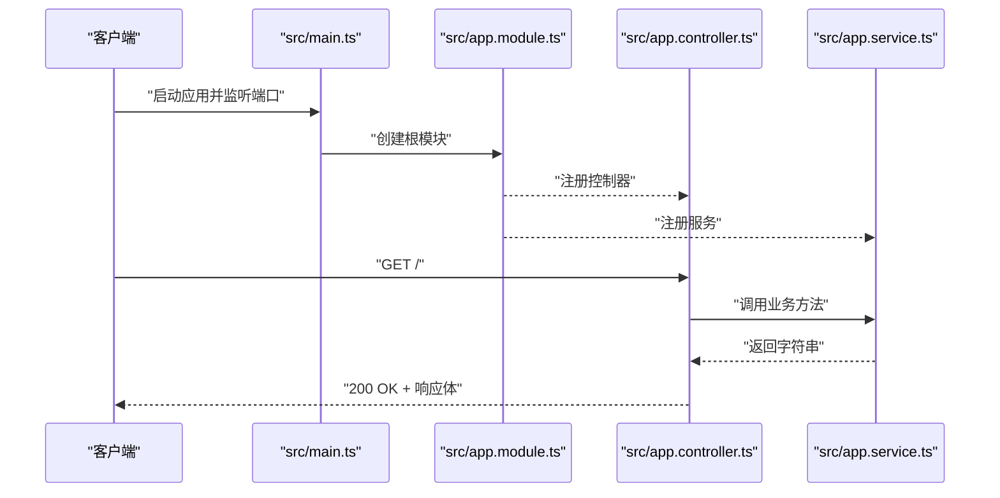
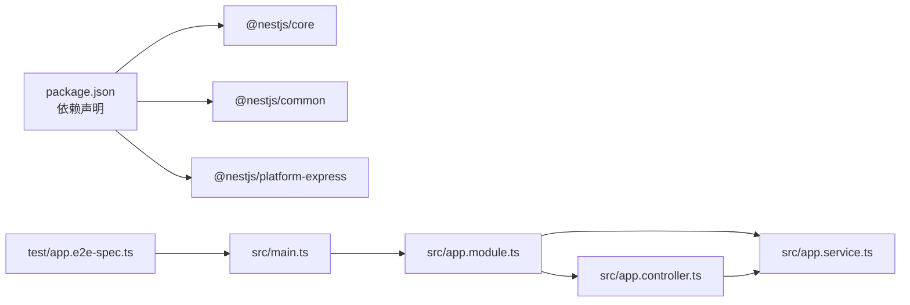

# API参考

<cite>
**本文引用的文件**
- [src/app.controller.ts](file://src/app.controller.ts)
- [src/app.service.ts](file://src/app.service.ts)
- [src/app.module.ts](file://src/app.module.ts)
- [src/main.ts](file://src/main.ts)
- [test/app.e2e-spec.ts](file://test/app.e2e-spec.ts)
- [README.md](file://README.md)
- [package.json](file://package.json)
</cite>

## 目录
1. [简介](#简介)
2. [项目结构](#项目结构)
3. [核心组件](#核心组件)
4. [架构总览](#架构总览)
5. [详细组件分析](#详细组件分析)
6. [依赖分析](#依赖分析)
7. [性能考虑](#性能考虑)
8. [故障排查指南](#故障排查指南)
9. [结论](#结论)
10. [附录](#附录)

## 简介
本文件为 nest-dome 项目的 RESTful API 文档，聚焦于唯一的 GET / 端点。该接口用于返回纯文本“Hello World!”，状态码为 200，无需任何请求参数。本文将从架构与实现角度说明该端点在 AppController 中的实现方式，包括 @Get() 装饰器的使用、处理方法的定义与调用链路，并提供 curl 与 JavaScript fetch 的调用示例。同时，本文强调该接口作为基础模板的作用，指导开发者如何基于此模式扩展更多 API 端点。

## 项目结构
该项目采用 NestJS 标准目录组织，核心文件如下：
- 入口文件：src/main.ts
- 根模块：src/app.module.ts
- 控制器：src/app.controller.ts
- 服务层：src/app.service.ts
- 测试用例：test/app.e2e-spec.ts
- 说明文档：README.md
- 依赖与脚本：package.json

下图展示项目文件之间的关系与职责分工：

图表来源
- [src/main.ts](file://src/main.ts#L1-L24)
- [src/app.module.ts](file://src/app.module.ts#L1-L25)
- [src/app.controller.ts](file://src/app.controller.ts#L1-L42)
- [src/app.service.ts](file://src/app.service.ts#L1-L37)
- [test/app.e2e-spec.ts](file://test/app.e2e-spec.ts#L1-L26)
- [README.md](file://README.md#L1-L99)
- [package.json](file://package.json#L1-L73)

章节来源
- [src/main.ts](file://src/main.ts#L1-L24)
- [src/app.module.ts](file://src/app.module.ts#L1-L25)
- [src/app.controller.ts](file://src/app.controller.ts#L1-L42)
- [src/app.service.ts](file://src/app.service.ts#L1-L37)
- [test/app.e2e-spec.ts](file://test/app.e2e-spec.ts#L1-L26)
- [README.md](file://README.md#L1-L99)
- [package.json](file://package.json#L1-L73)

## 核心组件
- 应用启动入口：负责创建 Nest 应用实例并监听端口，默认端口为 3000（可通过环境变量覆盖）。
- 根模块：声明控制器与服务，作为应用的装配中心。
- 控制器：通过 @Controller() 装饰器定义根路径路由前缀，使用 @Get() 装饰器将方法映射到 GET /。
- 服务层：封装业务逻辑，当前返回“Hello World!”。
- 端到端测试：验证 GET / 返回 200 且响应体为“Hello World!”。

章节来源
- [src/main.ts](file://src/main.ts#L1-L24)
- [src/app.module.ts](file://src/app.module.ts#L1-L25)
- [src/app.controller.ts](file://src/app.controller.ts#L1-L42)
- [src/app.service.ts](file://src/app.service.ts#L1-L37)
- [test/app.e2e-spec.ts](file://test/app.e2e-spec.ts#L1-L26)

## 架构总览
下图展示了从客户端发起请求到返回响应的完整流程，以及各组件间的依赖关系：

图表来源
- [src/main.ts](file://src/main.ts#L1-L24)
- [src/app.module.ts](file://src/app.module.ts#L1-L25)
- [src/app.controller.ts](file://src/app.controller.ts#L1-L42)
- [src/app.service.ts](file://src/app.service.ts#L1-L37)

## 详细组件分析

### GET / 端点规范
- 方法：GET
- 路径：/
- 请求参数：无
- 响应体：纯文本“Hello World!”
- 状态码：200

该接口作为基础模板，演示了控制器与服务层的协作模式，便于开发者在此基础上扩展更多端点。

章节来源
- [test/app.e2e-spec.ts](file://test/app.e2e-spec.ts#L1-L26)

### 控制器实现要点（AppController）
- @Controller() 装饰器未指定前缀时，路由前缀为根路径“/”。
- @Get() 装饰器将方法映射到 GET /。
- 处理方法通过依赖注入获取服务实例，并将业务委托给服务层。
- 控制器仅负责路由分发与简单编排，不直接处理复杂业务逻辑。

章节来源
- [src/app.controller.ts](file://src/app.controller.ts#L1-L42)

### 服务层实现要点（AppService）
- @Injectable() 装饰器使服务可被容器管理与注入。
- 当前方法返回固定字符串“Hello World!”，可替换为任意业务逻辑（如查询数据库、调用外部 API 等）。

章节来源
- [src/app.service.ts](file://src/app.service.ts#L1-L37)

### 启动与模块装配（AppModule、main.ts）
- AppModule 声明控制器与服务，完成依赖注入装配。
- main.ts 使用 NestFactory 创建应用实例并监听端口；默认端口 3000，可通过环境变量覆盖。

章节来源
- [src/app.module.ts](file://src/app.module.ts#L1-L25)
- [src/main.ts](file://src/main.ts#L1-L24)
- [package.json](file://package.json#L1-L73)

### 端到端测试验证
- 测试用例通过 supertest 发起 GET / 请求，断言状态码为 200 且响应体为“Hello World!”。

章节来源
- [test/app.e2e-spec.ts](file://test/app.e2e-spec.ts#L1-L26)

### 调用示例

- curl 示例
  - 命令：curl http://localhost:3000/
  - 预期输出：200 状态码与纯文本“Hello World!”

- JavaScript fetch 示例
  - 代码片段路径：[fetch 调用示例](file://test/app.e2e-spec.ts#L19-L23)
  - 说明：在浏览器或 Node 环境中使用 fetch 访问 http://localhost:3000/，断言响应状态与文本内容。

章节来源
- [test/app.e2e-spec.ts](file://test/app.e2e-spec.ts#L19-L23)

### 基于该模式扩展更多端点
- 新增控制器：使用 @Controller('前缀') 定义新的路由前缀；在类中使用 @Get('子路径') 或 @Post('子路径') 等装饰器映射不同 HTTP 方法。
- 依赖注入：在构造函数中注入服务，将业务逻辑委托给服务层。
- 参数与响应：根据需要添加 DTO、管道与拦截器，统一处理请求参数与响应格式。
- 测试：为新端点编写单元测试与端到端测试，确保行为符合预期。

章节来源
- [src/app.controller.ts](file://src/app.controller.ts#L1-L42)
- [src/app.module.ts](file://src/app.module.ts#L1-L25)
- [src/app.service.ts](file://src/app.service.ts#L1-L37)
- [test/app.e2e-spec.ts](file://test/app.e2e-spec.ts#L1-L26)

## 依赖分析
- 外部依赖：@nestjs/common、@nestjs/core、@nestjs/platform-express 等。
- 内部依赖：main.ts 依赖 AppModule；AppModule 注册 AppController 与 AppService；AppController 依赖 AppService。
- 测试依赖：supertest 用于端到端测试。

图表来源
- [package.json](file://package.json#L1-L73)
- [src/main.ts](file://src/main.ts#L1-L24)
- [src/app.module.ts](file://src/app.module.ts#L1-L25)
- [src/app.controller.ts](file://src/app.controller.ts#L1-L42)
- [src/app.service.ts](file://src/app.service.ts#L1-L37)
- [test/app.e2e-spec.ts](file://test/app.e2e-spec.ts#L1-L26)

章节来源
- [package.json](file://package.json#L1-L73)
- [src/main.ts](file://src/main.ts#L1-L24)
- [src/app.module.ts](file://src/app.module.ts#L1-L25)
- [src/app.controller.ts](file://src/app.controller.ts#L1-L42)
- [src/app.service.ts](file://src/app.service.ts#L1-L37)
- [test/app.e2e-spec.ts](file://test/app.e2e-spec.ts#L1-L26)

## 性能考虑
- 默认开发端口 3000 已满足本地开发需求；生产部署时建议通过反向代理与负载均衡优化并发与稳定性。
- 控制器保持薄层设计，将业务逻辑下沉至服务层，有利于缓存与重用。
- 对于高频端点，可在服务层引入缓存策略或连接池，减少重复计算与 I/O 开销。

## 故障排查指南
- 应用未启动或端口占用
  - 确认已执行启动命令并监听端口；若端口冲突，可在环境变量中设置端口后再启动。
  - 参考路径：[启动与监听端口](file://src/main.ts#L1-L24)、[脚本与依赖](file://package.json#L1-L73)

- 端点返回非 200 或响应体异常
  - 使用端到端测试验证：GET / 应返回 200 且响应体为“Hello World!”。
  - 参考路径：[端到端测试](file://test/app.e2e-spec.ts#L1-L26)

- 控制器或服务未生效
  - 确认 AppModule 已注册 AppController 与 AppService。
  - 参考路径：[模块装配](file://src/app.module.ts#L1-L25)

章节来源
- [src/main.ts](file://src/main.ts#L1-L24)
- [package.json](file://package.json#L1-L73)
- [test/app.e2e-spec.ts](file://test/app.e2e-spec.ts#L1-L26)
- [src/app.module.ts](file://src/app.module.ts#L1-L25)

## 结论
GET / 端点作为 nest-dome 的基础模板，清晰地展示了 NestJS 控制器与服务层的协作方式：控制器负责路由分发，服务层承载业务逻辑。该模式易于扩展，开发者可在此基础上快速新增更多端点，遵循依赖注入与模块化原则，配合测试保障质量。

## 附录
- 快速启动与运行
  - 参考路径：[安装与运行说明](file://README.md#L1-L99)、[脚本定义](file://package.json#L1-L73)

章节来源
- [README.md](file://README.md#L1-L99)
- [package.json](file://package.json#L1-L73)