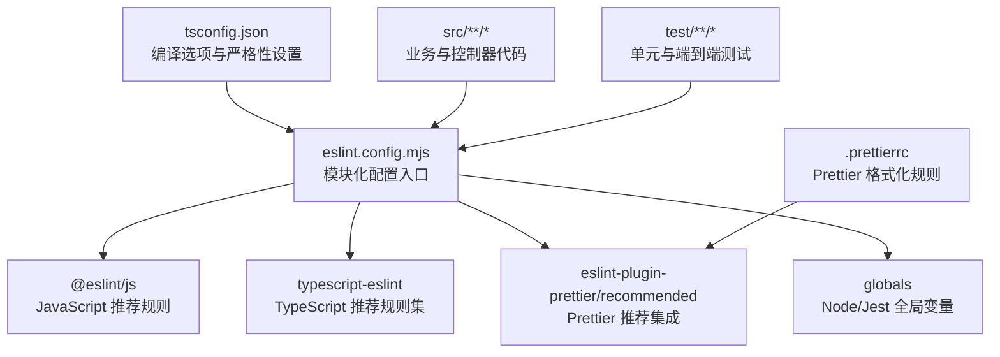
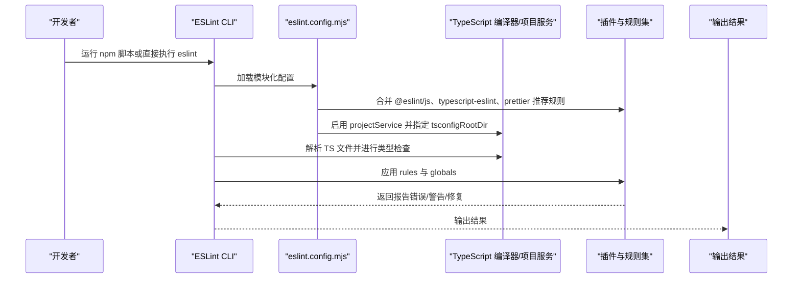
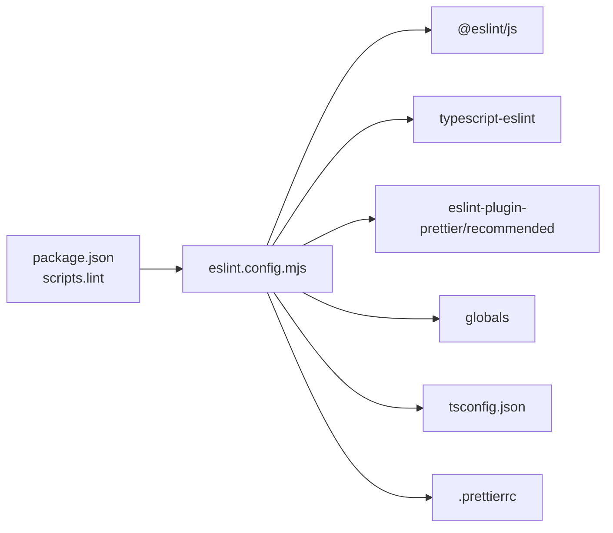

# ESLint 静态代码检查配置

<cite>
**本文引用的文件**
- [eslint.config.mjs](file://eslint.config.mjs)
- [package.json](file://package.json)
- [tsconfig.json](file://tsconfig.json)
- [.prettierrc](file://.prettierrc)
- [src/app.controller.spec.ts](file://src/app.controller.spec.ts)
- [src/app.controller.ts](file://src/app.controller.ts)
- [test/app.e2e-spec.ts](file://test/app.e2e-spec.ts)
</cite>

## 目录
1. [简介](#简介)
2. [项目结构](#项目结构)
3. [核心组件](#核心组件)
4. [架构总览](#架构总览)
5. [详细组件分析](#详细组件分析)
6. [依赖关系分析](#依赖关系分析)
7. [性能考量](#性能考量)
8. [故障排查指南](#故障排查指南)
9. [结论](#结论)
10. [附录](#附录)

## 简介
本文件面向使用 NestJS 的 TypeScript 项目，系统性解析 eslint.config.mjs 模块化 ESLint 配置的结构与执行逻辑。重点说明：
- 如何通过 @eslint/js 与 typescript-eslint 组合官方推荐规则集；
- globals 插件如何为 Node.js 与 Jest 环境预定义全局变量（如 describe、it）；
- languageOptions 中 projectService 与 tsconfigRootDir 的作用，确保类型感知检查正确运行；
- rules 部分中 @typescript-eslint/no-explicit-any 关闭的原因、no-floating-promises 警告的作用、prettier/prettier 规则如何将 Prettier 集成到 ESLint；
- export default tseslint.config() 的模块化配置方式优势；
- 常见错误示例与修复建议，帮助开发者理解 linting 规则在实际场景中的应用。

## 项目结构
该仓库采用模块化 ESLint 配置，核心配置位于根目录的 eslint.config.mjs；TypeScript 编译配置位于 tsconfig.json；格式化工具 Prettier 的规则位于 .prettierrc；测试文件位于 src 与 test 目录，便于验证 Jest 全局变量可用性与 e2e 测试流程。

图表来源
- [eslint.config.mjs](file://eslint.config.mjs#L1-L36)
- [package.json](file://package.json#L30-L54)
- [tsconfig.json](file://tsconfig.json#L1-L26)
- [.prettierrc](file://.prettierrc#L1-L5)

章节来源
- [eslint.config.mjs](file://eslint.config.mjs#L1-L36)
- [package.json](file://package.json#L1-L73)
- [tsconfig.json](file://tsconfig.json#L1-L26)
- [.prettierrc](file://.prettierrc#L1-L5)

## 核心组件
- 模块化配置入口：export default tseslint.config(...) 将多个配置对象合并为最终配置，支持按需启用/禁用规则与语言选项。
- 官方推荐规则集：
  - @eslint/js 提供 JavaScript 基础推荐规则；
  - typescript-eslint 提供 TypeScript 类型感知推荐规则集；
  - eslint-plugin-prettier/recommended 将 Prettier 作为 ESLint 规则运行，避免格式冲突。
- 全局变量注入：globals 插件为 Node.js 与 Jest 环境预定义 describe、it、beforeEach 等全局变量，避免未定义变量报错。
- 语言选项：languageOptions.sourceType、parserOptions.projectService 与 tsconfigRootDir 确保 ESLint 使用 TS 项目服务进行类型检查与路径解析。
- 规则集合：rules 中包含 no-explicit-any 关闭策略、no-floating-promises 警告策略、prettier/prettier 集成策略。

章节来源
- [eslint.config.mjs](file://eslint.config.mjs#L1-L36)
- [package.json](file://package.json#L30-L54)

## 架构总览
下图展示 ESLint 在本项目中的工作流：从命令行触发 lint，到加载配置、解析 TypeScript 文件、应用规则与 Prettier 集成，再到输出结果。

图表来源
- [eslint.config.mjs](file://eslint.config.mjs#L1-L36)
- [package.json](file://package.json#L8-L21)

## 详细组件分析

### 模块化配置与规则集组合
- 使用 tseslint.config(...) 将多个配置对象合并，便于分层管理忽略项、推荐规则、语言选项与具体规则。
- 通过引入 @eslint/js 与 typescript-eslint 的推荐规则集，实现 JS/TS 双向覆盖，提升开发体验与一致性。
- 引入 eslint-plugin-prettier/recommended，使 Prettier 以 ESLint 规则形式参与检查，避免格式冲突。

章节来源
- [eslint.config.mjs](file://eslint.config.mjs#L1-L36)
- [package.json](file://package.json#L30-L54)

### globals 插件与环境全局变量
- 在 languageOptions.globals 中同时引入 globals.node 与 globals.jest，确保 Node.js 与 Jest 测试环境下的全局变量（如 describe、it、beforeEach 等）被识别，避免“未定义变量”类错误。
- 适用于 src 下的业务代码与 test 下的单元/端到端测试文件。

章节来源
- [eslint.config.mjs](file://eslint.config.mjs#L15-L20)
- [src/app.controller.spec.ts](file://src/app.controller.spec.ts#L1-L23)
- [test/app.e2e-spec.ts](file://test/app.e2e-spec.ts#L1-L26)

### languageOptions 与类型感知检查
- sourceType 设为 commonjs，适配 Node.js 环境与 ES 模块导入语法。
- parserOptions.projectService 设为 true，启用 TS 项目服务，使 ESLint 能够基于 tsconfig 进行类型检查与路径解析。
- parserOptions.tsconfigRootDir 指向 import.meta.dirname，确保 ESLint 正确定位 tsconfig.json 所在目录，避免类型检查路径错误。

章节来源
- [eslint.config.mjs](file://eslint.config.mjs#L15-L25)
- [tsconfig.json](file://tsconfig.json#L1-L26)

### rules 部分详解
- @typescript-eslint/no-explicit-any 关闭（off）：在大型项目中允许必要的 any 使用以提升灵活性，但需配合其他规则与审查流程控制风险。
- @typescript-eslint/no-floating-promises 警告（warn）：阻止未处理的 Promise，避免静默失败；建议在 CI 中将其升级为错误以强制修复。
- @typescript-eslint/no-unsafe-argument 警告（warn）：提示潜在的不安全参数传递，配合类型检查减少运行时风险。
- prettier/prettier：将 Prettier 集成到 ESLint，统一格式化风格；endOfLine: auto 自动适配平台换行符。

章节来源
- [eslint.config.mjs](file://eslint.config.mjs#L27-L34)
- [.prettierrc](file://.prettierrc#L1-L5)

### Prettier 集成与格式化策略
- 通过 eslint-plugin-prettier/recommended 将 Prettier 作为 ESLint 规则运行，避免手动格式化与 ESLint 规则冲突。
- .prettierrc 中的 singleQuote 与 trailingComma 等规则与 ESLint 集成后自动生效，保证团队一致的代码风格。

章节来源
- [eslint.config.mjs](file://eslint.config.mjs#L1-L36)
- [.prettierrc](file://.prettierrc#L1-L5)

### 模块化配置的优势
- 结构清晰：将忽略项、推荐规则、语言选项与具体规则拆分为多个配置对象，便于维护与扩展。
- 可组合性强：可按需启用/禁用规则集，灵活适配不同项目阶段与团队规范。
- 易于升级：通过包管理器升级 @eslint/js、typescript-eslint、eslint-plugin-prettier 等依赖，无需大幅修改配置结构。

章节来源
- [eslint.config.mjs](file://eslint.config.mjs#L1-L36)
- [package.json](file://package.json#L30-L54)

## 依赖关系分析
- eslint.config.mjs 依赖：
  - @eslint/js：提供 JavaScript 推荐规则；
  - typescript-eslint：提供 TypeScript 推荐规则集与类型感知能力；
  - eslint-plugin-prettier/recommended：将 Prettier 集成到 ESLint；
  - globals：提供 Node.js 与 Jest 环境的全局变量声明；
  - tsconfig.json：为 ESLint 的 TS 项目服务提供编译选项与严格性设置。
- package.json scripts 中的 lint 脚本调用 ESLint 对 src、apps、libs、test 下的 TypeScript 文件进行检查，并支持自动修复。

图表来源
- [package.json](file://package.json#L8-L21)
- [eslint.config.mjs](file://eslint.config.mjs#L1-L36)
- [tsconfig.json](file://tsconfig.json#L1-L26)
- [.prettierrc](file://.prettierrc#L1-L5)

章节来源
- [package.json](file://package.json#L1-L73)
- [eslint.config.mjs](file://eslint.config.mjs#L1-L36)

## 性能考量
- 启用 projectService 会增加启动时的初始化成本，但在大型项目中能显著提升类型检查准确性与稳定性。
- 建议在本地开发时保持 projectService 开启，在 CI 中对 no-floating-promises 升级为错误，以尽早发现潜在问题。
- 将 Prettier 作为 ESLint 规则运行会带来额外开销，但收益是消除格式冲突与统一风格，通常值得权衡。

## 故障排查指南
- 未识别的 Jest 全局变量（如 describe、it）：
  - 确认 eslint.config.mjs 中已引入 globals.jest；
  - 确认测试文件位于 test 目录且被 ESLint 扫描。
  - 参考：[eslint.config.mjs](file://eslint.config.mjs#L15-L20)，[src/app.controller.spec.ts](file://src/app.controller.spec.ts#L1-L23)，[test/app.e2e-spec.ts](file://test/app.e2e-spec.ts#L1-L26)
- 未识别的 Node.js 全局变量（如 process、global）：
  - 确认 eslint.config.mjs 中已引入 globals.node；
  - 确认 tsconfig.json 的模块与解析策略与 Node.js 环境匹配。
  - 参考：[eslint.config.mjs](file://eslint.config.mjs#L15-L20)，[tsconfig.json](file://tsconfig.json#L1-L26)
- 类型检查失败或路径解析错误：
  - 确认 parserOptions.projectService 为 true；
  - 确认 parserOptions.tsconfigRootDir 指向正确的目录；
  - 确认 tsconfig.json 存在且包含必要的编译选项。
  - 参考：[eslint.config.mjs](file://eslint.config.mjs#L21-L25)，[tsconfig.json](file://tsconfig.json#L1-L26)
- no-floating-promises 警告：
  - 在需要异步操作的地方显式处理 Promise（如 await 或 .catch）；
  - 在 CI 中将该规则升级为错误，避免静默失败。
  - 参考：[eslint.config.mjs](file://eslint.config.mjs#L27-L34)
- Prettier 格式化冲突：
  - 确认已安装 eslint-config-prettier 与 eslint-plugin-prettier；
  - 确认 .prettierrc 规则与 ESLint 集成正常。
  - 参考：[package.json](file://package.json#L30-L54)，[eslint.config.mjs](file://eslint.config.mjs#L1-L36)，[.prettierrc](file://.prettierrc#L1-L5)

## 结论
本配置通过模块化方式整合 @eslint/js、typescript-eslint 与 Prettier 推荐规则集，结合 globals 插件为 Node.js 与 Jest 环境提供全局变量支持，并通过 projectService 与 tsconfigRootDir 确保类型感知检查的准确性。rules 部分在灵活性与安全性之间取得平衡，适合中大型 NestJS 项目长期演进。建议在 CI 中强化规则级别，确保代码质量与一致性。

## 附录
- 常见错误示例与修复思路（不展示具体代码，仅说明场景与修复方向）：
  - 使用 any 导致类型不明确：在必要处保留 any，但尽量缩小范围并在上层补充类型断言或重构；
  - 忽略 Promise 返回值：在调用异步函数时使用 await 或显式 .catch 处理错误；
  - 未处理的 Jest 测试全局变量：确认 eslint.config.mjs 中已引入 globals.jest，或将测试文件放入受支持的目录；
  - Prettier 与 ESLint 冲突：确保 eslint-plugin-prettier/recommended 已正确集成，且 .prettierrc 规则与 ESLint 规则一致。