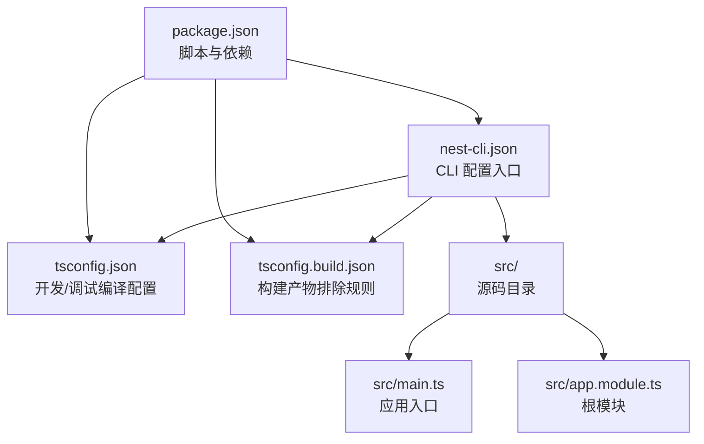
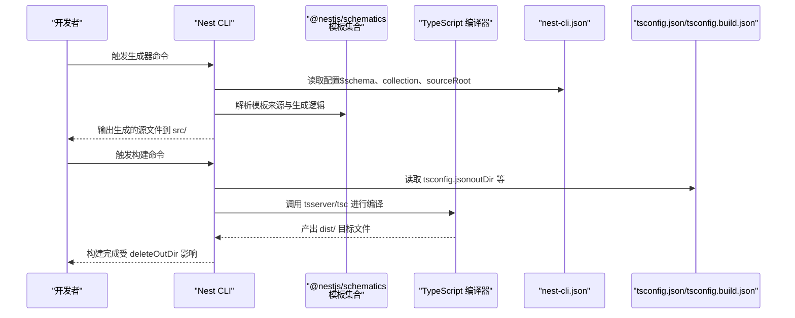
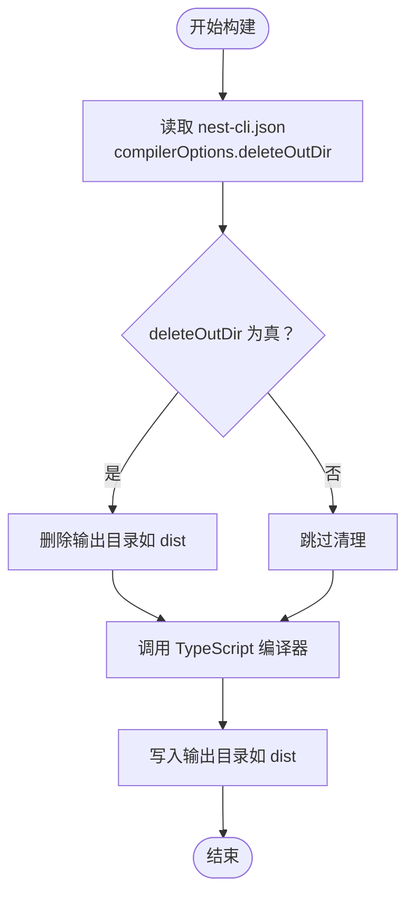
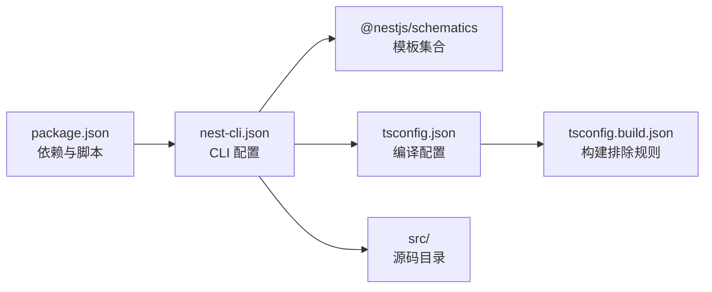

# Nest CLI 配置

<cite>
**本文引用的文件**
- [nest-cli.json](file://nest-cli.json)
- [package.json](file://package.json)
- [tsconfig.json](file://tsconfig.json)
- [tsconfig.build.json](file://tsconfig.build.json)
- [src/main.ts](file://src/main.ts)
- [src/app.module.ts](file://src/app.module.ts)
</cite>

## 目录
1. [简介](#简介)
2. [项目结构](#项目结构)
3. [核心组件](#核心组件)
4. [架构总览](#架构总览)
5. [详细组件分析](#详细组件分析)
6. [依赖关系分析](#依赖关系分析)
7. [性能考量](#性能考量)
8. [故障排查指南](#故障排查指南)
9. [结论](#结论)
10. [附录](#附录)

## 简介
本文件围绕 nest-cli.json 的配置进行系统化解读，重点说明以下方面：
- $schema 字段如何为 IDE 提供自动补全与校验能力
- collection 指向 @nestjs/schematics 的作用：定义 Nest CLI 生成器模板来源
- sourceRoot 设置为 src 的意义：确保生成文件位于源码目录
- compilerOptions.deleteOutDir: 在每次编译前清理输出目录，避免旧文件残留
- 与 tsconfig.json 协同工作，形成完整构建流程
- 实用示例：如何通过配置自定义生成器行为或添加 CLI 插件
- 扩展项目时的安全修改建议

## 项目结构
该项目采用标准的 Nest 应用结构，CLI 配置集中于根目录的 nest-cli.json，TypeScript 编译配置分为开发与构建两套 tsconfig 文件，源代码位于 src 目录。

图表来源
- [nest-cli.json](file://nest-cli.json#L1-L9)
- [tsconfig.json](file://tsconfig.json#L1-L26)
- [tsconfig.build.json](file://tsconfig.build.json#L1-L5)
- [src/main.ts](file://src/main.ts#L1-L9)
- [src/app.module.ts](file://src/app.module.ts#L1-L10)
- [package.json](file://package.json#L1-L73)

章节来源
- [nest-cli.json](file://nest-cli.json#L1-L9)
- [tsconfig.json](file://tsconfig.json#L1-L26)
- [tsconfig.build.json](file://tsconfig.build.json#L1-L5)
- [src/main.ts](file://src/main.ts#L1-L9)
- [src/app.module.ts](file://src/app.module.ts#L1-L10)
- [package.json](file://package.json#L1-L73)

## 核心组件
- $schema：指向 SchemaStore 上的 Nest CLI JSON Schema，用于 IDE 自动补全与实时校验
- collection：指定生成器模板集合来源，默认使用 @nestjs/schematics
- sourceRoot：声明源码根目录为 src，影响生成器与构建工具对文件位置的推断
- compilerOptions.deleteOutDir：启用后在构建前删除输出目录，避免历史产物污染

章节来源
- [nest-cli.json](file://nest-cli.json#L1-L9)

## 架构总览
Nest CLI 的工作流由 CLI 配置驱动，结合 TypeScript 编译配置与构建脚本，形成“生成器模板 -> 源码生成 -> 编译构建 -> 运行”的闭环。

图表来源
- [nest-cli.json](file://nest-cli.json#L1-L9)
- [tsconfig.json](file://tsconfig.json#L1-L26)
- [tsconfig.build.json](file://tsconfig.build.json#L1-L5)
- [package.json](file://package.json#L1-L73)

## 详细组件分析

### $schema 字段与 IDE 支持
- 作用：通过指向 SchemaStore 的 JSON Schema，为编辑器提供智能提示、参数校验与错误诊断
- 效果：在编辑 nest-cli.json 时，IDE 可以根据模式自动补全键名、类型约束与可选值，降低配置错误率
- 影响范围：仅影响编辑体验，不改变运行时行为

章节来源
- [nest-cli.json](file://nest-cli.json#L1-L9)

### collection 配置与生成器模板来源
- 默认值：@nestjs/schematics
- 含义：Nest CLI 使用该包提供的模板集合来生成控制器、服务、模块等文件
- 扩展方式：可通过替换 collection 指向自定义模板包，或在 CLI 中注册自定义插件实现更丰富的生成行为
- 注意事项：若更换 collection，需确保新模板与当前项目结构兼容

章节来源
- [nest-cli.json](file://nest-cli.json#L1-L9)
- [package.json](file://package.json#L1-L73)

### sourceRoot 设置为 src 的意义
- 作用：将源码根目录定位到 src，使生成器与构建工具默认在此目录下创建/查找文件
- 影响：所有通过 CLI 生成的文件都会落到 src 下，便于统一管理与版本控制
- 结合点：与 tsconfig.json 的 outDir 配合，保证构建产物与源码分离

章节来源
- [nest-cli.json](file://nest-cli.json#L1-L9)
- [tsconfig.json](file://tsconfig.json#L1-L26)

### compilerOptions.deleteOutDir 的用途
- 行为：在构建前删除输出目录（默认为 dist），避免旧文件残留
- 好处：减少构建产物污染、提升一致性；尤其在迁移或重构场景下更安全
- 与 tsconfig.json 的关系：tsconfig.json 定义了 outDir，Nest CLI 在执行构建前会先清理该目录，再进行编译

图表来源
- [nest-cli.json](file://nest-cli.json#L1-L9)
- [tsconfig.json](file://tsconfig.json#L1-L26)

章节来源
- [nest-cli.json](file://nest-cli.json#L1-L9)
- [tsconfig.json](file://tsconfig.json#L1-L26)

### 与 tsconfig.json 协同工作
- tsconfig.json 负责开发/调试阶段的编译选项，包括目标环境、输出目录、增量编译等
- tsconfig.build.json 继承 tsconfig.json，并额外排除 node_modules、测试与 spec 文件，专用于生产构建
- nest-cli.json 的 deleteOutDir 与 tsconfig.json 的 outDir 共同决定构建产物的位置与一致性

章节来源
- [tsconfig.json](file://tsconfig.json#L1-L26)
- [tsconfig.build.json](file://tsconfig.build.json#L1-L5)
- [nest-cli.json](file://nest-cli.json#L1-L9)

### 实用示例：自定义生成器行为与 CLI 插件
以下为可操作的实践路径（以步骤形式描述，不直接粘贴代码）：
- 自定义生成器模板
  - 将 collection 指向自定义模板包，或在 CLI 中注册自定义插件，以改变生成器的行为与文件结构
  - 修改后需确保生成的文件仍能被 tsconfig.json 正确编译
- 添加 CLI 插件
  - 在 package.json 中安装并配置 CLI 插件，使其在 nest build 或其他命令中生效
  - 保持 sourceRoot 与 outDir 的一致性，避免生成与构建冲突
- 扩展构建流程
  - 在 tsconfig.build.json 中调整排除规则，以适配新增的源文件类型或目录
  - 若需要保留某些中间产物，可在 nest-cli.json 中关闭 deleteOutDir，但需配合 CI/CD 清理策略

章节来源
- [nest-cli.json](file://nest-cli.json#L1-L9)
- [package.json](file://package.json#L1-L73)
- [tsconfig.json](file://tsconfig.json#L1-L26)
- [tsconfig.build.json](file://tsconfig.build.json#L1-L5)

### 安全修改建议
- 修改 sourceRoot 时，同步更新 tsconfig.json 的 outDir 与相对路径，避免构建失败
- 更换 collection 前，先在本地验证生成的文件结构是否符合团队规范
- 若关闭 deleteOutDir，请在 CI/CD 中增加清理步骤，防止缓存污染
- 对 compilerOptions 的改动应与团队达成共识，避免破坏现有构建流程

章节来源
- [nest-cli.json](file://nest-cli.json#L1-L9)
- [tsconfig.json](file://tsconfig.json#L1-L26)
- [tsconfig.build.json](file://tsconfig.build.json#L1-L5)
- [package.json](file://package.json#L1-L73)

## 依赖关系分析
- nest-cli.json 依赖 @nestjs/schematics 提供的模板集合
- 构建链路依赖 tsconfig.json 的 outDir 与 tsconfig.build.json 的排除规则
- package.json 的 scripts 与依赖版本决定了 CLI 的可用性与生成器的兼容性

图表来源
- [package.json](file://package.json#L1-L73)
- [nest-cli.json](file://nest-cli.json#L1-L9)
- [tsconfig.json](file://tsconfig.json#L1-L26)
- [tsconfig.build.json](file://tsconfig.build.json#L1-L5)

章节来源
- [package.json](file://package.json#L1-L73)
- [nest-cli.json](file://nest-cli.json#L1-L9)
- [tsconfig.json](file://tsconfig.json#L1-L26)
- [tsconfig.build.json](file://tsconfig.build.json#L1-L5)

## 性能考量
- deleteOutDir 会在每次构建前执行清理，可能增加构建时间；在大型项目中可权衡是否开启
- outDir 与增量编译（incremental）配合可提升二次构建速度
- 排除测试与 spec 文件可缩短构建时间，减少无关文件进入 dist

章节来源
- [tsconfig.json](file://tsconfig.json#L1-L26)
- [tsconfig.build.json](file://tsconfig.build.json#L1-L5)
- [nest-cli.json](file://nest-cli.json#L1-L9)

## 故障排查指南
- 生成文件未出现在预期位置
  - 检查 sourceRoot 是否为 src，以及生成器是否正确解析该路径
- 构建后 dist 中存在旧文件
  - 确认 compilerOptions.deleteOutDir 已启用，或在 CI/CD 中手动清理
- 生成器报错或模板缺失
  - 检查 collection 是否正确安装且版本兼容
- 编译异常或找不到模块
  - 核对 tsconfig.json 的 outDir 与相对路径，确保与 sourceRoot 一致

章节来源
- [nest-cli.json](file://nest-cli.json#L1-L9)
- [tsconfig.json](file://tsconfig.json#L1-L26)
- [package.json](file://package.json#L1-L73)

## 结论
nest-cli.json 是 Nest CLI 的配置中枢，它通过 $schema 提升编辑体验，通过 collection 指定模板来源，通过 sourceRoot 明确源码位置，并通过 compilerOptions.deleteOutDir 保障构建一致性。与 tsconfig.json 协同工作后，形成从生成到构建的完整闭环。在扩展项目时，应谨慎修改相关配置，确保与构建与生成流程保持一致。

## 附录
- 示例参考文件路径
  - [nest-cli.json](file://nest-cli.json#L1-L9)
  - [tsconfig.json](file://tsconfig.json#L1-L26)
  - [tsconfig.build.json](file://tsconfig.build.json#L1-L5)
  - [src/main.ts](file://src/main.ts#L1-L9)
  - [src/app.module.ts](file://src/app.module.ts#L1-L10)
  - [package.json](file://package.json#L1-L73)