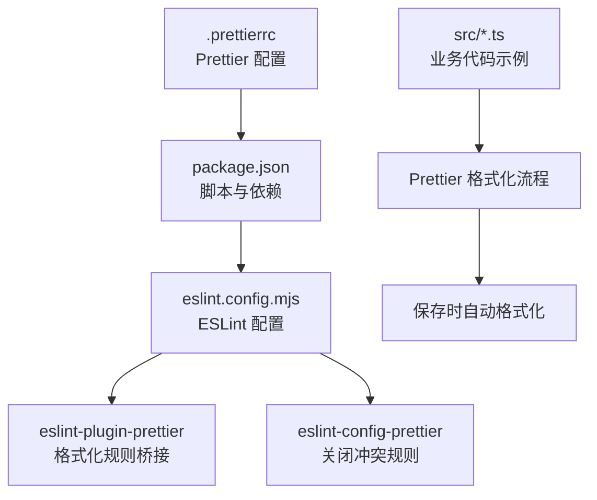
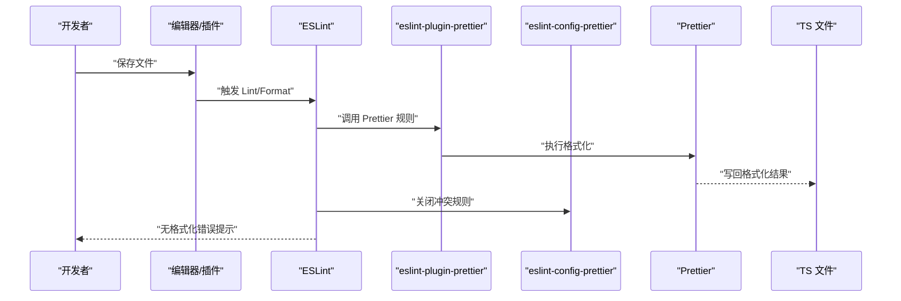
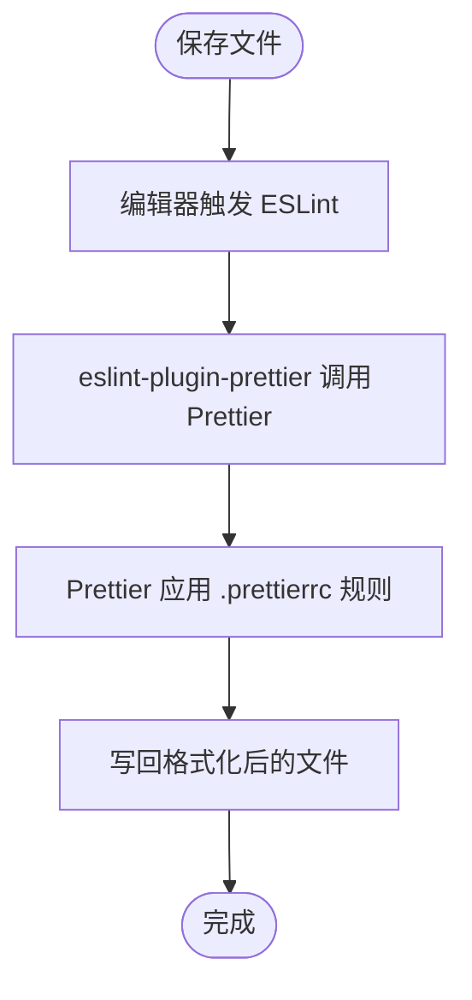
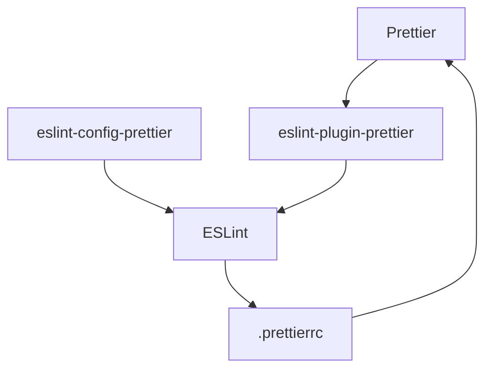

# Prettier 代码格式化配置

<cite>
**本文引用的文件**
- [.prettierrc](file://.prettierrc)
- [package.json](file://package.json)
- [eslint.config.mjs](file://eslint.config.mjs)
- [src/main.ts](file://src/main.ts)
- [src/app.controller.ts](file://src/app.controller.ts)
- [src/app.service.ts](file://src/app.service.ts)
- [src/app.module.ts](file://src/app.module.ts)
</cite>

## 目录
1. [简介](#简介)
2. [项目结构](#项目结构)
3. [核心组件](#核心组件)
4. [架构总览](#架构总览)
5. [详细组件分析](#详细组件分析)
6. [依赖关系分析](#依赖关系分析)
7. [性能考量](#性能考量)
8. [故障排查指南](#故障排查指南)
9. [结论](#结论)
10. [附录](#附录)

## 简介
本文件围绕项目中的 Prettier 配置展开，重点解释 .prettierrc 中的两个关键选项：singleQuote 与 trailingComma。我们将从以下维度展开：
- singleQuote: true 如何强制统一使用单引号，提升风格一致性；
- trailingComma: "all" 在多行对象与数组等场景添加尾随逗号，优化版本控制与维护；
- 结合项目现有代码示例，说明 Prettier 格式化前后差异；
- 解释 Prettier 与 ESLint 的集成方式（通过 eslint-plugin-prettier）及保存时自动格式化；
- 指导团队成员在编辑器中正确配置 Prettier 插件，确保本地与项目规范一致；
- 讨论在多人协作中统一格式化规则如何减少代码审查中的风格争议。

## 项目结构
该项目采用 NestJS 框架，核心配置集中在根目录的 .prettierrc、package.json 与 eslint.config.mjs 中。Prettier 作为独立格式化工具，配合 ESLint 的 eslint-plugin-prettier 与 eslint-config-prettier 实现“只负责格式化、不负责规则”的职责分离。

图表来源
- [.prettierrc](file://.prettierrc#L1-L5)
- [package.json](file://package.json#L1-L73)
- [eslint.config.mjs](file://eslint.config.mjs#L1-L36)

章节来源
- [package.json](file://package.json#L1-L73)
- [.prettierrc](file://.prettierrc#L1-L5)
- [eslint.config.mjs](file://eslint.config.mjs#L1-L36)

## 核心组件
- Prettier 配置文件 .prettierrc
  - singleQuote: true 强制使用单引号包裹字符串字面量，避免双引号与单引号混用导致的风格分歧。
  - trailingComma: "all" 在多行对象、数组、函数参数等场景添加尾随逗号，使 diff 更清晰，合并冲突更少。
- ESLint 集成
  - eslint-plugin-prettier 将 Prettier 的格式化结果作为 ESLint 规则执行，保证保存时自动格式化。
  - eslint-config-prettier 关闭与 Prettier 冲突的 ESLint 规则，避免双重校验。
- 项目脚本
  - package.json 提供 format 脚本，可对 src 与 test 下的 TypeScript 文件进行批量格式化。

章节来源
- [.prettierrc](file://.prettierrc#L1-L5)
- [package.json](file://package.json#L1-L73)
- [eslint.config.mjs](file://eslint.config.mjs#L1-L36)

## 架构总览
Prettier 与 ESLint 的集成遵循“格式化由 Prettier 负责，规则由 ESLint 负责”的最佳实践。具体流程如下：

图表来源
- [eslint.config.mjs](file://eslint.config.mjs#L1-L36)
- [package.json](file://package.json#L1-L73)

## 详细组件分析

### singleQuote: true 的作用与影响
- 统一字符串字面量风格：在 .prettierrc 中启用 singleQuote 后，Prettier 会优先使用单引号包裹字符串；当字符串包含单引号或需要转义时，再考虑使用双引号。
- 减少风格分歧：在多人协作中，避免出现“有人用单引号、有人用双引号”的情况，降低代码审查中的风格争议。
- 与 ESLint 协同：结合 eslint-plugin-prettier，保存时自动应用 singleQuote 规则，无需手动修改。

示例参考（路径）
- [src/app.service.ts](file://src/app.service.ts#L1-L9) 展示了单引号字符串字面量的使用，符合 singleQuote: true 的预期。

章节来源
- [.prettierrc](file://.prettierrc#L1-L5)
- [src/app.service.ts](file://src/app.service.ts#L1-L9)
- [eslint.config.mjs](file://eslint.config.mjs#L1-L36)

### trailingComma: "all" 的作用与优势
- 多行对象/数组/函数参数末尾添加逗号：在 .prettierrc 中设置 trailingComma: "all" 后，Prettier 会在多行场景自动添加尾随逗号。
- 版本控制友好：新增字段或参数时无需改动上一行，diff 更简洁，减少合并冲突概率。
- 代码维护便利：重构、重排字段顺序时更安全，避免遗漏逗号导致的语法错误。

示例参考（路径）
- [src/app.controller.ts](file://src/app.controller.ts#L22-L38) 展示了多行参数与对象字面量，符合 trailingComma: "all" 的预期行为。

章节来源
- [.prettierrc](file://.prettierrc#L1-L5)
- [src/app.controller.ts](file://src/app.controller.ts#L22-L38)
- [eslint.config.mjs](file://eslint.config.mjs#L1-L36)

### Prettier 与 ESLint 集成（eslint-plugin-prettier）
- eslint-plugin-prettier 将 Prettier 的格式化结果作为 ESLint 规则执行，从而在保存时触发格式化。
- eslint-config-prettier 关闭与 Prettier 冲突的 ESLint 规则，避免重复校验同一问题。
- 在 eslint.config.mjs 中，通过引入 eslint-plugin-prettier/recommended 并在 rules 中配置 prettier/prettier，实现保存即格式化。

章节来源
- [eslint.config.mjs](file://eslint.config.mjs#L1-L36)
- [package.json](file://package.json#L1-L73)

### 保存时自动格式化流程
- 编辑器插件（如 VS Code 的 ESLint/Prettier 插件）监听文件保存事件。
- ESLint 执行 eslint-plugin-prettier 规则，Prettier 对文件进行格式化。
- 格式化完成后，文件内容被写回磁盘，同时 ESLint 不报告格式化相关错误。

图表来源
- [eslint.config.mjs](file://eslint.config.mjs#L1-L36)
- [.prettierrc](file://.prettierrc#L1-L5)

### 批量格式化与脚本
- 项目提供 format 脚本，用于对 src 与 test 下的 TypeScript 文件进行批量格式化。
- 建议在提交前运行该脚本，确保仓库内所有 TS 文件均符合统一格式。

章节来源
- [package.json](file://package.json#L1-L73)

### 代码示例与格式化前后对比思路
为帮助理解，以下示例展示了在 singleQuote 与 trailingComma 影响下的典型差异思路（仅说明思路，不直接展示代码内容）：
- 字符串字面量：在启用 singleQuote 后，原本可能使用双引号的字符串会被转换为单引号包裹；若字符串本身包含单引号，则 Prettier 会根据策略选择合适的引号形式。
- 多行对象/数组/函数参数：在启用 trailingComma: "all" 后，多行场景会在末尾自动添加逗号；新增字段或参数时，仅需在新行追加，无需改动上一行。

示例参考（路径）
- [src/app.controller.ts](file://src/app.controller.ts#L22-L38) 展示了多行参数与对象字面量，体现 trailingComma 的适用场景。
- [src/app.service.ts](file://src/app.service.ts#L1-L9) 展示了单引号字符串字面量，体现 singleQuote 的适用场景。

章节来源
- [src/app.controller.ts](file://src/app.controller.ts#L22-L38)
- [src/app.service.ts](file://src/app.service.ts#L1-L9)

## 依赖关系分析
- Prettier 与 ESLint 的关系
  - Prettier 专注于格式化，ESLint 专注于逻辑与风格规则。
  - eslint-plugin-prettier 将 Prettier 的格式化结果作为 ESLint 规则执行，实现“保存即格式化”。
  - eslint-config-prettier 关闭与 Prettier 冲突的 ESLint 规则，避免重复校验。
- 项目依赖
  - package.json 中声明了 prettier、eslint、eslint-plugin-prettier、eslint-config-prettier 等依赖，确保格式化链路可用。

图表来源
- [package.json](file://package.json#L1-L73)
- [eslint.config.mjs](file://eslint.config.mjs#L1-L36)
- [.prettierrc](file://.prettierrc#L1-L5)

章节来源
- [package.json](file://package.json#L1-L73)
- [eslint.config.mjs](file://eslint.config.mjs#L1-L36)
- [.prettierrc](file://.prettierrc#L1-L5)

## 性能考量
- Prettier 是纯格式化工具，性能开销极低，通常不会成为瓶颈。
- 在大型项目中，建议：
  - 使用 .prettierignore 排除不需要格式化的文件；
  - 在 CI 中仅对变更文件进行格式检查，避免全量扫描；
  - 保持 .prettierrc 简洁，避免过度复杂的规则导致格式化时间增加。

## 故障排查指南
- 保存后未自动格式化
  - 检查编辑器是否安装并启用了 ESLint 与 Prettier 插件；
  - 确认 eslint.config.mjs 中已正确引入 eslint-plugin-prettier/recommended，并配置了 prettier/prettier 规则。
- ESLint 报告格式化错误
  - 确认 eslint-config-prettier 已正确关闭与 Prettier 冲突的规则；
  - 运行 npm run format 或对应脚本，确保仓库内格式化一致。
- trailingComma 未生效
  - 确认 .prettierrc 中 trailingComma 设置为 "all"；
  - 检查目标代码是否处于多行场景（对象、数组、函数参数等）。
- singleQuote 未生效
  - 确认 .prettierrc 中 singleQuote 设置为 true；
  - 检查字符串字面量是否包含单引号，Prettier 可能出于兼容性考虑选择其他引号形式。

章节来源
- [eslint.config.mjs](file://eslint.config.mjs#L1-L36)
- [package.json](file://package.json#L1-L73)
- [.prettierrc](file://.prettierrc#L1-L5)

## 结论
通过在 .prettierrc 中启用 singleQuote 与 trailingComma: "all"，项目实现了：
- 统一的字符串字面量风格，减少审查中的风格分歧；
- 多行结构的尾随逗号规范化，提升版本控制与协作效率；
- 与 ESLint 的无缝集成，实现保存时自动格式化；
- 团队成员在编辑器中正确配置插件即可获得一致的本地体验。

这些规则共同构成了项目的基础格式化规范，建议在团队内推广并纳入 CI 校验流程，以确保长期一致性。

## 附录
- 团队配置建议
  - 在编辑器中安装并启用 ESLint 与 Prettier 插件；
  - 确保编辑器设置为“保存时自动格式化”，并与 ESLint 集成；
  - 在 CI 中加入格式检查步骤，防止格式漂移。
- 常用命令
  - npm run format：批量格式化 src 与 test 下的 TypeScript 文件；
  - npm run lint：运行 ESLint 并尝试自动修复（不含格式化）。

章节来源
- [package.json](file://package.json#L1-L73)
- [eslint.config.mjs](file://eslint.config.mjs#L1-L36)
- [.prettierrc](file://.prettierrc#L1-L5)