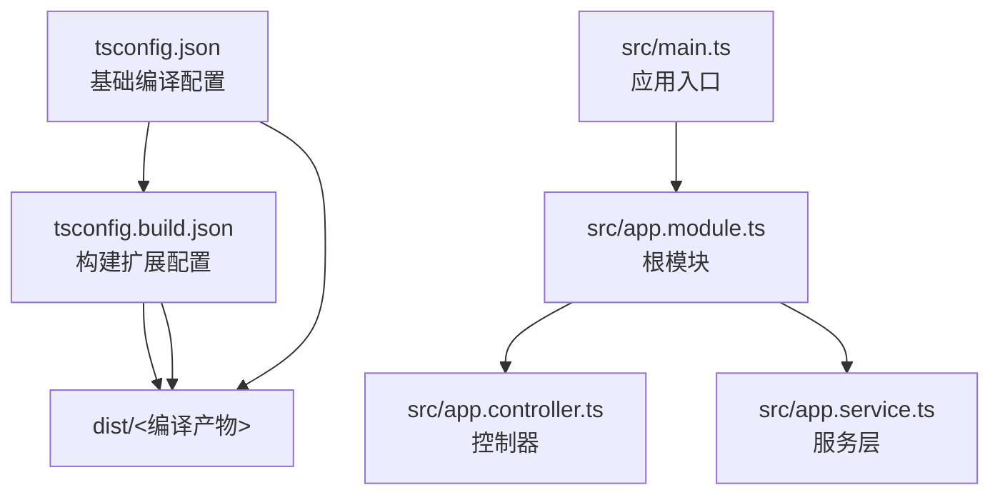
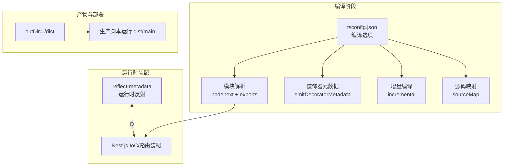
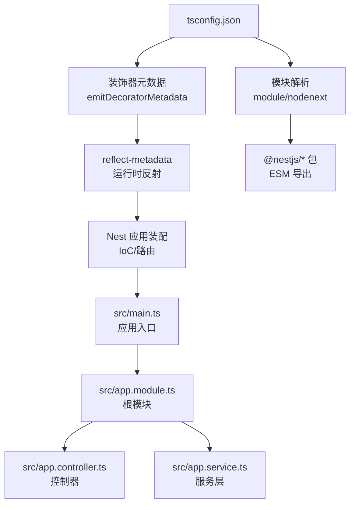

# TypeScript 配置

<cite>
**本文引用的文件**
- [tsconfig.json](file://tsconfig.json)
- [tsconfig.build.json](file://tsconfig.build.json)
- [package.json](file://package.json)
- [nest-cli.json](file://nest-cli.json)
- [src/main.ts](file://src/main.ts)
- [src/app.module.ts](file://src/app.module.ts)
- [src/app.controller.ts](file://src/app.controller.ts)
- [src/app.service.ts](file://src/app.service.ts)
</cite>

## 目录
1. [简介](#简介)
2. [项目结构](#项目结构)
3. [核心组件](#核心组件)
4. [架构总览](#架构总览)
5. [详细组件分析](#详细组件分析)
6. [依赖关系分析](#依赖关系分析)
7. [性能考量](#性能考量)
8. [故障排查指南](#故障排查指南)
9. [结论](#结论)
10. [附录](#附录)

## 简介
本文件围绕 tsconfig.json 中的关键 TypeScript 编译选项，系统解析其对 nest-dome 项目的影响，并结合项目实际代码（如模块装饰器、控制器与服务的依赖注入）说明配置如何在保证类型安全的同时，支撑 Nest.js 框架特性与运行时兼容性。重点包括：
- module/moduleResolution 设置为 nodenext 的作用
- esModuleInterop 与 allowSyntheticDefaultImports 在模块互操作中的用途
- emitDecoratorMetadata 与 experimentalDecorators 对 Nest.js 依赖注入与装饰器功能的支持机制
- target: ES2023 对 Node.js 运行时兼容性的影响
- outDir 如何控制编译输出目录
- isolatedModules、declaration、sourceMap 等开发辅助选项
- 针对部署环境的 strict 类型检查与性能相关选项（如 incremental）的调整建议

## 项目结构
本项目采用标准的 Nest.js 结构，TypeScript 配置位于根目录，构建配置通过扩展基础配置实现排除策略。生产启动脚本直接运行 dist 目录下的编译产物，体现 outDir 的使用。

图表来源
- [tsconfig.json](file://tsconfig.json#L1-L26)
- [tsconfig.build.json](file://tsconfig.build.json#L1-L5)
- [src/main.ts](file://src/main.ts#L1-L24)
- [src/app.module.ts](file://src/app.module.ts#L1-L25)
- [src/app.controller.ts](file://src/app.controller.ts#L1-L42)
- [src/app.service.ts](file://src/app.service.ts#L1-L37)

章节来源
- [tsconfig.json](file://tsconfig.json#L1-L26)
- [tsconfig.build.json](file://tsconfig.build.json#L1-L5)
- [package.json](file://package.json#L1-L73)
- [nest-cli.json](file://nest-cli.json#L1-L9)

## 核心组件
本节聚焦 tsconfig.json 中与 Nest.js 生态密切相关的编译选项，逐项解释其含义与影响。

- module 与 moduleResolution：nodenext
  - 影响：启用 Node.js 原生 ESM 解析行为，遵循 package.json 的 exports 字段与 ESM 规范进行模块解析，避免 CommonJS 与 ESM 混用导致的互操作问题。
  - 对项目的影响：与 Nest.js 11.x 的 ESM 支持一致，减少动态导入与包解析的兼容性风险；配合 resolvePackageJsonExports，能更好地利用包导出的条件字段。
  - 章节来源
    - [tsconfig.json](file://tsconfig.json#L1-L26)

- resolvePackageJsonExports：true
  - 影响：强制使用 package.json 的 exports 字段进行解析，提升包导出的确定性与安全性。
  - 对项目的影响：确保 @nestjs/* 与第三方包的 ESM 导出路径稳定，避免因默认入口差异导致的运行时错误。
  - 章节来源
    - [tsconfig.json](file://tsconfig.json#L1-L26)

- esModuleInterop：true
  - 影响：在编译期插入必要的互操作代码，使 CommonJS 模块在 ESM 环境中也能被正确使用。
  - 对项目的影响：与 @nestjs/common、@nestjs/core 等基于 CommonJS 发布的包协同工作，避免 require 与 import 的混用引发的类型或运行时问题。
  - 章节来源
    - [tsconfig.json](file://tsconfig.json#L1-L26)

- allowSyntheticDefaultImports：true
  - 影响：允许在 ESM 环境中对没有默认导出的模块使用默认导入语法。
  - 对项目的影响：简化导入写法，减少显式命名空间导入，提升可读性。
  - 章节来源
    - [tsconfig.json](file://tsconfig.json#L1-L26)

- isolatedModules：true
  - 影响：要求每个文件被视为独立模块，便于增量编译与编辑器工具链（如 tsserver）高效工作。
  - 对项目的影响：提升开发体验与构建稳定性，避免跨文件共享状态导致的类型错误。
  - 章节来源
    - [tsconfig.json](file://tsconfig.json#L1-L26)

- declaration：true
  - 影响：生成 .d.ts 类型声明文件，便于发布库或在 monorepo 场景中共享类型信息。
  - 对项目的影响：当前项目未发布为库，但开启后有利于 IDE 类型提示与二次开发。
  - 章节来源
    - [tsconfig.json](file://tsconfig.json#L1-L26)

- removeComments：true
  - 影响：移除注释，减小产物体积。
  - 对项目的影响：生产构建更简洁，但调试时需配合 sourceMap。
  - 章节来源
    - [tsconfig.json](file://tsconfig.json#L1-L26)

- emitDecoratorMetadata：true
  - 影响：在编译期生成装饰器元数据，供运行时反射使用。
  - 对项目的影响：为 Nest.js 的依赖注入、路由映射、参数装饰器等提供元数据支持，是框架运行时装配的基础。
  - 章节来源
    - [tsconfig.json](file://tsconfig.json#L1-L26)

- experimentalDecorators：true
  - 影响：启用实验性装饰器语法支持。
  - 对项目的影响：确保装饰器语法在目标语言版本下可用，与 emitDecoratorMetadata 协同工作。
  - 章节来源
    - [tsconfig.json](file://tsconfig.json#L1-L26)

- target：ES2023
  - 影响：将 TypeScript 编译为 ES2023 目标语法，保留较新的语言特性。
  - 对项目的影响：Node.js 版本需满足 ES2023 的能力要求；若低于此目标，可能触发运行时错误或降级行为。
  - 章节来源
    - [tsconfig.json](file://tsconfig.json#L1-L26)
    - [package.json](file://package.json#L1-L73)

- sourceMap：true
  - 影响：生成 source map，便于在浏览器或 Node.js 中进行源码级调试。
  - 对项目的影响：开发与测试阶段调试体验更好；生产构建可按需关闭以减少体积。
  - 章节来源
    - [tsconfig.json](file://tsconfig.json#L1-L26)

- outDir：./dist
  - 影响：指定编译输出目录。
  - 对项目的影响：生产脚本直接运行 dist/main，确保产物与源码分离，便于部署与缓存。
  - 章节来源
    - [tsconfig.json](file://tsconfig.json#L1-L26)
    - [package.json](file://package.json#L1-L73)
    - [nest-cli.json](file://nest-cli.json#L1-L9)

- baseUrl：./
  - 影响：设置模块解析的基准路径。
  - 对项目的影响：与 tsconfig-paths 在测试与调试场景中配合使用，提升路径解析一致性。
  - 章节来源
    - [tsconfig.json](file://tsconfig.json#L1-L26)

- incremental：true
  - 影响：启用增量编译，仅编译变更文件，提升开发时的编译速度。
  - 对项目的影响：在大型项目中显著缩短等待时间；注意与 clean 构建策略的协调。
  - 章节来源
    - [tsconfig.json](file://tsconfig.json#L1-L26)

- skipLibCheck：true
  - 影响：跳过对库文件的类型检查，加速编译。
  - 对项目的影响：降低编译开销，但可能掩盖第三方库的类型问题；建议在 CI 中临时关闭以发现潜在问题。
  - 章节来源
    - [tsconfig.json](file://tsconfig.json#L1-L26)

- strictNullChecks：true
  - 影响：严格空值检查，提升类型安全。
  - 对项目的影响：减少运行时 null/undefined 引发的错误；建议在团队协作中保持开启。
  - 章节来源
    - [tsconfig.json](file://tsconfig.json#L1-L26)

- forceConsistentCasingInFileNames：true
  - 影响：禁止不同大小写的文件名冲突，避免跨平台差异。
  - 对项目的影响：统一文件命名，减少 Linux/macOS 与 Windows 的差异问题。
  - 章节来源
    - [tsconfig.json](file://tsconfig.json#L1-L26)

- noImplicitAny：false
  - 影响：允许隐式 any，降低初期开发门槛。
  - 对项目的影响：建议逐步收紧为 true，提升长期维护质量。
  - 章节来源
    - [tsconfig.json](file://tsconfig.json#L1-L26)

- strictBindCallApply：false
  - 影响：放宽对 bind/call/apply 的严格检查。
  - 对项目的影响：平衡灵活性与安全性，通常保持默认即可。
  - 章节来源
    - [tsconfig.json](file://tsconfig.json#L1-L26)

- noFallthroughCasesInSwitch：false
  - 影响：允许 switch 的贯穿。
  - 对项目的影响：保持宽松，建议在需要时显式添加 break 或重构逻辑。
  - 章节来源
    - [tsconfig.json](file://tsconfig.json#L1-L26)

## 架构总览
下图展示了 tsconfig.json 选项如何影响编译流程与运行时装配，特别是装饰器元数据与模块解析对 Nest.js 依赖注入与路由映射的支持。

图表来源
- [tsconfig.json](file://tsconfig.json#L1-L26)
- [package.json](file://package.json#L1-L73)

## 详细组件分析

### 模块系统与互操作：module 与 moduleResolution 设为 nodenext
- 作用与影响
  - nodenext 使 TypeScript 采用 Node.js 的 ESM 解析策略，优先读取 package.json 的 exports 字段，避免 CommonJS 与 ESM 混用带来的歧义。
  - resolvePackageJsonExports 与之配合，确保对包导出路径的精确解析。
- 对 Nest.js 的意义
  - Nest.js 11.x 强化了 ESM 支持，nodenext 配置与 @nestjs/* 包的导出策略一致，减少运行时模块解析失败的风险。
- 与项目的关系
  - 项目使用 @nestjs/common、@nestjs/core 等包，nodenext 配置有助于稳定模块解析与动态导入。
- 图表来源
  - [tsconfig.json](file://tsconfig.json#L1-L26)

章节来源
- [tsconfig.json](file://tsconfig.json#L1-L26)

### 模块互操作：esModuleInterop 与 allowSyntheticDefaultImports
- 作用与影响
  - esModuleInterop：在 ESM 环境中为 CommonJS 模块生成互操作包装，避免 require 与 import 的混用问题。
  - allowSyntheticDefaultImports：允许对无默认导出的模块使用默认导入语法，简化导入写法。
- 对 Nest.js 的意义
  - 与 @nestjs/common、@nestjs/core 等包协同工作，避免“默认导出不存在”的类型或运行时错误。
- 与项目的关系
  - 项目导入 @nestjs/common、@nestjs/core，这两项配置确保导入语法与运行时行为一致。
- 图表来源
  - [tsconfig.json](file://tsconfig.json#L1-L26)

章节来源
- [tsconfig.json](file://tsconfig.json#L1-L26)

### 装饰器与依赖注入：emitDecoratorMetadata 与 experimentalDecorators
- 作用与影响
  - experimentalDecorators：启用装饰器语法支持。
  - emitDecoratorMetadata：在编译期生成装饰器元数据，供 reflect-metadata 在运行时读取。
- 对 Nest.js 的意义
  - @Module、@Controller、@Injectable 等装饰器依赖装饰器元数据完成模块装配、路由映射与依赖注入。
  - 项目中 AppModule、AppController、AppService 均使用装饰器，必须开启上述两项配置。
- 与项目的关系
  - src/app.module.ts、src/app.controller.ts、src/app.service.ts 展示了装饰器的实际使用；tsconfig.json 的配置保障了元数据生成与运行时反射。
- 图表来源
  - [tsconfig.json](file://tsconfig.json#L1-L26)
  - [src/app.module.ts](file://src/app.module.ts#L1-L25)
  - [src/app.controller.ts](file://src/app.controller.ts#L1-L42)
  - [src/app.service.ts](file://src/app.service.ts#L1-L37)

章节来源
- [tsconfig.json](file://tsconfig.json#L1-L26)
- [src/app.module.ts](file://src/app.module.ts#L1-L25)
- [src/app.controller.ts](file://src/app.controller.ts#L1-L42)
- [src/app.service.ts](file://src/app.service.ts#L1-L37)

### 目标语言与运行时兼容性：target: ES2023
- 作用与影响
  - 将编译目标设定为 ES2023，保留较新的语言特性。
- 对项目的影响
  - Node.js 版本需满足 ES2023 的能力要求；若低于此目标，可能导致运行时错误或降级行为。
- 与项目的关系
  - package.json 的 CLI 依赖要求 Node >= 20.11，与 ES2023 目标相匹配，确保运行时兼容性。
- 图表来源
  - [tsconfig.json](file://tsconfig.json#L1-L26)
  - [package.json](file://package.json#L1-L73)

章节来源
- [tsconfig.json](file://tsconfig.json#L1-L26)
- [package.json](file://package.json#L1-L73)

### 编译输出与部署：outDir
- 作用与影响
  - 指定编译输出目录为 dist。
- 对项目的影响
  - 生产脚本直接运行 dist/main，确保产物与源码分离，便于部署与缓存。
- 与项目的关系
  - package.json 的 start:prod 脚本与 nest-cli.json 的 deleteOutDir 配合，保证每次构建前清理输出目录。
- 图表来源
  - [tsconfig.json](file://tsconfig.json#L1-L26)
  - [package.json](file://package.json#L1-L73)
  - [nest-cli.json](file://nest-cli.json#L1-L9)

章节来源
- [tsconfig.json](file://tsconfig.json#L1-L26)
- [package.json](file://package.json#L1-L73)
- [nest-cli.json](file://nest-cli.json#L1-L9)

### 开发辅助：isolatedModules、declaration、sourceMap
- isolatedModules：true
  - 使每个文件被视为独立模块，利于增量编译与编辑器工具链高效工作。
- declaration：true
  - 生成 .d.ts 类型声明文件，便于 IDE 类型提示与二次开发。
- sourceMap：true
  - 生成 source map，便于调试与定位问题。
- 对项目的影响
  - 提升开发体验与调试效率；生产构建可按需关闭以减少体积。
- 图表来源
  - [tsconfig.json](file://tsconfig.json#L1-L26)

章节来源
- [tsconfig.json](file://tsconfig.json#L1-L26)

### 构建扩展：tsconfig.build.json
- 作用与影响
  - 通过 extends 继承基础配置，并排除 node_modules、test、dist 与 spec 文件，聚焦生产构建。
- 对项目的影响
  - 清晰区分开发与构建范围，避免无关文件参与编译。
- 图表来源
  - [tsconfig.build.json](file://tsconfig.build.json#L1-L5)

章节来源
- [tsconfig.build.json](file://tsconfig.build.json#L1-L5)

## 依赖关系分析
下图展示了 tsconfig.json 选项与项目关键文件之间的依赖关系，强调装饰器元数据与模块解析对 Nest.js 装配流程的支持。

图表来源
- [tsconfig.json](file://tsconfig.json#L1-L26)
- [src/main.ts](file://src/main.ts#L1-L24)
- [src/app.module.ts](file://src/app.module.ts#L1-L25)
- [src/app.controller.ts](file://src/app.controller.ts#L1-L42)
- [src/app.service.ts](file://src/app.service.ts#L1-L37)

章节来源
- [tsconfig.json](file://tsconfig.json#L1-L26)
- [src/main.ts](file://src/main.ts#L1-L24)
- [src/app.module.ts](file://src/app.module.ts#L1-L25)
- [src/app.controller.ts](file://src/app.controller.ts#L1-L42)
- [src/app.service.ts](file://src/app.service.ts#L1-L37)

## 性能考量
- 增量编译（incremental）
  - 优势：仅编译变更文件，显著缩短开发时编译时间。
  - 注意：与 clean 构建策略协调，避免缓存污染。
- 跳过库检查（skipLibCheck）
  - 优势：加速编译。
  - 注意：在 CI 中可临时关闭以发现第三方库的类型问题。
- 移除注释（removeComments）
  - 优势：减小产物体积。
  - 注意：生产调试需配合 sourceMap。
- 目标语言（target）
  - 选择 ES2023 以获得新特性，但需确保 Node.js 版本满足要求。

章节来源
- [tsconfig.json](file://tsconfig.json#L1-L26)

## 故障排查指南
- 装饰器元数据缺失或运行时装配失败
  - 检查是否开启 emitDecoratorMetadata 与 experimentalDecorators。
  - 章节来源
    - [tsconfig.json](file://tsconfig.json#L1-L26)
- 模块解析错误（CommonJS/ESM 混用）
  - 确认 module 与 moduleResolution 设置为 nodenext，并启用 resolvePackageJsonExports。
  - 章节来源
    - [tsconfig.json](file://tsconfig.json#L1-L26)
- 运行时导入失败（默认导出不存在）
  - 确认 allowSyntheticDefaultImports 与 esModuleInterop 已开启。
  - 章节来源
    - [tsconfig.json](file://tsconfig.json#L1-L26)
- 生产启动失败（dist/main 不存在）
  - 确认 outDir 指向 dist，且构建已成功执行。
  - 章节来源
    - [tsconfig.json](file://tsconfig.json#L1-L26)
    - [package.json](file://package.json#L1-L73)
- 调试困难（无法定位源码）
  - 确认 sourceMap 已开启，必要时在生产构建中保留 sourceMap 以便定位问题。
  - 章节来源
    - [tsconfig.json](file://tsconfig.json#L1-L26)

## 结论
本项目的 tsconfig.json 通过 nodenext 模块解析、esModuleInterop 与 allowSyntheticDefaultImports 的互操作配置、emitDecoratorMetadata 与 experimentalDecorators 的装饰器支持，以及 ES2023 目标与 outDir 输出策略，有效支撑了 Nest.js 的依赖注入与装饰器装配，并兼顾了开发体验与构建性能。建议在团队协作中保持 strictNullChecks 等严格类型检查，逐步收紧 noImplicitAny 等选项，以提升长期可维护性；在 CI 中可临时关闭 skipLibCheck 以发现潜在问题。

## 附录
- 修改建议（按部署环境调整）
  - 开发环境
    - 保持 incremental、sourceMap、isolatedModules，提升开发效率与调试体验。
    - 严格类型检查：建议逐步收紧 noImplicitAny、strictBindCallApply 等选项。
  - 测试/预生产环境
    - 保持 strictNullChecks、incremental，确保类型安全与构建速度。
    - 可考虑关闭 removeComments 以减少产物体积，保留 sourceMap 用于问题定位。
  - 生产环境
    - 确保 Node.js 版本满足 ES2023 要求。
    - 关闭 skipLibCheck，以在构建阶段暴露第三方库的类型问题。
    - 保留 sourceMap 以便线上问题定位，或在发布前移除以减小体积。
- 与项目实际代码的对应关系
  - AppModule、AppController、AppService 的装饰器使用与依赖注入，均依赖 tsconfig.json 中的装饰器元数据与模块解析配置。
  - 章节来源
    - [src/app.module.ts](file://src/app.module.ts#L1-L25)
    - [src/app.controller.ts](file://src/app.controller.ts#L1-L42)
    - [src/app.service.ts](file://src/app.service.ts#L1-L37)
    - [tsconfig.json](file://tsconfig.json#L1-L26)