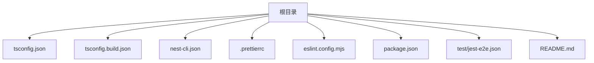
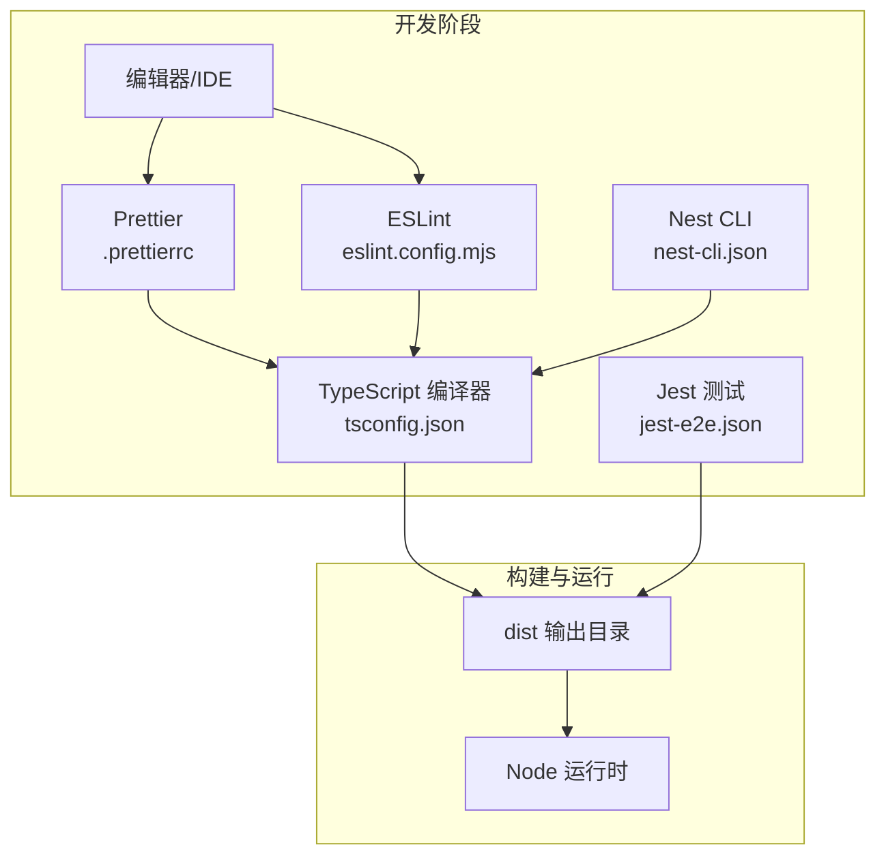
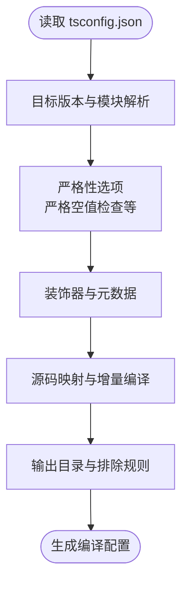
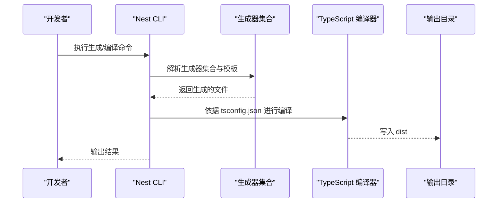
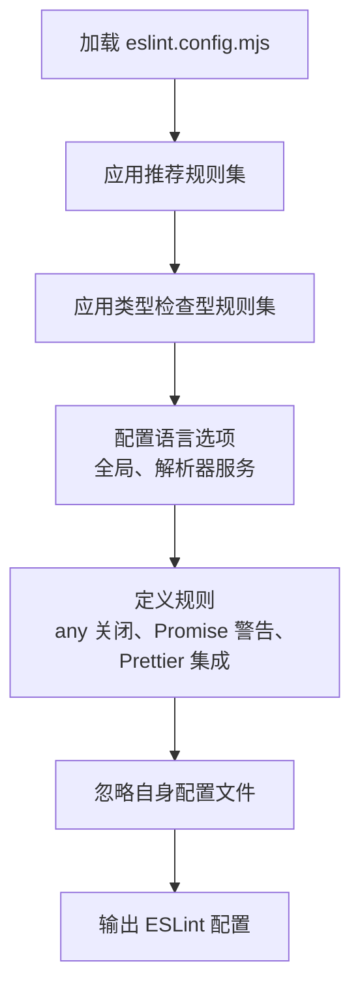
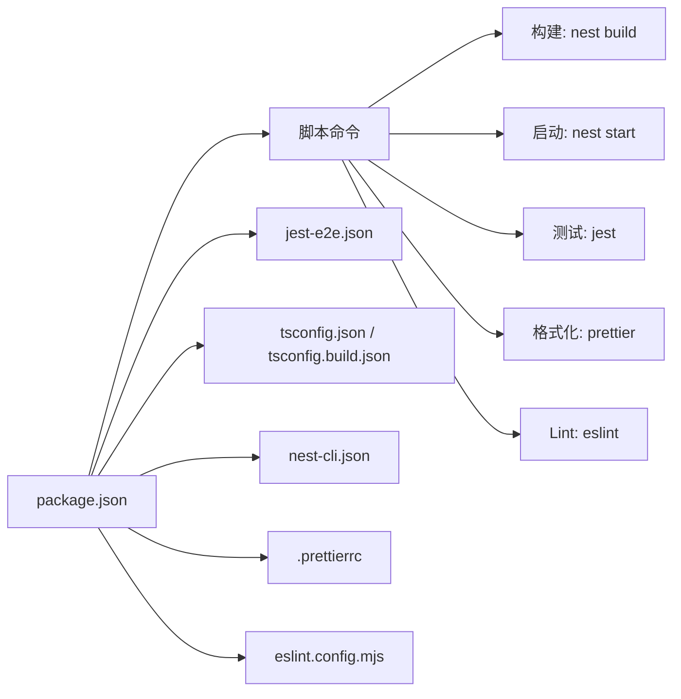

# 开发环境配置

<cite>
**本文引用的文件**
- [tsconfig.json](file://tsconfig.json)
- [tsconfig.build.json](file://tsconfig.build.json)
- [nest-cli.json](file://nest-cli.json)
- [.prettierrc](file://.prettierrc)
- [eslint.config.mjs](file://eslint.config.mjs)
- [package.json](file://package.json)
- [test/jest-e2e.json](file://test/jest-e2e.json)
- [README.md](file://README.md)
</cite>

## 目录
1. [简介](#简介)
2. [项目结构](#项目结构)
3. [核心组件](#核心组件)
4. [架构总览](#架构总览)
5. [详细组件分析](#详细组件分析)
6. [依赖关系分析](#依赖关系分析)
7. [性能与质量特性](#性能与质量特性)
8. [故障排查指南](#故障排查指南)
9. [结论](#结论)
10. [附录](#附录)

## 简介
本文件系统性梳理 nest-dome 项目的开发工具链配置，重点围绕以下四类配置展开：
- TypeScript 编译配置：解释 tsconfig.json 中的关键编译选项对代码质量与兼容性的影响
- Nest CLI 配置：说明 nest-cli.json 如何配置生成器与编译行为
- Prettier 格式化：解析 .prettierrc 的格式化策略，确保团队风格一致
- ESLint 规则：深入分析 eslint.config.mjs 的规则集，包括语法检查与质量约束
同时提供实践建议，帮助开发者按需定制这些配置，并理解它们在开发流程中的协同机制。

## 项目结构
该仓库采用典型的 NestJS 项目布局，核心配置文件集中在根目录，测试配置位于 test 目录。下图展示与本文相关的配置文件及其位置关系。

图表来源
- [tsconfig.json](file://tsconfig.json#L1-L26)
- [tsconfig.build.json](file://tsconfig.build.json#L1-L5)
- [nest-cli.json](file://nest-cli.json#L1-L9)
- [.prettierrc](file://.prettierrc#L1-L5)
- [eslint.config.mjs](file://eslint.config.mjs#L1-L36)
- [package.json](file://package.json#L1-L73)
- [test/jest-e2e.json](file://test/jest-e2e.json#L1-L10)
- [README.md](file://README.md#L1-L99)

章节来源
- [README.md](file://README.md#L24-L60)

## 核心组件
本节从“质量”和“一致性”的双重视角，逐项解析各配置文件的作用与影响。

- TypeScript 编译配置（tsconfig.json）
  - 影响范围：类型检查严格度、模块系统、装饰器与元数据、增量编译、输出目录等
  - 关键点：目标版本、模块解析策略、严格空值检查、装饰器与元数据、源码映射、增量编译等
  - 质量收益：通过严格选项降低运行时风险；通过装饰器与元数据支持 Nest 框架反射机制
  - 兼容性影响：目标版本与模块解析策略决定打包产物的兼容范围

- Nest CLI 配置（nest-cli.json）
  - 影响范围：生成器集合、源码根目录、编译清理策略
  - 关键点：删除输出目录、使用官方 schematics 集合
  - 工程效率：统一生成器行为，减少手写样板代码

- Prettier 格式化（.prettierrc）
  - 影响范围：代码风格统一、减少审阅分歧
  - 关键点：单引号、尾随逗号策略
  - 团队协作：通过 CI/本地统一格式化，避免风格争议

- ESLint 规则（eslint.config.mjs）
  - 影响范围：语法检查、类型安全规则、与 Prettier 的集成
  - 关键点：推荐规则集、类型检查型规则、Node/Jest 全局、解析器服务、部分规则关闭/警告
  - 质量保障：在编辑器与 CI 中提前发现潜在问题

章节来源
- [tsconfig.json](file://tsconfig.json#L1-L26)
- [tsconfig.build.json](file://tsconfig.build.json#L1-L5)
- [nest-cli.json](file://nest-cli.json#L1-L9)
- [.prettierrc](file://.prettierrc#L1-L5)
- [eslint.config.mjs](file://eslint.config.mjs#L1-L36)
- [package.json](file://package.json#L1-L73)

## 架构总览
下图展示了开发工具链在构建与运行阶段的协作关系：编辑器/IDE 在保存时触发 Prettier 格式化与 ESLint 检查；Nest CLI 使用 tsconfig 进行编译；Jest 测试使用各自的 ts-jest 配置；最终产物由 Node 运行。

图表来源
- [.prettierrc](file://.prettierrc#L1-L5)
- [eslint.config.mjs](file://eslint.config.mjs#L1-L36)
- [tsconfig.json](file://tsconfig.json#L1-L26)
- [nest-cli.json](file://nest-cli.json#L1-L9)
- [test/jest-e2e.json](file://test/jest-e2e.json#L1-L10)
- [package.json](file://package.json#L1-L73)

## 详细组件分析

### TypeScript 编译配置（tsconfig.json）
- 目标与模块系统
  - 目标版本与模块解析策略共同决定了打包产物的兼容范围与生态适配性
  - 模块解析策略与 NodeNext 相关设置有助于与现代 Node 生态兼容
- 严格性与类型安全
  - 启用严格空值检查，有助于在编译期捕获潜在的空指针问题
  - 关闭某些严格选项（如显式 any、绑定调用严格等）以平衡工程可用性
- 装饰器与元数据
  - 启用实验性装饰器与元数据收集，为 Nest 框架的依赖注入与反射机制提供基础
- 构建与调试
  - 启用源码映射便于调试
  - 增量编译提升开发体验
- 输出与排除
  - 统一输出目录，便于后续打包与部署
  - 构建配置通过扩展根 tsconfig 并排除测试与 spec 文件，确保仅构建业务代码

图表来源
- [tsconfig.json](file://tsconfig.json#L1-L26)
- [tsconfig.build.json](file://tsconfig.build.json#L1-L5)

章节来源
- [tsconfig.json](file://tsconfig.json#L1-L26)
- [tsconfig.build.json](file://tsconfig.build.json#L1-L5)

### Nest CLI 配置（nest-cli.json）
- 生成器集合
  - 使用官方 schematics 集合，确保生成的样板代码与框架规范一致
- 源码根目录
  - 明确源码根目录，使 CLI 在生成与编译时定位准确
- 编译清理策略
  - 删除输出目录，避免历史产物污染新构建

图表来源
- [nest-cli.json](file://nest-cli.json#L1-L9)
- [tsconfig.json](file://tsconfig.json#L1-L26)

章节来源
- [nest-cli.json](file://nest-cli.json#L1-L9)

### Prettier 格式化（.prettierrc）
- 单引号与尾随逗号
  - 统一字符串与对象字面量的书写风格，减少审阅分歧
- 与 ESLint 的配合
  - 通过推荐插件与 endOfLine 自动处理，确保两者在 CI/本地一致

章节来源
- [.prettierrc](file://.prettierrc#L1-L5)

### ESLint 规则（eslint.config.mjs）
- 规则集与解析器
  - 使用推荐规则集与类型检查型规则集，结合解析器服务启用类型感知
  - 配置 Node 与 Jest 全局，满足服务端与测试场景
- 关键规则
  - 对显式 any 关闭，鼓励更严格的类型约束
  - 对浮点 Promise 与不安全参数发出警告，提醒潜在异步错误
  - 与 Prettier 集成，统一格式化与检查
- 忽略与项目根目录
  - 忽略自身配置文件，避免循环检查
  - 解析器服务指向项目根目录，确保多包/子目录场景正确解析

图表来源
- [eslint.config.mjs](file://eslint.config.mjs#L1-L36)

章节来源
- [eslint.config.mjs](file://eslint.config.mjs#L1-L36)

## 依赖关系分析
- 包管理与脚本
  - package.json 定义了构建、启动、调试、测试、格式化与 lint 的常用脚本
  - Jest 与 ts-jest 配置分别用于单元测试与端到端测试
- 工具链依赖
  - Nest CLI 与 TypeScript 版本需匹配，以获得最佳生成与编译体验
  - ESLint 与 Prettier 插件共同作用于编辑器与 CI

图表来源
- [package.json](file://package.json#L1-L73)
- [test/jest-e2e.json](file://test/jest-e2e.json#L1-L10)
- [tsconfig.json](file://tsconfig.json#L1-L26)
- [tsconfig.build.json](file://tsconfig.build.json#L1-L5)
- [nest-cli.json](file://nest-cli.json#L1-L9)
- [.prettierrc](file://.prettierrc#L1-L5)
- [eslint.config.mjs](file://eslint.config.mjs#L1-L36)

章节来源
- [package.json](file://package.json#L1-L73)
- [test/jest-e2e.json](file://test/jest-e2e.json#L1-L10)

## 性能与质量特性
- 编译性能
  - 增量编译与源码映射在开发模式下显著提升迭代速度
  - 构建配置排除测试与 spec 文件，缩短构建时间
- 类型安全
  - 严格空值检查与装饰器元数据为框架反射提供基础，减少运行时错误
  - 关闭显式 any 与警告不安全参数，鼓励更严格的类型约束
- 代码一致性
  - Prettier 统一风格，减少审阅成本
  - ESLint 与 Prettier 集成，确保格式与规则一致

[本节为通用性能讨论，无需列出具体文件来源]

## 故障排查指南
- 编译错误
  - 若出现模块解析或导出解析相关错误，检查模块解析策略与包导出字段
  - 若装饰器或元数据报错，确认已启用实验性装饰器与元数据收集
- Lint 失败
  - 若规则冲突，优先遵循 ESLint 推荐规则集；必要时调整规则级别
  - 确保解析器服务指向正确的项目根目录
- 格式化不生效
  - 确认编辑器已启用 Prettier 插件并与 ESLint 集成
  - 检查 endOfLine 设置是否与团队约定一致
- 测试失败
  - 端到端测试配置与单元测试配置分离，分别检查对应配置文件
  - 确保 ts-jest 转换器与测试正则匹配正确

章节来源
- [eslint.config.mjs](file://eslint.config.mjs#L1-L36)
- [.prettierrc](file://.prettierrc#L1-L5)
- [test/jest-e2e.json](file://test/jest-e2e.json#L1-L10)

## 结论
本项目的开发工具链通过 tsconfig.json、nest-cli.json、.prettierrc 与 eslint.config.mjs 的协同，实现了高质量、高一致性的开发体验。TypeScript 的严格选项与装饰器支持为框架提供了坚实基础；Nest CLI 统一了生成器与编译流程；Prettier 与 ESLint 则在风格与质量上形成互补。开发者可按需调整这些配置，以适应不同规模与团队的工程实践。

[本节为总结性内容，无需列出具体文件来源]

## 附录
- 自定义建议
  - TypeScript：根据目标运行时调整目标版本与模块解析策略；在团队内统一严格选项
  - Nest CLI：保持生成器集合与框架版本同步；明确源码根目录与输出清理策略
  - Prettier：与团队协商风格偏好，确保 CI 与本地一致
  - ESLint：在推荐规则基础上按需增减规则，保持与 Prettier 的集成稳定
- 常用脚本参考
  - 构建、启动、调试、测试、覆盖率、格式化与 Lint 的脚本定义见包管理文件

章节来源
- [package.json](file://package.json#L1-L73)