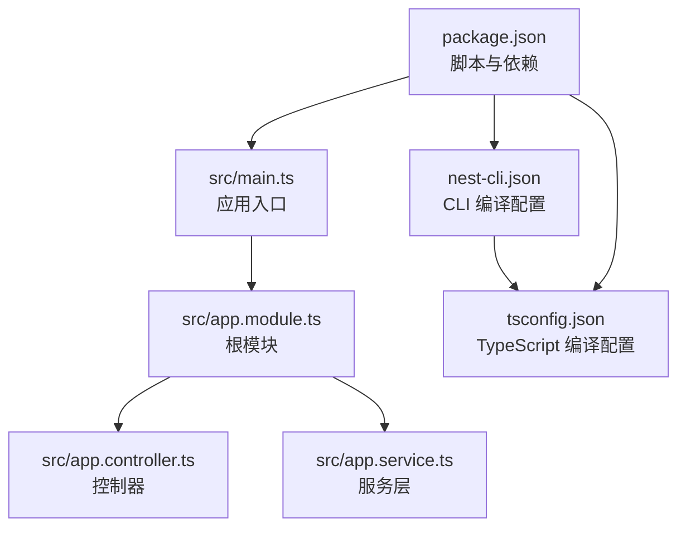
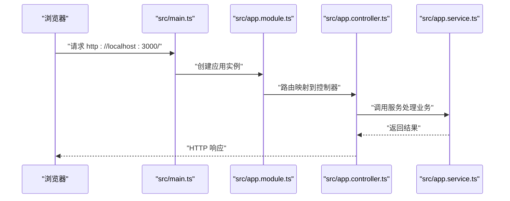
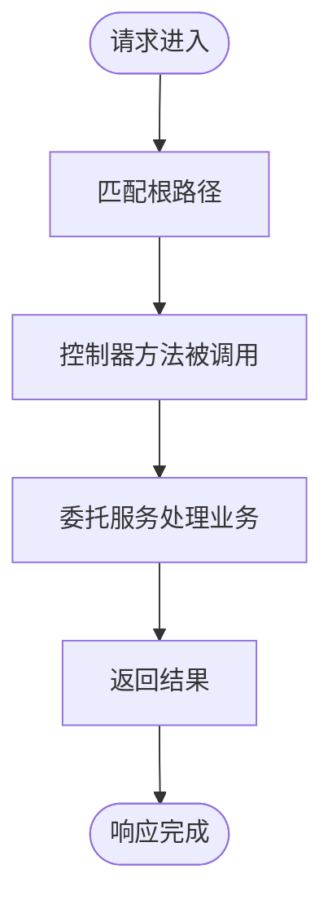
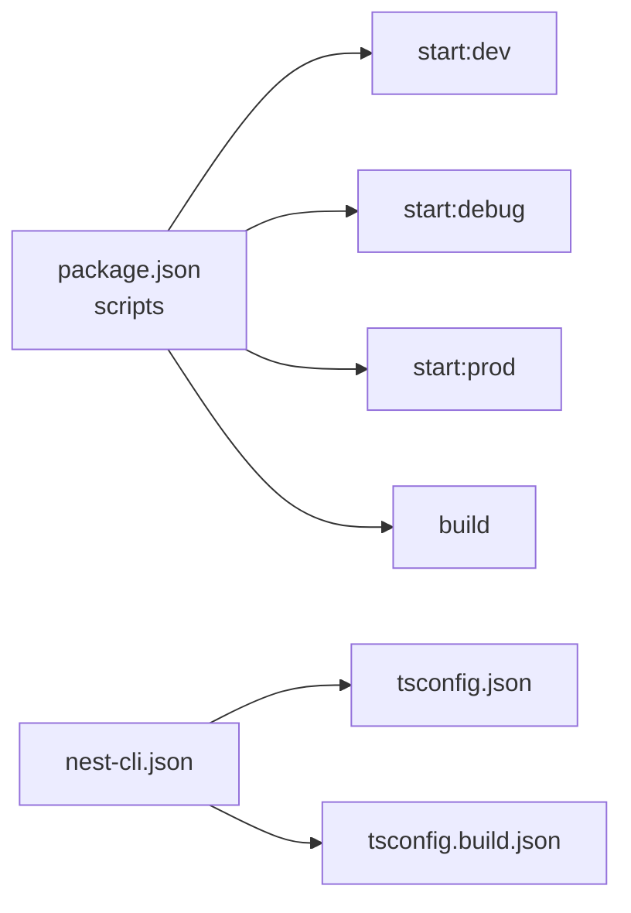

# 快速开始指南

<cite>
**本文引用的文件**
- [README.md](file://README.md)
- [package.json](file://package.json)
- [src/main.ts](file://src/main.ts)
- [src/app.module.ts](file://src/app.module.ts)
- [src/app.controller.ts](file://src/app.controller.ts)
- [src/app.service.ts](file://src/app.service.ts)
- [nest-cli.json](file://nest-cli.json)
- [tsconfig.json](file://tsconfig.json)
- [tsconfig.build.json](file://tsconfig.build.json)
</cite>

## 目录
1. [简介](#简介)
2. [项目结构](#项目结构)
3. [核心组件](#核心组件)
4. [架构概览](#架构概览)
5. [详细组件分析](#详细组件分析)
6. [依赖分析](#依赖分析)
7. [性能与运行建议](#性能与运行建议)
8. [故障排查指南](#故障排查指南)
9. [结论](#结论)
10. [附录](#附录)

## 简介
本指南面向首次接触 NestJS 的开发者，带你从零开始运行 nest-dome 项目。你将学会：
- 使用 pnpm 安装依赖并解决常见的网络问题
- 分步理解 pnpm run start 与 pnpm run start:dev 的区别
- 如何访问 http://localhost:3000 验证服务是否正常运行
- 构建（build）、生产启动（start:prod）与调试模式（start:debug）的使用场景与命令差异
- 常见初始化问题的排查方法，如端口占用、依赖安装失败等

## 项目结构
该项目采用标准的 NestJS 结构，包含源码目录、测试目录、CLI 配置与 TypeScript 编译配置。核心文件包括：
- 入口文件：src/main.ts
- 根模块：src/app.module.ts
- 控制器与服务：src/app.controller.ts、src/app.service.ts
- CLI 配置：nest-cli.json
- TypeScript 配置：tsconfig.json、tsconfig.build.json
- 包脚本与依赖：package.json

图表来源
- [src/main.ts](file://src/main.ts#L1-L24)
- [src/app.module.ts](file://src/app.module.ts#L1-L25)
- [src/app.controller.ts](file://src/app.controller.ts#L1-L42)
- [src/app.service.ts](file://src/app.service.ts#L1-L37)
- [nest-cli.json](file://nest-cli.json#L1-L9)
- [tsconfig.json](file://tsconfig.json#L1-L26)
- [package.json](file://package.json#L1-L73)

章节来源
- [README.md](file://README.md#L24-L45)
- [package.json](file://package.json#L1-L73)
- [nest-cli.json](file://nest-cli.json#L1-L9)
- [tsconfig.json](file://tsconfig.json#L1-L26)

## 核心组件
- 应用入口与启动
  - 入口文件通过工厂函数创建应用实例，并监听端口启动 HTTP 服务。默认端口来自环境变量，未设置时回退为 3000。
- 根模块
  - 根模块声明了控制器与服务，作为应用的“总指挥部”，负责组织应用的依赖关系。
- 控制器与服务
  - 控制器负责处理 HTTP 请求；服务封装业务逻辑，二者通过依赖注入协作。

章节来源
- [src/main.ts](file://src/main.ts#L1-L24)
- [src/app.module.ts](file://src/app.module.ts#L1-L25)
- [src/app.controller.ts](file://src/app.controller.ts#L1-L42)
- [src/app.service.ts](file://src/app.service.ts#L1-L37)

## 架构概览
下图展示了从浏览器访问到服务响应的关键流程，以及开发与生产模式的差异。

图表来源
- [src/main.ts](file://src/main.ts#L1-L24)
- [src/app.module.ts](file://src/app.module.ts#L1-L25)
- [src/app.controller.ts](file://src/app.controller.ts#L1-L42)
- [src/app.service.ts](file://src/app.service.ts#L1-L37)

## 详细组件分析

### 依赖安装与网络问题
- 使用 pnpm 安装依赖
  - 项目使用 pnpm 作为包管理器，安装命令在 README 中给出。若网络受限，可参考以下常见解决方案：
    - 切换镜像源：国内用户可配置 pnpm 使用淘宝镜像或其他可用镜像源，以提升下载速度。
    - 清理缓存：若安装卡住或报错，先清理 pnpm 缓存再重试。
    - 检查代理：若公司网络需要代理，请正确配置系统代理后再尝试安装。
    - 回退策略：若镜像源不稳定，可暂时切换到 npm/yarn 并使用对应安装命令，但需注意与项目 pnpm 锁定文件的兼容性。
- 锁定文件与版本
  - 项目包含 pnpm-lock.yaml，确保团队成员安装一致的依赖版本。首次安装建议保持默认行为，避免手动修改锁定文件。

章节来源
- [README.md](file://README.md#L28-L33)
- [package.json](file://package.json#L1-L73)

### 开发服务器启动与访问验证
- 启动开发服务器
  - 使用 pnpm run start:dev 启动开发模式。该模式会在代码变更时自动重启，适合本地开发与调试。
- 访问验证
  - 默认监听端口为 3000。启动成功后，在浏览器访问 http://localhost:3000 即可看到服务响应。
  - 若端口被占用，可在环境变量中调整端口，或停止占用端口的进程后重试。

章节来源
- [README.md](file://README.md#L34-L45)
- [src/main.ts](file://src/main.ts#L1-L24)
- [package.json](file://package.json#L1-L73)

### 构建（build）
- 作用与流程
  - 构建命令会编译 TypeScript 源码至 dist 目录，生成可运行的 JavaScript 文件。构建过程遵循 tsconfig.json 与 tsconfig.build.json 的配置。
- 输出位置
  - 编译输出位于 dist 目录，入口文件为 dist/main.js。

章节来源
- [package.json](file://package.json#L1-L73)
- [tsconfig.json](file://tsconfig.json#L1-L26)
- [tsconfig.build.json](file://tsconfig.build.json#L1-L5)

### 生产启动（start:prod）
- 适用场景
  - 在 CI/CD 或生产环境中部署时使用。该模式直接运行已编译的 dist/main.js。
- 命令差异
  - start:prod 与 start 的区别在于：start:prod 直接使用 Node 运行 dist/main.js，而 start 由 CLI 控制器决定运行方式（通常也指向 dist/main.js，但行为可能受 CLI 配置影响）。

章节来源
- [README.md](file://README.md#L34-L45)
- [package.json](file://package.json#L1-L73)

### 调试模式（start:debug）
- 适用场景
  - 需要断点调试时使用。该模式在开发模式基础上启用调试参数，便于在 IDE 中附加调试器进行断点调试。
- 命令差异
  - start:debug 与 start:dev 的主要差异在于启用了调试参数，使调试器能够连接到运行中的进程。

章节来源
- [README.md](file://README.md#L34-L45)
- [package.json](file://package.json#L1-L73)

### 控制器与服务的交互流程
- 路由与响应
  - 控制器通过装饰器将根路径映射到响应方法；该方法委托服务层处理业务逻辑并返回结果。
- 依赖注入
  - 控制器通过构造函数注入服务，实现松耦合与可测试性。

图表来源
- [src/app.controller.ts](file://src/app.controller.ts#L1-L42)
- [src/app.service.ts](file://src/app.service.ts#L1-L37)

章节来源
- [src/app.controller.ts](file://src/app.controller.ts#L1-L42)
- [src/app.service.ts](file://src/app.service.ts#L1-L37)

## 依赖分析
- 包脚本与命令映射
  - scripts 字段定义了常用命令与其对应的 nest/cli 行为。start:dev、start:debug、start:prod 等命令分别对应不同的运行模式。
- CLI 与编译配置
  - nest-cli.json 指定源码目录与编译选项（如删除输出目录），tsconfig.json 与 tsconfig.build.json 提供 TypeScript 编译规则。

图表来源
- [package.json](file://package.json#L1-L73)
- [nest-cli.json](file://nest-cli.json#L1-L9)
- [tsconfig.json](file://tsconfig.json#L1-L26)
- [tsconfig.build.json](file://tsconfig.build.json#L1-L5)

章节来源
- [package.json](file://package.json#L1-L73)
- [nest-cli.json](file://nest-cli.json#L1-L9)
- [tsconfig.json](file://tsconfig.json#L1-L26)
- [tsconfig.build.json](file://tsconfig.build.json#L1-L5)

## 性能与运行建议
- 开发阶段优先使用 start:dev，以便热更新与快速迭代。
- 生产部署前务必先执行 build，确保 dist 目录产物完整且符合预期。
- start:prod 适合在容器或服务器上稳定运行，建议结合进程管理工具（如 PM2）进行守护与日志管理。
- start:debug 仅用于开发调试，避免在生产环境开启。

[本节为通用建议，无需引用具体文件]

## 故障排查指南
- 端口占用
  - 现象：启动时报端口冲突。
  - 排查：确认 3000 端口是否被其他程序占用；可通过环境变量设置不同端口，或终止占用进程后重试。
  - 参考：入口文件监听端口的逻辑与默认端口回退。
- 依赖安装失败
  - 现象：pnpm install 报错或卡住。
  - 排查：检查网络与镜像源配置；清理 pnpm 缓存后重试；必要时切换到 npm/yarn 并注意版本兼容性。
- 构建失败
  - 现象：pnpm run build 报错。
  - 排查：检查 TypeScript 配置与源码语法；确认 tsconfig.json 与 tsconfig.build.json 的一致性；排除类型错误与导出问题。
- 访问异常
  - 现象：浏览器无法访问 http://localhost:3000。
  - 排查：确认服务已启动且无报错；检查防火墙与代理设置；确保未被其他安全软件拦截。

章节来源
- [src/main.ts](file://src/main.ts#L1-L24)
- [README.md](file://README.md#L28-L45)
- [package.json](file://package.json#L1-L73)
- [tsconfig.json](file://tsconfig.json#L1-L26)

## 结论
通过本指南，你可以顺利完成 nest-dome 项目的首次运行：使用 pnpm 安装依赖、选择合适的启动模式（开发/生产/调试）、构建产物并在本地验证服务。遇到问题时，可依据本指南的排查步骤快速定位并解决。随着对项目结构与命令的理解加深，你将能够更高效地进行开发与部署。

[本节为总结，无需引用具体文件]

## 附录
- 常用命令清单
  - 安装依赖：pnpm install
  - 开发启动：pnpm run start:dev
  - 生产启动：pnpm run start:prod
  - 构建：pnpm run build
  - 调试启动：pnpm run start:debug
- 访问地址
  - http://localhost:3000

章节来源
- [README.md](file://README.md#L28-L45)
- [package.json](file://package.json#L1-L73)