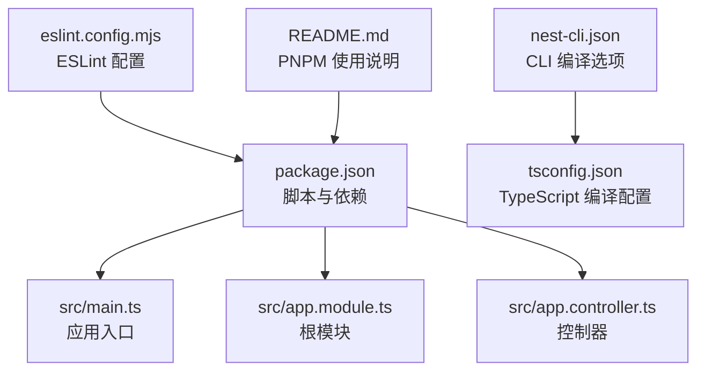
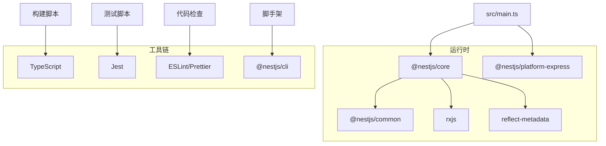
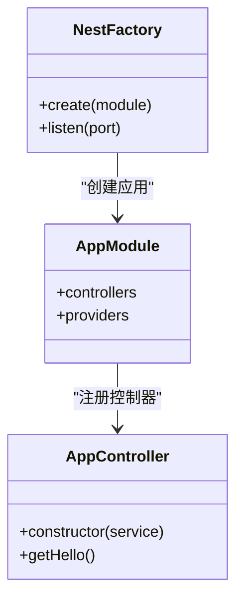
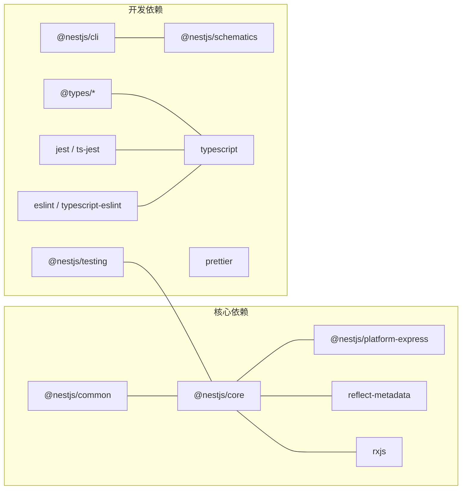

# 技术栈与依赖

<cite>
**本文引用的文件**
- [package.json](file://package.json)
- [README.md](file://README.md)
- [nest-cli.json](file://nest-cli.json)
- [tsconfig.json](file://tsconfig.json)
- [eslint.config.mjs](file://eslint.config.mjs)
- [src/main.ts](file://src/main.ts)
- [src/app.module.ts](file://src/app.module.ts)
- [src/app.controller.ts](file://src/app.controller.ts)
</cite>

## 目录
1. [引言](#引言)
2. [项目结构](#项目结构)
3. [核心组件](#核心组件)
4. [架构总览](#架构总览)
5. [详细组件分析](#详细组件分析)
6. [依赖关系分析](#依赖关系分析)
7. [性能考量](#性能考量)
8. [故障排查指南](#故障排查指南)
9. [结论](#结论)
10. [附录](#附录)

## 引言
本节聚焦于 nest-dome 项目的依赖技术栈构成，基于 package.json 文件进行精确分析，并结合项目中的 CLI、TypeScript 编译配置与测试配置，系统梳理核心依赖与开发依赖的作用、版本范围与兼容性，解释 reflect-metadata 与 rxjs 在 Nest.js 运行时的关键角色，说明 PNPM 作为包管理工具的选择依据及其在脚本中的体现，并给出依赖管理的最佳实践建议，帮助开发者安全升级与处理潜在版本冲突。

## 项目结构
该项目采用标准的 NestJS 项目布局，包含源码目录、测试目录、构建与编译配置、以及包管理与脚手架配置：
- 源码位于 src 目录，包含应用入口、根模块与示例控制器/服务
- 测试位于 test 目录，包含 e2e 测试配置
- 构建与编译通过 nest-cli.json 与 tsconfig.json 配置
- 包管理与脚手架通过 package.json 与 nest-cli.json 定义

图表来源
- [package.json](file://package.json#L1-L73)
- [src/main.ts](file://src/main.ts#L1-L24)
- [src/app.module.ts](file://src/app.module.ts#L1-L25)
- [src/app.controller.ts](file://src/app.controller.ts#L1-L42)
- [nest-cli.json](file://nest-cli.json#L1-L9)
- [tsconfig.json](file://tsconfig.json#L1-L26)
- [eslint.config.mjs](file://eslint.config.mjs#L1-L36)
- [README.md](file://README.md#L29-L45)

章节来源
- [package.json](file://package.json#L1-L73)
- [nest-cli.json](file://nest-cli.json#L1-L9)
- [tsconfig.json](file://tsconfig.json#L1-L26)
- [eslint.config.mjs](file://eslint.config.mjs#L1-L36)
- [README.md](file://README.md#L29-L45)

## 核心组件
本节按“核心依赖”和“开发依赖”两类梳理，明确各依赖在项目中的职责与版本范围，并说明它们之间的兼容性关系。

- 核心依赖（运行时）
  - @nestjs/common：提供装饰器、注解、日志、异常、模块系统等基础能力
  - @nestjs/core：提供应用工厂、依赖注入容器、生命周期钩子等核心运行时能力
  - @nestjs/platform-express：提供基于 Express 的 HTTP 服务器适配层
  - reflect-metadata：用于支持装饰器元数据反射，是 NestJS 依赖注入与装饰器功能的基础
  - rxjs：NestJS 内部广泛使用响应式流，用于事件处理、异步数据流与可观测序列

- 开发依赖（工具链）
  - @nestjs/cli、@nestjs/schematics、@nestjs/testing：脚手架生成、模板与测试工具
  - @types/*：Express、Jest、Node、Supertest 的类型声明
  - typescript、ts-node、tsconfig-paths、ts-loader：TypeScript 编译与运行时支持
  - jest、ts-jest、supertest：单元与 e2e 测试框架与断言库
  - eslint、typescript-eslint、eslint-config-prettier、eslint-plugin-prettier：代码质量与格式化
  - prettier、source-map-support：代码格式化与调试支持
  - @eslint/eslintrc、@eslint/js、globals：ESLint 配置与全局规则

版本范围与兼容性要点
- 核心依赖版本均采用 ^ 语义化版本，当前锁定在 11.x 左右，与 TypeScript 5.x、Jest 30.x、ESLint 9.x 等工具链保持一致的主版本生态
- reflect-metadata 与 rxjs 的版本范围满足 NestJS 11 的最低要求，确保装饰器反射与响应式流正常工作
- 开发依赖版本整体与 NestJS 11 生态对齐，避免跨版本不兼容导致的构建或测试失败

章节来源
- [package.json](file://package.json#L22-L54)
- [tsconfig.json](file://tsconfig.json#L1-L26)
- [eslint.config.mjs](file://eslint.config.mjs#L1-L36)

## 架构总览
下图展示了应用启动与依赖交互的高层视图，突出核心运行时依赖与工具链的关系。

图表来源
- [src/main.ts](file://src/main.ts#L1-L24)
- [package.json](file://package.json#L22-L54)
- [tsconfig.json](file://tsconfig.json#L1-L26)
- [eslint.config.mjs](file://eslint.config.mjs#L1-L36)

## 详细组件分析

### 核心运行时依赖：@nestjs/common、@nestjs/core、@nestjs/platform-express
- @nestjs/common
  - 职责：提供装饰器（如 @Controller、@Injectable）、异常过滤器、日志、管道、守卫、模块系统等基础设施
  - 兼容性：与 @nestjs/core 协同工作，版本需与 NestJS 主版本保持一致
- @nestjs/core
  - 职责：应用工厂（NestFactory）、依赖注入容器、生命周期钩子、模块加载与装配
  - 兼容性：与 @nestjs/common、@nestjs/platform-express、reflect-metadata、rxjs 紧密耦合
- @nestjs/platform-express
  - 职责：提供基于 Express 的 HTTP 服务器适配层，负责请求/响应处理与中间件集成
  - 兼容性：与 @nestjs/core 版本对齐，确保模块系统与运行时行为一致

图表来源
- [src/main.ts](file://src/main.ts#L1-L24)
- [src/app.module.ts](file://src/app.module.ts#L1-L25)
- [src/app.controller.ts](file://src/app.controller.ts#L1-L42)

章节来源
- [src/main.ts](file://src/main.ts#L1-L24)
- [src/app.module.ts](file://src/app.module.ts#L1-L25)
- [src/app.controller.ts](file://src/app.controller.ts#L1-L42)

### 运行时关键角色：reflect-metadata 与 rxjs
- reflect-metadata
  - 角色：为装饰器提供元数据反射能力，支撑依赖注入、参数类型解析、模块扫描等功能
  - 配置：tsconfig.json 中启用 emitDecoratorMetadata 与 experimentalDecorators，确保装饰器元数据在编译期保留
- rxjs
  - 角色：NestJS 内部广泛使用响应式流处理异步事件、观察者模式与可组合的数据流
  - 影响：与 @nestjs/core 协作，保证模块生命周期、异常传播与中间件等机制的响应式特性

章节来源
- [tsconfig.json](file://tsconfig.json#L1-L26)
- [package.json](file://package.json#L22-L29)

### 包管理工具：PNPM 的选择与脚本体现
- 选择依据
  - 快速安装：PNPM 通过硬链接与符号链接减少磁盘占用与安装时间
  - 一致性：严格锁定版本，避免不同环境下的依赖差异
  - 脚本友好：与 NestJS CLI、TypeScript、Jest 等工具链配合良好
- 在脚本中的体现
  - README 明确使用 pnpm install、pnpm run start、pnpm run test 等命令
  - package.json 中的 scripts 与 nest-cli.json 的 compilerOptions 配置共同构成完整的开发与构建流程

章节来源
- [README.md](file://README.md#L29-L45)
- [package.json](file://package.json#L8-L21)
- [nest-cli.json](file://nest-cli.json#L1-L9)

### 开发依赖与工具链：Jest、TypeScript、ESLint 等
- Jest 与 ts-jest
  - 职责：单元测试与覆盖率统计，ts-jest 将 TypeScript 源码转换为可执行的 JavaScript
  - 配置：jest 字段定义了模块扩展名、根目录、测试正则、转换规则与覆盖率输出目录
- TypeScript 与 ts-node/tsconfig-paths
  - 职责：类型检查、编译与运行时路径映射，支持开发与调试场景
  - 配置：tsconfig.json 指定 nodenext 模块系统、装饰器元数据、目标版本等
- ESLint 与 Prettier
  - 职责：静态检查与代码风格统一，eslint.config.mjs 集成推荐规则与 Prettier 插件
  - 配置：tseslint 推荐类型检查配置，globals 注入 Node/Jest 全局变量

章节来源
- [package.json](file://package.json#L8-L21)
- [package.json](file://package.json#L55-L71)
- [tsconfig.json](file://tsconfig.json#L1-L26)
- [eslint.config.mjs](file://eslint.config.mjs#L1-L36)

## 依赖关系分析
下图展示 package.json 中核心依赖与开发依赖之间的关系与版本策略。

图表来源
- [package.json](file://package.json#L22-L54)

章节来源
- [package.json](file://package.json#L22-L54)

## 性能考量
- 依赖体积与安装速度
  - 使用 PNPM 的硬链接机制减少重复依赖的存储与网络传输
  - 锁定文件（pnpm-lock.yaml）确保多环境一致的安装结果
- 构建与测试效率
  - TypeScript 采用增量编译与源码映射，提升开发体验
  - Jest 支持 watch 模式与覆盖率收集，缩短反馈周期
- 运行时性能
  - NestJS 11 与 RxJS 7 的组合在响应式数据流与模块装配上具备较高性能表现
  - Express 平台适配层在高并发场景下表现稳定

[本节为通用性能讨论，无需列出章节来源]

## 故障排查指南
- 依赖版本冲突
  - 现象：安装阶段报错或运行时报错找不到模块
  - 处理：优先使用 PNPM 的锁定文件，必要时通过 pnpm update 或 pnpm add 指定版本范围
- 装饰器反射问题
  - 现象：依赖注入失败或装饰器元数据缺失
  - 处理：确认 tsconfig.json 中已启用 emitDecoratorMetadata 与 experimentalDecorators
- 测试环境异常
  - 现象：Jest 无法识别 TypeScript 或覆盖率统计异常
  - 处理：检查 jest 字段与 ts-jest 转换规则；确保 tsconfig-paths 正常工作
- ESLint 规则冲突
  - 现象：编辑器提示规则冲突或 CI 报错
  - 处理：遵循 eslint.config.mjs 的推荐配置，必要时调整规则级别

章节来源
- [tsconfig.json](file://tsconfig.json#L1-L26)
- [package.json](file://package.json#L55-L71)
- [eslint.config.mjs](file://eslint.config.mjs#L1-L36)

## 结论
本项目围绕 NestJS 11 生态构建，核心运行时依赖（@nestjs/common、@nestjs/core、@nestjs/platform-express）与工具链（TypeScript、Jest、ESLint、PNPM）协同工作，形成稳定的开发与生产环境。reflect-metadata 与 rxjs 在装饰器反射与响应式流方面发挥关键作用。通过严格的版本范围与锁定文件，项目在兼容性与性能之间取得平衡。建议在升级时遵循主版本对齐原则，优先使用 PNPM 的锁定与增量更新策略，以降低版本冲突风险。

[本节为总结性内容，无需列出章节来源]

## 附录
- 最佳实践建议
  - 升级策略：先升级 @nestjs/* 到同一主版本，再同步升级 TypeScript、Jest、ESLint 等工具链
  - 版本锁定：使用 pnpm-lock.yaml 固定依赖版本，避免 CI 与本地环境差异
  - 渐进式升级：每次仅变更少量依赖，配合 Jest 与 ESLint 快速验证
  - 兼容性检查：关注装饰器与响应式流相关 API 的变更，确保 reflect-metadata 与 rxjs 版本满足最低要求
  - 脚本一致性：统一使用 pnpm 命令，避免混用 npm/yarn 导致的锁文件不一致

[本节为通用指导，无需列出章节来源]