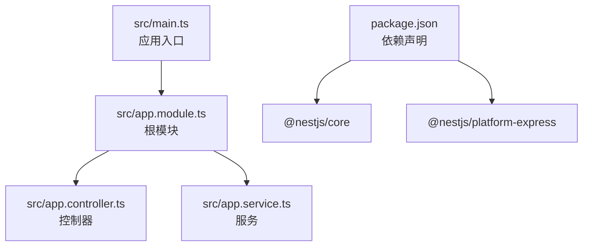
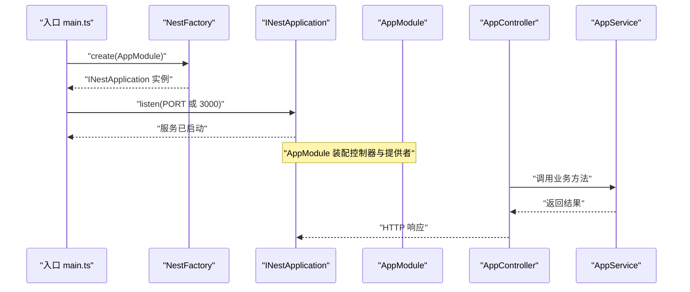
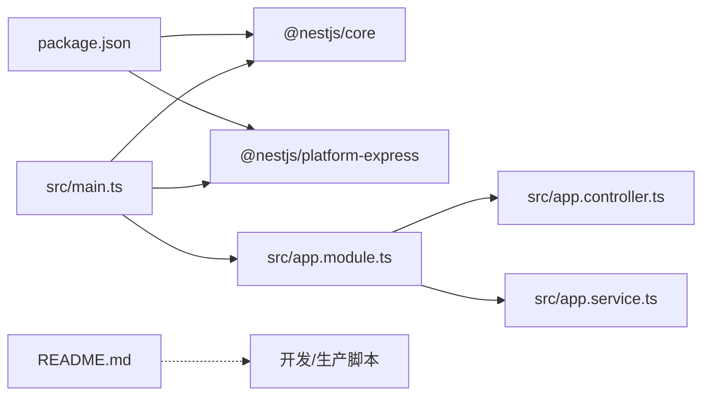

# 应用入口

<cite>
**本文引用的文件**
- [src/main.ts](file://src/main.ts)
- [src/app.module.ts](file://src/app.module.ts)
- [src/app.controller.ts](file://src/app.controller.ts)
- [src/app.service.ts](file://src/app.service.ts)
- [package.json](file://package.json)
- [README.md](file://README.md)
- [test/app.e2e-spec.ts](file://test/app.e2e-spec.ts)
</cite>

## 目录
1. [简介](#简介)
2. [项目结构](#项目结构)
3. [核心组件](#核心组件)
4. [架构总览](#架构总览)
5. [详细组件分析](#详细组件分析)
6. [依赖关系分析](#依赖关系分析)
7. [性能与启动特性](#性能与启动特性)
8. [故障排查指南](#故障排查指南)
9. [结论](#结论)
10. [附录：扩展启动配置](#附录扩展启动配置)

## 简介
本文件围绕 NEST 应用的启动入口 main.ts 展开，系统性解析以下关键点：
- NestFactory 如何创建应用实例并加载 AppModule
- 异步函数 bootstrap() 的执行流程：应用实例创建、端口监听（支持环境变量 PORT 或默认 3000）、服务启动
- 结合代码示例展示 NestJS 框架的启动机制，阐明其如何集成 Express 底层服务
- 常见问题排查指引（端口占用、模块加载失败等）
- 启动配置扩展建议（启用 CORS、设置全局前缀等）

## 项目结构
该仓库采用典型的 NestJS 单体应用结构，入口文件位于 src/main.ts，根模块为 src/app.module.ts，控制器与服务分别在 src/app.controller.ts 和 src/app.service.ts 中定义。package.json 显示依赖了 @nestjs/core 与 @nestjs/platform-express，表明底层运行时基于 Express。

图表来源
- [src/main.ts](file://src/main.ts#L1-L24)
- [src/app.module.ts](file://src/app.module.ts#L1-L25)
- [src/app.controller.ts](file://src/app.controller.ts#L1-L42)
- [src/app.service.ts](file://src/app.service.ts#L1-L37)
- [package.json](file://package.json#L1-L73)

章节来源
- [src/main.ts](file://src/main.ts#L1-L24)
- [src/app.module.ts](file://src/app.module.ts#L1-L25)
- [package.json](file://package.json#L1-L73)

## 核心组件
- 入口文件 main.ts
  - 通过 NestFactory.create(AppModule) 创建应用实例
  - 使用 app.listen(process.env.PORT ?? 3000) 监听端口并启动服务
- 根模块 app.module.ts
  - 使用 @Module 装饰器声明控制器与提供者，作为应用装配中心
- 控制器 app.controller.ts
  - 使用 @Controller() 与 @Get() 将根路径映射到业务方法
- 服务 app.service.ts
  - 使用 @Injectable() 标注，提供业务逻辑（如返回问候语）

章节来源
- [src/main.ts](file://src/main.ts#L1-L24)
- [src/app.module.ts](file://src/app.module.ts#L1-L25)
- [src/app.controller.ts](file://src/app.controller.ts#L1-L42)
- [src/app.service.ts](file://src/app.service.ts#L1-L37)

## 架构总览
下图展示了从入口到控制器的调用链路，以及底层平台集成关系。

图表来源
- [src/main.ts](file://src/main.ts#L1-L24)
- [src/app.module.ts](file://src/app.module.ts#L1-L25)
- [src/app.controller.ts](file://src/app.controller.ts#L1-L42)
- [src/app.service.ts](file://src/app.service.ts#L1-L37)

## 详细组件分析

### 入口文件 main.ts：启动流程与平台集成
- NestFactory.create(AppModule)
  - 作用：扫描 AppModule 及其依赖，构建依赖注入容器与应用上下文
  - 返回：INestApplication 实例（具备 listen、use、getHttpServer 等能力）
- app.listen(process.env.PORT ?? 3000)
  - 作用：启动 HTTP 服务器，监听指定端口
  - 默认行为：未设置环境变量时使用 3000
- 平台集成
  - 由于依赖 @nestjs/platform-express，底层运行时为 Express
  - 可通过 app.use(...)、app.setGlobalPrefix(...) 等扩展配置

章节来源
- [src/main.ts](file://src/main.ts#L1-L24)
- [package.json](file://package.json#L1-L73)

### 根模块 app.module.ts：模块装配与依赖注入
- @Module({ controllers, providers })
  - controllers：声明控制器集合，建立路由映射
  - providers：声明可注入服务，由 Nest IoC 容器统一管理
- AppModule 本身为空类，配置集中在装饰器对象中

章节来源
- [src/app.module.ts](file://src/app.module.ts#L1-L25)

### 控制器 app.controller.ts：路由与业务委托
- @Controller()：将类标记为控制器，默认根路径前缀
- @Get()：将方法映射到 GET 请求，返回字符串
- 依赖注入：构造函数注入 AppService，控制器仅负责路由分发

章节来源
- [src/app.controller.ts](file://src/app.controller.ts#L1-L42)

### 服务 app.service.ts：业务逻辑承载
- @Injectable()：标注可注入服务，提供 getHello() 方法
- 依赖注入：由 Nest 自动创建并注入到控制器

章节来源
- [src/app.service.ts](file://src/app.service.ts#L1-L37)

### 测试验证：端到端请求链路
- 测试文件通过 createNestApplication() 初始化应用，随后发起 HTTP 请求
- 断言返回状态码与响应体，验证控制器到服务的完整链路

章节来源
- [test/app.e2e-spec.ts](file://test/app.e2e-spec.ts#L1-L25)

## 依赖关系分析
- main.ts 依赖 NestFactory 与 AppModule
- AppModule 依赖 AppController 与 AppService
- package.json 显式声明 @nestjs/core 与 @nestjs/platform-express
- README.md 提供开发与生产启动脚本说明

图表来源
- [src/main.ts](file://src/main.ts#L1-L24)
- [src/app.module.ts](file://src/app.module.ts#L1-L25)
- [src/app.controller.ts](file://src/app.controller.ts#L1-L42)
- [src/app.service.ts](file://src/app.service.ts#L1-L37)
- [package.json](file://package.json#L1-L73)
- [README.md](file://README.md#L1-L99)

章节来源
- [package.json](file://package.json#L1-L73)
- [README.md](file://README.md#L1-L99)

## 性能与启动特性
- 异步启动：bootstrap() 为异步函数，确保创建与监听均为异步完成
- 默认端口：未设置环境变量时使用 3000，便于本地开发
- 平台选择：依赖 @nestjs/platform-express，底层基于 Express，具备良好的生态兼容性
- 启动顺序：先装配 AppModule，再启动 HTTP 服务，保证路由与服务可用

章节来源
- [src/main.ts](file://src/main.ts#L1-L24)
- [package.json](file://package.json#L1-L73)

## 故障排查指南
- 端口占用
  - 现象：启动时报端口冲突错误
  - 排查：检查是否已有进程占用了默认端口；修改环境变量 PORT 或释放占用端口
  - 验证：更换端口后再次启动，确认服务正常监听
- 模块加载失败
  - 现象：应用无法启动，提示模块或依赖缺失
  - 排查：确认 AppModule 是否正确导出；检查依赖安装与版本匹配；核对控制器与服务的导入路径
  - 验证：最小化复现，逐步恢复功能，定位问题模块
- 控制器无响应
  - 现象：访问根路径无返回
  - 排查：确认 @Controller() 与 @Get() 装饰器使用正确；检查服务方法返回值
  - 验证：通过端到端测试或浏览器访问验证
- 生产启动异常
  - 现象：pnpm run start:prod 报错
  - 排查：确认已编译生成 dist 目录；检查运行时 Node 版本与依赖
  - 验证：本地运行 node dist/main 验证

章节来源
- [src/main.ts](file://src/main.ts#L1-L24)
- [src/app.module.ts](file://src/app.module.ts#L1-L25)
- [src/app.controller.ts](file://src/app.controller.ts#L1-L42)
- [src/app.service.ts](file://src/app.service.ts#L1-L37)
- [README.md](file://README.md#L1-L99)

## 结论
main.ts 作为 NestJS 应用的唯一入口，通过 NestFactory.create(AppModule) 完成应用实例创建与模块装配，随后以异步方式监听端口并启动服务。该流程清晰、简洁，且与 Express 平台无缝集成。结合本仓库的最小化实现，读者可快速理解 NestJS 的启动机制，并在此基础上扩展 CORS、全局前缀、中间件等高级配置。

## 附录：扩展启动配置
以下为常见扩展场景的实践建议（以代码片段路径代替具体代码）：
- 启用 CORS
  - 在入口处获取应用实例后，调用 app.enableCors() 或 app.use(cors())（需安装 cors 中间件）
  - 参考路径：[src/main.ts](file://src/main.ts#L1-L24)
- 设置全局前缀
  - 在入口处调用 app.setGlobalPrefix("api")，使所有路由前缀统一为 /api
  - 参考路径：[src/main.ts](file://src/main.ts#L1-L24)
- 启用中间件
  - 在入口处调用 app.use(...) 注册中间件（如日志、限流等）
  - 参考路径：[src/main.ts](file://src/main.ts#L1-L24)
- 自定义异常过滤器/拦截器
  - 在入口处调用 app.useGlobalFilters(...) 或 app.useGlobalInterceptors(...)
  - 参考路径：[src/main.ts](file://src/main.ts#L1-L24)
- 配置静态资源
  - 在入口处调用 app.useStaticAssets(...) 或 app.setBaseHref(...)
  - 参考路径：[src/main.ts](file://src/main.ts#L1-L24)

章节来源
- [src/main.ts](file://src/main.ts#L1-L24)