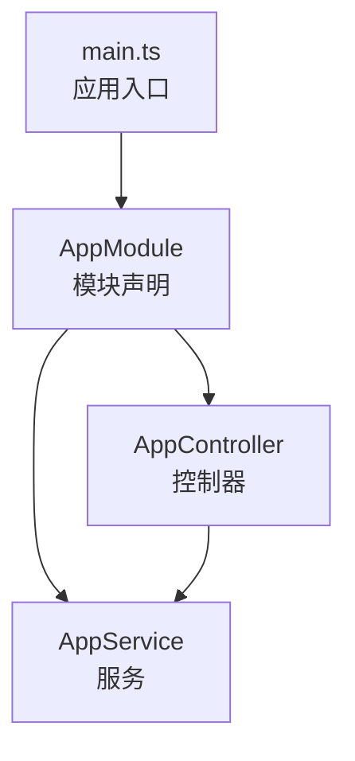
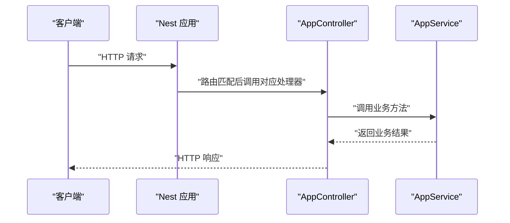
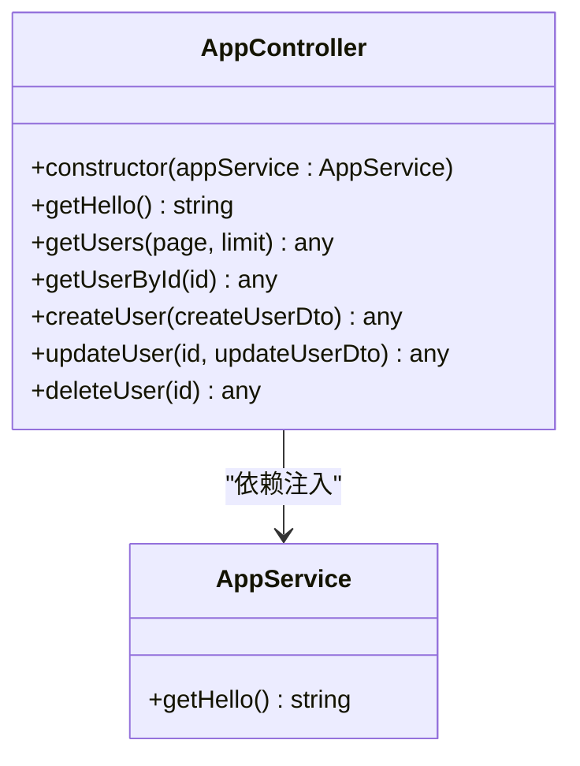
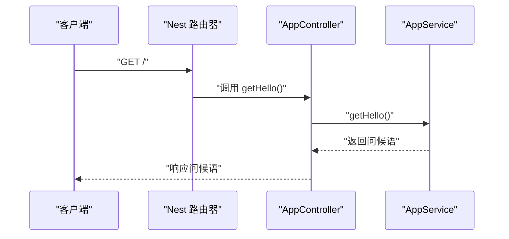
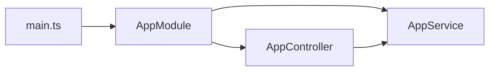

# 控制器层

<cite>
**本文引用的文件**
- [src/app.controller.ts](file://src/app.controller.ts)
- [src/app.service.ts](file://src/app.service.ts)
- [src/app.module.ts](file://src/app.module.ts)
- [src/main.ts](file://src/main.ts)
- [src/app.controller.spec.ts](file://src/app.controller.spec.ts)
</cite>

## 目录
1. [引言](#引言)
2. [项目结构](#项目结构)
3. [核心组件](#核心组件)
4. [架构总览](#架构总览)
5. [详细组件分析](#详细组件分析)
6. [依赖关系分析](#依赖关系分析)
7. [性能考量](#性能考量)
8. [故障排查指南](#故障排查指南)
9. [结论](#结论)
10. [附录：最佳实践与扩展建议](#附录最佳实践与扩展建议)

## 引言
本节聚焦于控制器层的实现机制，围绕以下目标展开：
- 全面解析 AppController 的实现，重点说明 @Controller() 装饰器的作用及其路由前缀配置方式
- 分析 @Get() 装饰器如何绑定 HTTP GET 请求到根路径 '/'，并处理客户端请求
- 详细描述构造函数中通过 private readonly 语法实现的依赖注入，即 AppController 如何获取 AppService 实例
- 结合实际请求流程，展示控制器作为请求协调者的角色：接收请求、调用服务、返回响应
- 提供添加新路由、参数解析（如 @Param、@Query）、状态码控制的最佳实践

## 项目结构
该项目采用典型的 NestJS 应用结构，控制器、服务、模块与入口文件分布清晰：
- 控制器：负责定义路由与处理请求
- 服务：封装业务逻辑
- 模块：声明控制器与提供者，并进行依赖装配
- 入口：应用启动与端口监听

图表来源
- [src/main.ts](file://src/main.ts#L1-L9)
- [src/app.module.ts](file://src/app.module.ts#L1-L10)
- [src/app.controller.ts](file://src/app.controller.ts#L1-L20)
- [src/app.service.ts](file://src/app.service.ts#L1-L9)

章节来源
- [src/main.ts](file://src/main.ts#L1-L9)
- [src/app.module.ts](file://src/app.module.ts#L1-L10)

## 核心组件
- AppController：定义多个路由处理器，演示 GET/POST/PUT/DELETE 等常见操作；使用装饰器进行路由映射与参数解析
- AppService：提供基础业务方法（例如返回问候语），由控制器在构造函数中注入使用
- AppModule：声明控制器与提供者，完成依赖注入容器的装配
- main.ts：应用启动入口，创建 Nest 应用并监听端口

章节来源
- [src/app.controller.ts](file://src/app.controller.ts#L1-L96)
- [src/app.service.ts](file://src/app.service.ts#L1-L9)
- [src/app.module.ts](file://src/app.module.ts#L1-L10)
- [src/main.ts](file://src/main.ts#L1-L9)

## 架构总览
下图展示了从客户端请求到响应返回的关键流转，体现控制器作为请求协调者的职责。

图表来源
- [src/app.controller.ts](file://src/app.controller.ts#L1-L20)
- [src/app.service.ts](file://src/app.service.ts#L1-L9)
- [src/main.ts](file://src/main.ts#L1-L9)

## 详细组件分析

### AppController：装饰器与路由前缀
- @Controller() 装饰器用于标记类为控制器。在当前项目中，@Controller() 未传入显式参数，这意味着该控制器不设置全局路由前缀。所有路由处理器将以根路径开始进行匹配
- 路由处理器通过 @Get()、@Post()、@Put()、@Delete() 等装饰器声明，分别绑定到对应的 HTTP 方法
- 示例：
  - @Get() 绑定到根路径 '/'，返回问候语
  - @Get('users') 绑定到 '/users'
  - @Get('users/:id') 绑定到 '/users/:id'，用于按 ID 查询用户

章节来源
- [src/app.controller.ts](file://src/app.controller.ts#L1-L20)
- [src/app.controller.ts](file://src/app.controller.ts#L22-L52)
- [src/app.controller.ts](file://src/app.controller.ts#L54-L94)

### 参数解析与数据绑定
- @Param('id')：从路由路径参数中提取 id 并注入到处理器形参
- @Query('page'|'limit')：从查询字符串中提取分页参数并注入到处理器形参
- @Body()：从请求体中解析 JSON 数据并注入到处理器形参
- 示例：
  - 用户列表接口使用 @Query('page') 和 @Query('limit')
  - 按 ID 查询用户接口使用 @Param('id')
  - 创建/更新用户接口使用 @Body()

章节来源
- [src/app.controller.ts](file://src/app.controller.ts#L22-L52)
- [src/app.controller.ts](file://src/app.controller.ts#L41-L52)
- [src/app.controller.ts](file://src/app.controller.ts#L55-L68)
- [src/app.controller.ts](file://src/app.controller.ts#L71-L85)

### 依赖注入与构造函数
- 在构造函数中通过 private readonly 语法声明并注入 AppService 实例
- 这种写法同时完成两个职责：
  - 将 AppService 注入为受保护且不可变的成员变量
  - 使 TypeScript 编译器生成相应字段，便于依赖注入容器识别与装配
- 控制器在处理器中直接调用注入的服务方法，实现“控制器只做编排、服务做业务”的分层

图表来源
- [src/app.controller.ts](file://src/app.controller.ts#L1-L20)
- [src/app.service.ts](file://src/app.service.ts#L1-L9)

章节来源
- [src/app.controller.ts](file://src/app.controller.ts#L1-L20)
- [src/app.service.ts](file://src/app.service.ts#L1-L9)

### 请求处理流程（以根路径 GET 为例）
- 客户端向根路径发送 GET 请求
- Nest 路由器根据 @Get() 装饰器匹配到 AppController.getHello 处理器
- 处理器调用注入的 AppService.getHello 返回业务结果
- 控制器将结果返回给客户端

图表来源
- [src/app.controller.ts](file://src/app.controller.ts#L1-L20)
- [src/app.service.ts](file://src/app.service.ts#L1-L9)

章节来源
- [src/app.controller.ts](file://src/app.controller.ts#L1-L20)
- [src/app.controller.spec.ts](file://src/app.controller.spec.ts#L1-L23)

### 添加新路由的最佳实践
- 明确 HTTP 方法与路径：优先使用 @Get/@Post/@Put/@Delete 对应的装饰器
- 使用路径参数与查询参数时，保持命名一致且语义明确
- 对于复杂业务，尽量将核心逻辑下沉至服务层，控制器仅做编排与数据转换
- 为每个路由处理器提供清晰的返回结构（如统一 success/data 字段）

章节来源
- [src/app.controller.ts](file://src/app.controller.ts#L22-L94)

### 参数解析与类型安全
- @Param/@Query/@Body 可与类型注解配合，提升可维护性与 IDE 支持
- 对于查询参数，建议提供默认值，避免空值导致的运行时错误
- 对于路由参数，建议在处理器内进行必要的类型转换与校验

章节来源
- [src/app.controller.ts](file://src/app.controller.ts#L22-L52)
- [src/app.controller.ts](file://src/app.controller.ts#L41-L52)
- [src/app.controller.ts](file://src/app.controller.ts#L55-L68)
- [src/app.controller.ts](file://src/app.controller.ts#L71-L85)

### 状态码控制与响应格式
- 当前示例返回的是纯文本或对象，未显式设置 HTTP 状态码
- 在生产环境中，建议：
  - 使用 @Res() 或 @HttpCode() 控制状态码
  - 使用 @Header() 设置响应头
  - 对异常场景使用 @Catch() 与 @ExceptionFilter() 统一处理并返回标准错误格式

章节来源
- [src/app.controller.ts](file://src/app.controller.ts#L1-L96)

## 依赖关系分析
- AppModule 声明控制器与提供者，完成依赖注入容器的装配
- AppController 依赖 AppService，通过构造函数注入
- main.ts 创建应用并启动监听

图表来源
- [src/app.module.ts](file://src/app.module.ts#L1-L10)
- [src/app.controller.ts](file://src/app.controller.ts#L1-L20)
- [src/app.service.ts](file://src/app.service.ts#L1-L9)
- [src/main.ts](file://src/main.ts#L1-L9)

章节来源
- [src/app.module.ts](file://src/app.module.ts#L1-L10)
- [src/app.controller.ts](file://src/app.controller.ts#L1-L20)
- [src/app.service.ts](file://src/app.service.ts#L1-L9)
- [src/main.ts](file://src/main.ts#L1-L9)

## 性能考量
- 控制器应尽量保持轻量，避免在其中执行耗时操作
- 将计算密集型任务移至服务层或异步任务队列
- 合理使用缓存与分页参数，降低数据库压力
- 对高频接口进行限流与监控

## 故障排查指南
- 路由无法访问
  - 检查控制器是否已在模块中声明
  - 确认装饰器路径与请求路径一致
- 参数解析失败
  - 确认 @Param/@Query/@Body 的键名与客户端请求一致
  - 为可选参数提供默认值
- 依赖注入报错
  - 确保服务已在模块 providers 中声明
  - 检查构造函数注入的类型与名称是否正确

章节来源
- [src/app.module.ts](file://src/app.module.ts#L1-L10)
- [src/app.controller.ts](file://src/app.controller.ts#L1-L20)

## 结论
AppController 展示了 NestJS 控制器层的典型用法：通过装饰器声明路由、利用依赖注入获取服务实例、在处理器中编排业务并返回响应。结合本项目中的示例，可以快速理解控制器在请求生命周期中的职责边界，并在此基础上扩展更多路由与参数解析能力。

## 附录：最佳实践与扩展建议
- 新增路由
  - 使用 @Get/@Post/@Put/@Delete 对应装饰器
  - 路径设计遵循 REST 风格，资源名词复数化
- 参数解析
  - @Param：用于路径参数，注意类型转换
  - @Query：用于查询参数，提供默认值
  - @Body：用于请求体，结合 DTO 进行校验
- 状态码与响应
  - 统一返回结构（success/data/message）
  - 使用 @HttpCode/@Header 控制响应行为
- 测试
  - 单元测试中通过 TestingModule 注入控制器与服务
  - 针对关键路由编写断言，覆盖正常与异常分支

章节来源
- [src/app.controller.ts](file://src/app.controller.ts#L1-L96)
- [src/app.controller.spec.ts](file://src/app.controller.spec.ts#L1-L23)