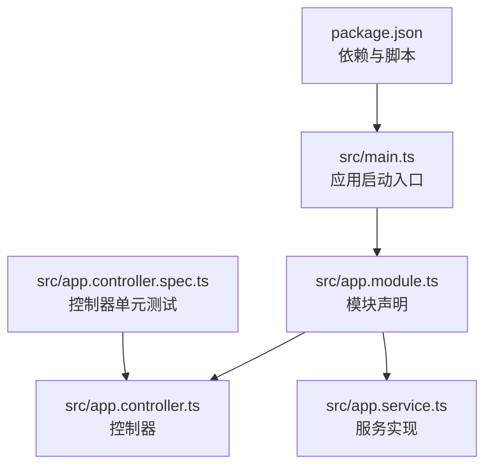
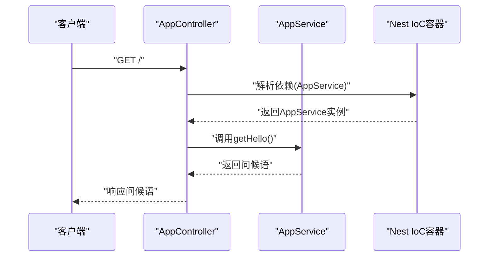
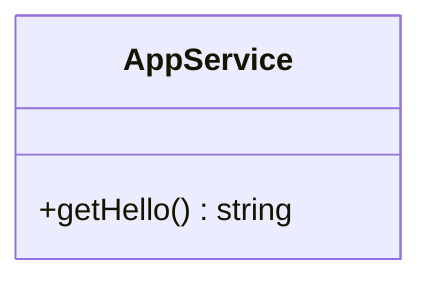
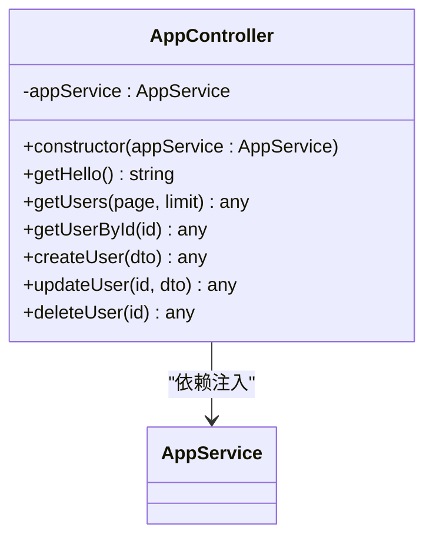
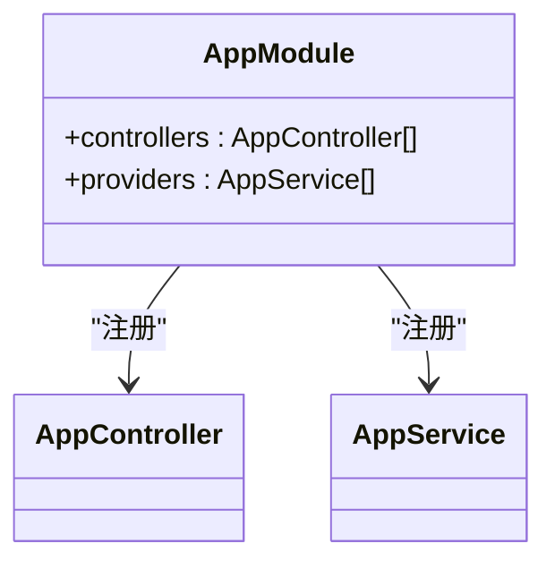
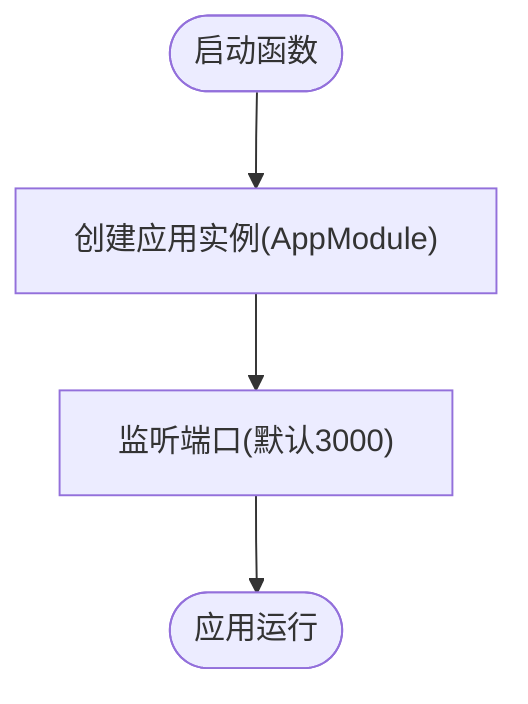
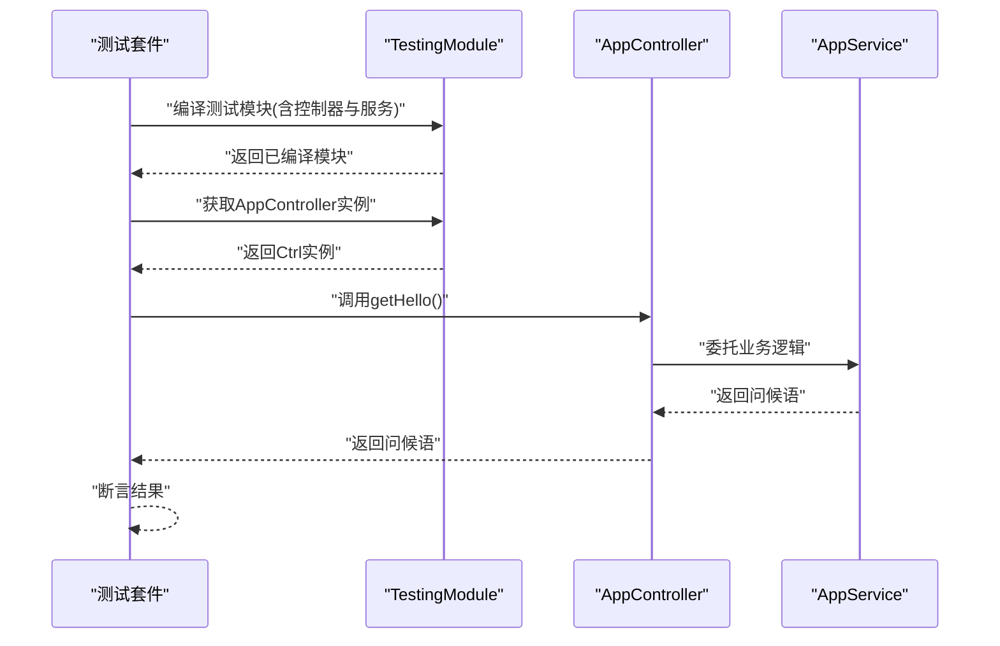
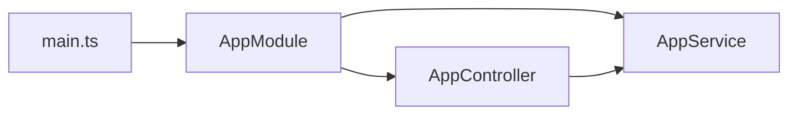

# 服务层

<cite>
**本文引用的文件**
- [src/app.service.ts](file://src/app.service.ts)
- [src/app.controller.ts](file://src/app.controller.ts)
- [src/app.module.ts](file://src/app.module.ts)
- [src/main.ts](file://src/main.ts)
- [src/app.controller.spec.ts](file://src/app.controller.spec.ts)
- [package.json](file://package.json)
</cite>

## 目录
1. [引言](#引言)
2. [项目结构](#项目结构)
3. [核心组件](#核心组件)
4. [架构总览](#架构总览)
5. [详细组件分析](#详细组件分析)
6. [依赖关系分析](#依赖关系分析)
7. [性能考量](#性能考量)
8. [故障排查指南](#故障排查指南)
9. [结论](#结论)
10. [附录](#附录)

## 引言
本节面向希望深入理解NestJS服务层设计与实现的读者，围绕AppService作为业务逻辑封装单元展开，系统阐述以下主题：
- 如何通过@Injectable()装饰器使服务成为Nest IoC容器管理的提供者，并支持依赖注入；
- 服务类如何封装可复用的业务处理逻辑，与控制器解耦；
- 结合代码示例展示服务方法的定义与调用流程，强调其无状态特性与单一职责原则；
- 服务间依赖注入、异步操作处理（Promise/async-await）以及错误抛出的最佳实践；
- 如何通过服务层提升代码可测试性与可维护性。

## 项目结构
该仓库采用NestJS标准脚手架结构，核心文件包括应用入口、模块声明、控制器与服务实现，以及基础测试配置。下图给出与本文相关的文件组织与职责划分。

图表来源
- [src/main.ts](file://src/main.ts#L1-L9)
- [src/app.module.ts](file://src/app.module.ts#L1-L10)
- [src/app.controller.ts](file://src/app.controller.ts#L1-L96)
- [src/app.service.ts](file://src/app.service.ts#L1-L9)
- [src/app.controller.spec.ts](file://src/app.controller.spec.ts#L1-L23)
- [package.json](file://package.json#L1-L73)

章节来源
- [src/main.ts](file://src/main.ts#L1-L9)
- [src/app.module.ts](file://src/app.module.ts#L1-L10)
- [src/app.controller.ts](file://src/app.controller.ts#L1-L96)
- [src/app.service.ts](file://src/app.service.ts#L1-L9)
- [src/app.controller.spec.ts](file://src/app.controller.spec.ts#L1-L23)
- [package.json](file://package.json#L1-L73)

## 核心组件
- AppService：承载业务逻辑的核心服务，使用@Injectable()装饰器声明为可由Nest IoC容器管理的提供者。其方法getHello()返回固定字符串，体现服务的无状态与单一职责（仅负责问候语生成）。
- AppController：HTTP接口的入口，通过构造函数注入AppService实例，将路由处理委托给服务方法，从而实现控制器与业务逻辑的解耦。
- AppModule：模块声明文件，注册控制器与服务，向IoC容器暴露依赖关系。
- main.ts：应用启动入口，创建Nest应用实例并监听端口。

章节来源
- [src/app.service.ts](file://src/app.service.ts#L1-L9)
- [src/app.controller.ts](file://src/app.controller.ts#L1-L25)
- [src/app.module.ts](file://src/app.module.ts#L1-L10)
- [src/main.ts](file://src/main.ts#L1-L9)

## 架构总览
下图展示了从请求到响应的典型调用链路，突出控制器与服务之间的依赖注入关系及控制反转模式。

图表来源
- [src/app.controller.ts](file://src/app.controller.ts#L1-L25)
- [src/app.service.ts](file://src/app.service.ts#L1-L9)
- [src/app.module.ts](file://src/app.module.ts#L1-L10)

## 详细组件分析

### AppService：业务逻辑封装单元
- 装饰器与容器管理
  - 使用@Injectable()装饰器声明服务，使其成为Nest IoC容器可管理的提供者，支持自动依赖注入与生命周期管理。
- 无状态与单一职责
  - 方法getHello()不持有内部可变状态，仅执行简单业务输出，符合无状态与单一职责原则，便于测试与复用。
- 可扩展性
  - 在保持现有接口不变的前提下，可在服务中新增业务方法，或引入外部依赖（如数据库、缓存等），并通过构造函数注入，实现横向扩展。

图表来源
- [src/app.service.ts](file://src/app.service.ts#L1-L9)

章节来源
- [src/app.service.ts](file://src/app.service.ts#L1-L9)

### AppController：控制器与服务的桥梁
- 依赖注入
  - 在构造函数中注入AppService实例，通过私有字段保存依赖，避免在方法内重复创建对象，降低耦合并提升性能。
- 控制器职责
  - 仅负责路由映射、参数解析与响应格式化，具体业务逻辑委托给AppService，实现关注点分离。
- 示例方法
  - getHello()直接调用服务方法，返回问候语；
  - 其他用户管理相关方法（如获取用户列表、详情、创建、更新、删除）体现了REST风格的资源操作，均以统一的success/data结构返回，便于前端消费。

图表来源
- [src/app.controller.ts](file://src/app.controller.ts#L1-L96)
- [src/app.service.ts](file://src/app.service.ts#L1-L9)

章节来源
- [src/app.controller.ts](file://src/app.controller.ts#L1-L96)

### AppModule：模块与依赖声明
- 注册控制器与服务
  - 在providers数组中声明AppService，在controllers数组中声明AppController，使Nest IoC容器能够解析依赖关系并完成实例化。
- 模块边界
  - 该模块聚焦于根路径的问候语与用户资源的演示，体现模块化的边界与职责划分。

图表来源
- [src/app.module.ts](file://src/app.module.ts#L1-L10)

章节来源
- [src/app.module.ts](file://src/app.module.ts#L1-L10)

### main.ts：应用启动与端口监听
- 应用工厂
  - 通过NestFactory.create(AppModule)创建应用实例，加载模块并初始化IoC容器。
- 启动监听
  - 默认监听环境变量PORT或3000端口，完成服务启动。

图表来源
- [src/main.ts](file://src/main.ts#L1-L9)

章节来源
- [src/main.ts](file://src/main.ts#L1-L9)

### 测试：控制器与服务的可测试性
- 测试模块构建
  - 使用TestingModule编译包含AppController与AppService的测试模块，模拟真实依赖注入场景。
- 单元测试断言
  - 通过测试模块获取AppController实例，断言getHello()返回期望值，验证控制器与服务协作的正确性。

图表来源
- [src/app.controller.spec.ts](file://src/app.controller.spec.ts#L1-L23)
- [src/app.controller.ts](file://src/app.controller.ts#L1-L25)
- [src/app.service.ts](file://src/app.service.ts#L1-L9)

章节来源
- [src/app.controller.spec.ts](file://src/app.controller.spec.ts#L1-L23)

## 依赖关系分析
- 控制器对服务的依赖
  - AppController通过构造函数注入AppService，形成单向依赖链，控制器不直接持有业务实现，降低紧耦合风险。
- 模块对组件的声明
  - AppModule在providers与controllers中分别声明AppService与AppController，确保IoC容器能解析并注入依赖。
- 启动阶段的装配
  - main.ts创建应用时加载AppModule，完成依赖图的构建与实例化。

图表来源
- [src/main.ts](file://src/main.ts#L1-L9)
- [src/app.module.ts](file://src/app.module.ts#L1-L10)
- [src/app.controller.ts](file://src/app.controller.ts#L1-L25)
- [src/app.service.ts](file://src/app.service.ts#L1-L9)

章节来源
- [src/main.ts](file://src/main.ts#L1-L9)
- [src/app.module.ts](file://src/app.module.ts#L1-L10)
- [src/app.controller.ts](file://src/app.controller.ts#L1-L25)
- [src/app.service.ts](file://src/app.service.ts#L1-L9)

## 性能考量
- 无状态服务
  - AppService当前方法不维护内部状态，避免了竞态条件与内存泄漏风险，有利于并发安全与可伸缩性。
- 依赖注入的开销
  - 通过IoC容器集中管理依赖，减少重复创建与销毁成本；但需避免过度嵌套与循环依赖，保持模块边界清晰。
- 响应式与异步
  - 对于I/O密集型任务，建议使用异步方法（Promise/async-await）提升吞吐量；同时注意错误传播与超时控制，避免阻塞事件循环。
- 测试驱动的优化
  - 将业务逻辑集中在服务层，便于编写单元测试与集成测试，快速定位性能瓶颈并进行针对性优化。

## 故障排查指南
- 控制器无法注入服务
  - 确认AppModule已在providers中声明对应服务，且控制器在controllers中被正确注册。
- 依赖未解析或循环依赖
  - 检查模块间的导入导出关系，避免双向依赖；必要时拆分模块或引入中间层。
- 测试失败
  - 使用TestingModule编译测试模块，确保同时注册控制器与服务；通过模块获取实例后进行断言。
- 端口占用或启动异常
  - 检查main.ts中的端口配置与环境变量；确认依赖安装完整并版本兼容。

章节来源
- [src/app.module.ts](file://src/app.module.ts#L1-L10)
- [src/app.controller.spec.ts](file://src/app.controller.spec.ts#L1-L23)
- [src/main.ts](file://src/main.ts#L1-L9)
- [package.json](file://package.json#L1-L73)

## 结论
本项目以最小实现展示了NestJS服务层的核心价值：通过@Injectable()装饰器与IoC容器实现依赖注入，AppService封装可复用的业务逻辑，AppController仅承担路由与响应职责，二者解耦带来更高的可测试性与可维护性。遵循无状态与单一职责原则，配合模块化与测试策略，可为复杂业务场景奠定稳健的架构基础。

## 附录
- 最佳实践清单
  - 服务方法保持无状态与纯函数特性，便于测试与并发安全；
  - 控制器仅做薄层适配，业务逻辑全部下沉至服务；
  - 使用异步方法处理I/O，合理抛出错误并统一异常处理；
  - 通过模块化与依赖注入，避免硬编码与循环依赖；
  - 编写单元测试覆盖关键业务分支，保障变更质量。