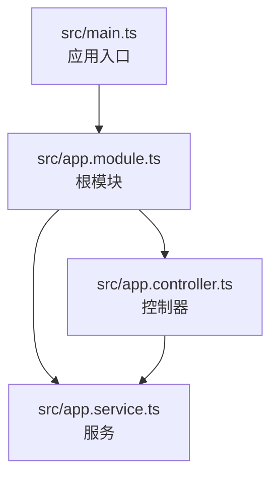
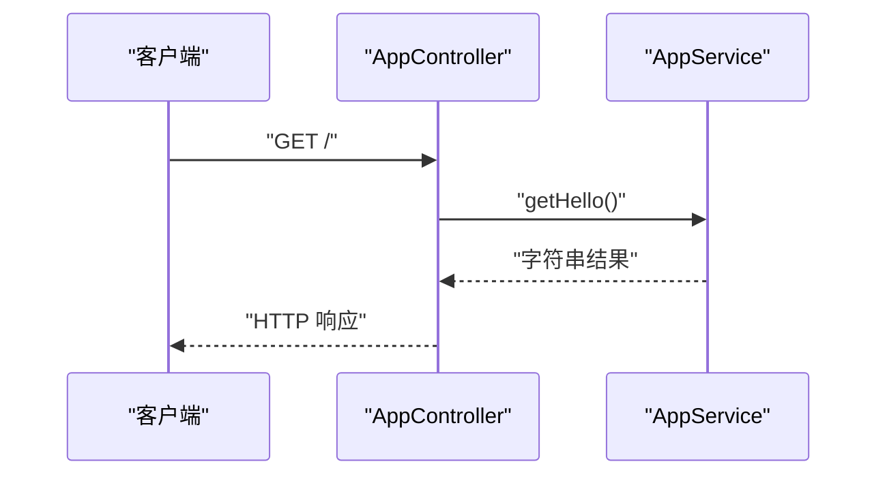
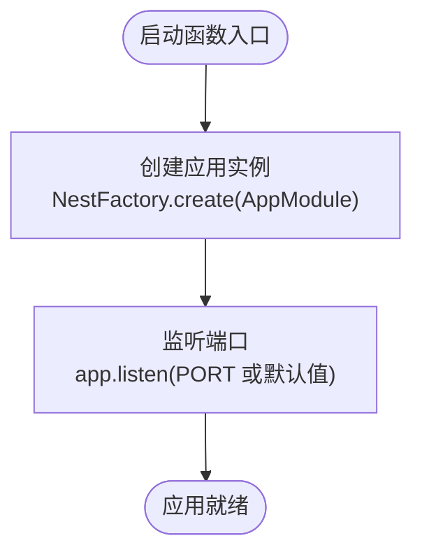
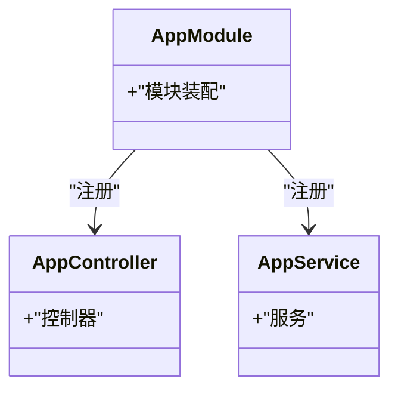
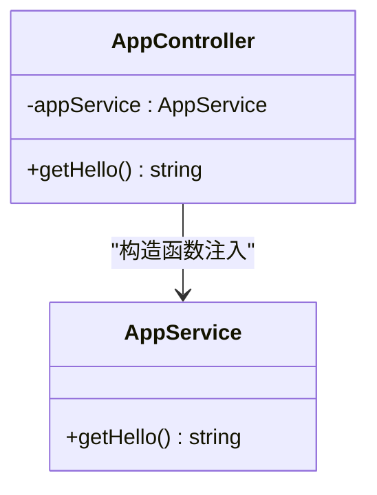
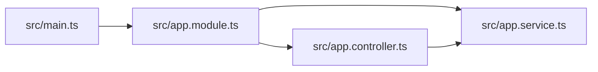

# 核心架构

<cite>
**本文引用的文件**
- [src/main.ts](file://src/main.ts)
- [src/app.module.ts](file://src/app.module.ts)
- [src/app.controller.ts](file://src/app.controller.ts)
- [src/app.service.ts](file://src/app.service.ts)
- [README.md](file://README.md)
</cite>

## 目录
1. [引言](#引言)
2. [项目结构](#项目结构)
3. [核心组件](#核心组件)
4. [架构总览](#架构总览)
5. [详细组件分析](#详细组件分析)
6. [依赖关系分析](#依赖关系分析)
7. [性能考量](#性能考量)
8. [故障排查指南](#故障排查指南)
9. [结论](#结论)

## 引言
本节面向希望理解 nest-dome 项目中 Nest.js 典型分层架构的读者，重点围绕以下目标展开：
- main.ts 作为应用入口，如何通过 NestFactory 创建并启动 Express 服务器；
- AppModule 作为根模块，如何通过 imports、controllers 和 providers 注册应用组件；
- AppController 如何使用 @Controller 和 @Get 装饰器定义路由，并通过依赖注入使用 AppService；
- AppService 中业务逻辑的封装方式；
- 绘制“客户端请求 → AppController → AppService → 返回响应”的调用关系图；
- 强调依赖注入（DI）与控制反转（IoC）在 Nest.js 中的实现机制与优势。

本仓库提供了一个最小可用示例，适合初学者快速建立对 Nest.js 分层架构的整体认知。

章节来源
- [README.md](file://README.md#L24-L45)

## 项目结构
该项目采用典型的 Nest.js 分层组织方式：
- 入口文件：src/main.ts
- 根模块：src/app.module.ts
- 控制器：src/app.controller.ts
- 服务（业务层）：src/app.service.ts

下图展示了该仓库的文件级结构与职责映射：

图表来源
- [src/main.ts](file://src/main.ts#L1-L24)
- [src/app.module.ts](file://src/app.module.ts#L1-L25)
- [src/app.controller.ts](file://src/app.controller.ts#L1-L42)
- [src/app.service.ts](file://src/app.service.ts#L1-L37)

章节来源
- [src/main.ts](file://src/main.ts#L1-L24)
- [src/app.module.ts](file://src/app.module.ts#L1-L25)

## 核心组件
本节从“入口启动 → 模块装配 → 控制器路由 → 服务业务”的角度，逐层剖析关键组件及其职责边界。

- 应用入口（main.ts）
  - 作用：通过 NestFactory.create(AppModule) 创建应用实例；随后监听端口对外提供 HTTP 服务。
  - 关键点：异步启动流程、端口配置（优先使用环境变量，否则回退到默认值）。
  
- 根模块（app.module.ts）
  - 作用：声明控制器与服务，作为应用的“总指挥部”，统一注册与装配。
  - 关键点：@Module 装饰器内配置 controllers 与 providers；模块本身不包含业务逻辑。
  
- 控制器（app.controller.ts）
  - 作用：定义路由（@Controller、@Get），接收请求并委托给服务处理。
  - 关键点：构造函数注入 AppService，体现 DI/IoC 的使用。
  
- 服务（app.service.ts）
  - 作用：封装业务逻辑（例如返回问候语），可被控制器或其他服务注入使用。
  - 关键点：@Injectable 标注使其可被容器管理，默认单例。

章节来源
- [src/main.ts](file://src/main.ts#L11-L23)
- [src/app.module.ts](file://src/app.module.ts#L13-L22)
- [src/app.controller.ts](file://src/app.controller.ts#L12-L41)
- [src/app.service.ts](file://src/app.service.ts#L19-L36)

## 架构总览
下图展示了从客户端请求到响应返回的完整调用链路，以及各组件之间的依赖关系。

图表来源
- [src/app.controller.ts](file://src/app.controller.ts#L35-L41)
- [src/app.service.ts](file://src/app.service.ts#L31-L35)

## 详细组件分析

### 入口启动流程（main.ts）
- NestFactory.create(AppModule)：创建应用实例，扫描根模块及其依赖，完成模块装配。
- app.listen(...)：启动 HTTP 服务器，监听端口（支持环境变量覆盖）。
- bootstrap()：立即执行的启动函数，遵循 Nest.js 惯例命名。

图表来源
- [src/main.ts](file://src/main.ts#L11-L23)

章节来源
- [src/main.ts](file://src/main.ts#L11-L23)

### 根模块装配（app.module.ts）
- @Module({ controllers, providers })：声明控制器与服务，模块承担“装配”职责。
- 控制器与服务在此汇聚，形成后续依赖注入的基础。

图表来源
- [src/app.module.ts](file://src/app.module.ts#L13-L22)

章节来源
- [src/app.module.ts](file://src/app.module.ts#L13-L22)

### 控制器路由与依赖注入（app.controller.ts）
- @Controller()：将类标记为控制器，根路径前缀为“/”。
- @Get()：将方法绑定到 GET 请求，处理“/”路径。
- 构造函数注入：private readonly appService: AppService，由容器自动注入。
- 委托调用：控制器仅负责路由分发，业务逻辑委托给 AppService。

图表来源
- [src/app.controller.ts](file://src/app.controller.ts#L12-L41)
- [src/app.service.ts](file://src/app.service.ts#L19-L36)

章节来源
- [src/app.controller.ts](file://src/app.controller.ts#L12-L41)

### 服务层业务封装（app.service.ts）
- @Injectable()：标注服务可被容器管理，支持依赖注入与单例生命周期。
- getHello()：封装业务逻辑（此处为返回问候语），可扩展为数据库查询、外部接口调用等。

章节来源
- [src/app.service.ts](file://src/app.service.ts#L19-L36)

### 依赖注入与控制反转（DI/IoC）机制
- 控制反转（IoC）：将对象的创建与依赖关系交由容器管理，而非手动 new。
- 依赖注入（DI）：通过构造函数注入、属性注入等方式，将所需依赖自动注入到目标类。
- 优势：
  - 解耦：控制器不直接依赖具体实现，便于替换与测试；
  - 单例管理：@Injectable 默认单例，降低资源消耗；
  - 生命周期：容器统一管理创建、销毁与作用域；
  - 可测试性：可通过替换注入实例进行单元测试与集成测试。

章节来源
- [src/app.controller.ts](file://src/app.controller.ts#L24-L24)
- [src/app.service.ts](file://src/app.service.ts#L19-L20)

## 依赖关系分析
- 文件级依赖
  - main.ts 依赖 AppModule；
  - AppModule 依赖 AppController 与 AppService；
  - AppController 依赖 AppService；
  - AppService 不依赖其他组件。
- 组件间耦合度
  - 控制器与服务之间为“使用依赖”，耦合度低；
  - 根模块集中装配，避免分散注册，提升可维护性。

图表来源
- [src/main.ts](file://src/main.ts#L1-L24)
- [src/app.module.ts](file://src/app.module.ts#L1-L25)
- [src/app.controller.ts](file://src/app.controller.ts#L1-L42)
- [src/app.service.ts](file://src/app.service.ts#L1-L37)

章节来源
- [src/main.ts](file://src/main.ts#L1-L24)
- [src/app.module.ts](file://src/app.module.ts#L13-L22)
- [src/app.controller.ts](file://src/app.controller.ts#L12-L41)
- [src/app.service.ts](file://src/app.service.ts#L19-L36)

## 性能考量
- 单例服务：@Injectable 默认单例，减少重复创建成本；
- 路由与处理器简单：当前示例为轻量级路由，适合入门演示；
- 启动与监听：异步启动流程确保容器初始化完成后再接受请求；
- 端口配置：支持环境变量覆盖，便于在不同环境（开发/生产）灵活切换。

章节来源
- [src/app.service.ts](file://src/app.service.ts#L19-L20)
- [src/main.ts](file://src/main.ts#L16-L23)

## 故障排查指南
- 端口占用
  - 现象：启动时报端口冲突错误；
  - 排查：检查环境变量 PORT 是否被占用，或显式修改端口；
  - 参考：main.ts 中的端口监听逻辑。
- 控制器未生效
  - 现象：访问 / 无响应；
  - 排查：确认 AppModule 已注册 AppController；确认 @Controller 与 @Get 路由装饰器正确使用。
- 服务未注入
  - 现象：控制器无法调用服务方法；
  - 排查：确认 AppModule 已注册 AppService；确认 AppService 使用 @Injectable 标注。
- 依赖循环
  - 现象：应用启动失败或行为异常；
  - 排查：避免控制器与服务互相导入导致循环依赖；将共享逻辑抽取至独立模块或工具。

章节来源
- [src/main.ts](file://src/main.ts#L16-L23)
- [src/app.module.ts](file://src/app.module.ts#L13-L22)
- [src/app.controller.ts](file://src/app.controller.ts#L12-L41)
- [src/app.service.ts](file://src/app.service.ts#L19-L36)

## 结论
本仓库以最小化示例清晰地展示了 Nest.js 的典型分层架构：
- main.ts 作为入口，通过 NestFactory 完成应用创建与启动；
- AppModule 作为根模块，集中装配控制器与服务；
- AppController 通过装饰器定义路由，并借助依赖注入调用 AppService；
- AppService 封装业务逻辑，体现“控制器薄、服务厚”的设计原则；
- 依赖注入与控制反转贯穿其中，带来解耦、可测试与可维护的优势。

该结构适合初学者快速上手 Nest.js 并理解其分层思想与 DI/IoC 的实践价值。