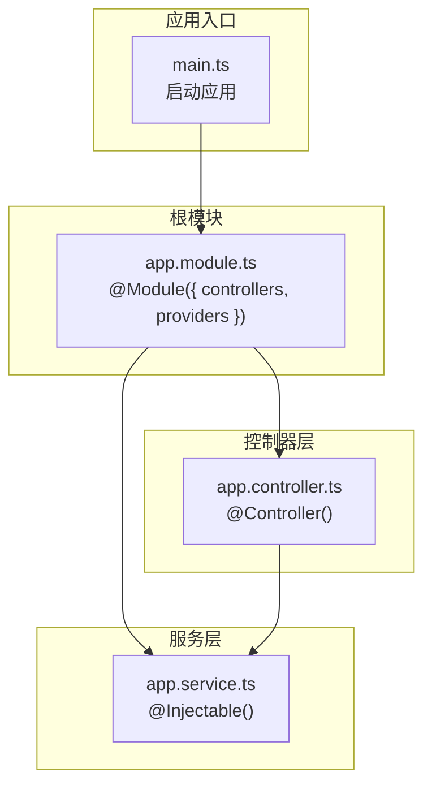
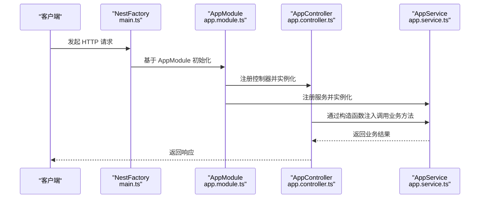
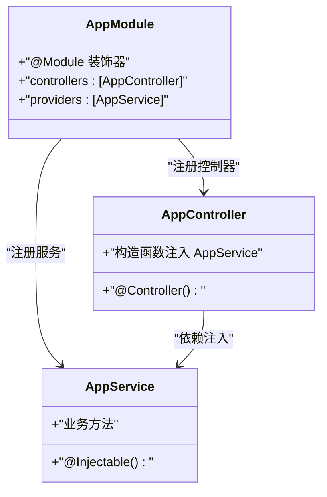
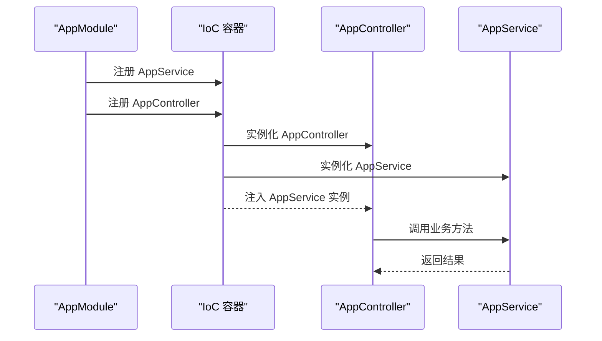
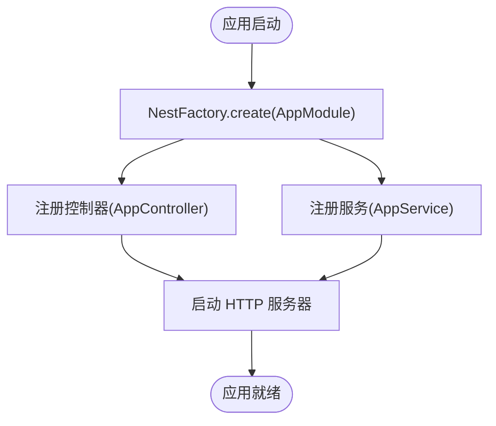
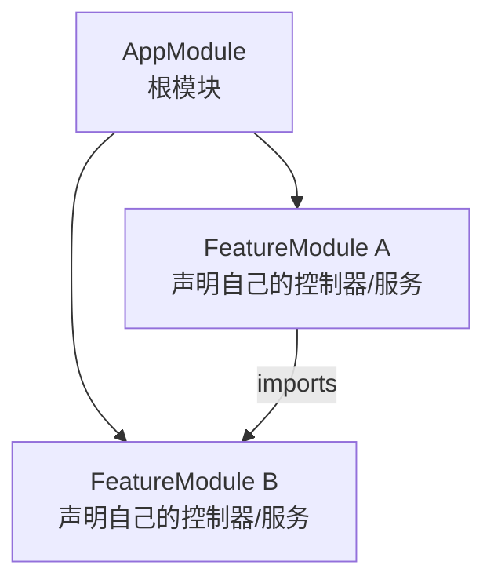
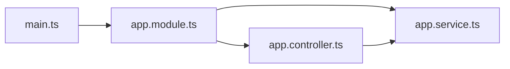

# 模块系统

<cite>
**本文引用的文件**
- [src/app.module.ts](file://src/app.module.ts)
- [src/app.controller.ts](file://src/app.controller.ts)
- [src/app.service.ts](file://src/app.service.ts)
- [src/main.ts](file://src/main.ts)
- [src/app.controller.spec.ts](file://src/app.controller.spec.ts)
- [test/app.e2e-spec.ts](file://test/app.e2e-spec.ts)
</cite>

## 目录
1. [引言](#引言)
2. [项目结构](#项目结构)
3. [核心组件](#核心组件)
4. [架构总览](#架构总览)
5. [详细组件分析](#详细组件分析)
6. [依赖关系分析](#依赖关系分析)
7. [性能考量](#性能考量)
8. [故障排查指南](#故障排查指南)
9. [结论](#结论)
10. [附录](#附录)

## 引言
本文件围绕 AppModule 作为 Nest.js 应用根模块的角色展开，系统阐述 @Module 装饰器的配置项（controllers、providers）如何组织与封装应用组件，实现依赖管理与边界划分；并结合代码分析 AppModule 如何将 AppController 与 AppService 关联，由 Nest IoC 容器完成实例化与依赖解析。同时给出模块间导入（imports）的扩展示例思路，说明模块作用域对服务可见性的影响，并总结模块化设计在可维护性与可测试性方面的优势。

## 项目结构
该仓库采用典型的 Nest.js 单模块结构：
- 根模块 AppModule 负责声明控制器与服务，并向 Nest 启动流程暴露入口。
- 入口文件 main.ts 使用 NestFactory 基于 AppModule 启动应用。
- 测试文件分别演示了单元测试与端到端测试中对模块的使用方式。

图表来源
- [src/main.ts](file://src/main.ts#L1-L9)
- [src/app.module.ts](file://src/app.module.ts#L1-L10)
- [src/app.controller.ts](file://src/app.controller.ts#L1-L96)
- [src/app.service.ts](file://src/app.service.ts#L1-L9)

章节来源
- [src/main.ts](file://src/main.ts#L1-L9)
- [src/app.module.ts](file://src/app.module.ts#L1-L10)

## 核心组件
- AppModule：应用的根模块，通过 @Module 装饰器声明控制器与服务，承担应用边界与依赖聚合职责。
- AppController：HTTP 控制器，负责处理路由与响应，内部依赖 AppService。
- AppService：可注入服务，提供业务逻辑能力，被 AppController 通过构造函数注入。
- main.ts：应用启动入口，基于 AppModule 创建 Nest 应用实例并监听端口。

章节来源
- [src/app.module.ts](file://src/app.module.ts#L1-L10)
- [src/app.controller.ts](file://src/app.controller.ts#L1-L96)
- [src/app.service.ts](file://src/app.service.ts#L1-L9)
- [src/main.ts](file://src/main.ts#L1-L9)

## 架构总览
下图展示了从应用启动到请求处理的关键交互路径，体现根模块如何组织控制器与服务，并由 IoC 容器完成依赖解析与实例化。

图表来源
- [src/main.ts](file://src/main.ts#L1-L9)
- [src/app.module.ts](file://src/app.module.ts#L1-L10)
- [src/app.controller.ts](file://src/app.controller.ts#L1-L96)
- [src/app.service.ts](file://src/app.service.ts#L1-L9)

## 详细组件分析

### AppModule 的角色与职责
- 作为根模块，AppModule 聚合了应用所需的所有控制器与服务，形成清晰的应用边界。
- 通过 @Module 的 controllers 数组注册请求处理器（AppController），使 Nest 路由系统能够识别并映射到对应路由。
- 通过 @Module 的 providers 数组注册可注入服务（AppService），使其成为 Nest IoC 容器中的受管对象，支持依赖注入与生命周期管理。

图表来源
- [src/app.module.ts](file://src/app.module.ts#L1-L10)
- [src/app.controller.ts](file://src/app.controller.ts#L1-L96)
- [src/app.service.ts](file://src/app.service.ts#L1-L9)

章节来源
- [src/app.module.ts](file://src/app.module.ts#L1-L10)

### 控制器与服务的依赖绑定
- AppController 通过构造函数注入 AppService，体现了依赖倒置原则：上层（控制器）仅依赖抽象（服务接口或类本身），具体实现由 IoC 容器解析。
- AppModule 在 providers 中声明 AppService，确保容器在需要时创建实例并注入到 AppController。
- 这种绑定关系使得控制器与服务解耦，便于独立演进与替换。

图表来源
- [src/app.module.ts](file://src/app.module.ts#L1-L10)
- [src/app.controller.ts](file://src/app.controller.ts#L1-L96)
- [src/app.service.ts](file://src/app.service.ts#L1-L9)

章节来源
- [src/app.controller.ts](file://src/app.controller.ts#L1-L96)
- [src/app.service.ts](file://src/app.service.ts#L1-L9)

### 模块启动与运行流程
- main.ts 使用 NestFactory.create(AppModule) 创建应用实例，随后启动 HTTP 服务器。
- AppModule 作为根模块，承载所有控制器与服务的注册与装配，是应用启动的唯一入口。

图表来源
- [src/main.ts](file://src/main.ts#L1-L9)
- [src/app.module.ts](file://src/app.module.ts#L1-L10)

章节来源
- [src/main.ts](file://src/main.ts#L1-L9)

### 模块间导入（imports）扩展示例
- 当应用规模扩大时，可通过 imports 将多个子模块组合为更大的功能域，实现更细粒度的边界划分与复用。
- 示例思路（概念性说明，不直接对应现有文件）：
  - 新建 FeatureModule，声明其 own 的控制器与服务；
  - 在 AppModule 的 imports 中引入 FeatureModule；
  - FeatureModule 内部通过 @Module 的 controllers/providers 暴露给外部使用；
  - 外部模块（如其他 FeatureModule 或根模块）通过 imports 组合，形成层次化的模块树。

图表来源
- [src/app.module.ts](file://src/app.module.ts#L1-L10)

章节来源
- [src/app.module.ts](file://src/app.module.ts#L1-L10)

### 模块作用域对服务可见性的影响
- 服务默认作用域为单例（Singleton），在模块内共享；若希望在不同模块间共享同一实例，应将其置于公共模块并通过 imports 导入。
- 若服务仅在当前模块内使用，可保持在当前模块的 providers 中，避免跨模块污染。
- 对于需要隔离的场景，可在各自模块中声明同名但不同实现的服务，通过依赖注入选择合适的实例。

章节来源
- [src/app.module.ts](file://src/app.module.ts#L1-L10)
- [src/app.service.ts](file://src/app.service.ts#L1-L9)

### 可维护性与可测试性优势
- 可维护性：模块化将控制器与服务按功能边界组织，降低耦合并提升内聚；根模块集中声明依赖，便于变更追踪。
- 可测试性：
  - 单元测试：通过 TestingModule 的 controllers/providers 精准构建测试上下文，快速验证控制器行为。
  - 端到端测试：通过 imports 引入 AppModule，完整初始化应用，覆盖真实路由与中间件链路。
  - 隔离性：模块边界清晰，便于模拟依赖与断言副作用。

章节来源
- [src/app.controller.spec.ts](file://src/app.controller.spec.ts#L1-L23)
- [test/app.e2e-spec.ts](file://test/app.e2e-spec.ts#L1-L26)

## 依赖关系分析
- AppModule 依赖 AppController 与 AppService，形成“根模块—控制器—服务”的线性依赖链。
- AppController 依赖 AppService，体现控制器对服务的调用关系。
- main.ts 依赖 AppModule，作为应用启动入口。

图表来源
- [src/main.ts](file://src/main.ts#L1-L9)
- [src/app.module.ts](file://src/app.module.ts#L1-L10)
- [src/app.controller.ts](file://src/app.controller.ts#L1-L96)
- [src/app.service.ts](file://src/app.service.ts#L1-L9)

章节来源
- [src/main.ts](file://src/main.ts#L1-L9)
- [src/app.module.ts](file://src/app.module.ts#L1-L10)
- [src/app.controller.ts](file://src/app.controller.ts#L1-L96)
- [src/app.service.ts](file://src/app.service.ts#L1-L9)

## 性能考量
- 单例服务减少重复实例化开销，适合无状态或轻状态的业务逻辑。
- 控制器与服务的职责分离有助于缓存与并发场景下的资源复用。
- 模块拆分应避免过度碎片化，以免增加容器解析与模块加载成本。

## 故障排查指南
- 控制器无法注入服务：检查 AppModule 的 providers 是否包含目标服务，以及服务是否标注为可注入。
- 路由未生效：确认 AppModule 的 controllers 包含对应控制器，且控制器已正确声明路由前缀与方法装饰器。
- 启动失败：核对 main.ts 中传入的根模块是否正确，以及环境变量（如端口）是否有效。

章节来源
- [src/app.module.ts](file://src/app.module.ts#L1-L10)
- [src/app.controller.ts](file://src/app.controller.ts#L1-L96)
- [src/app.service.ts](file://src/app.service.ts#L1-L9)
- [src/main.ts](file://src/main.ts#L1-L9)

## 结论
AppModule 作为 Nest.js 应用的根模块，通过 @Module 的 controllers 与 providers 配置，将控制器与服务有机组织，形成清晰的模块边界与依赖关系。借助 Nest IoC 容器，AppController 与 AppService 实现自动实例化与依赖解析，从而提升系统的可维护性与可测试性。随着应用扩展，可通过 imports 将功能模块化拆分，进一步优化架构复杂度与团队协作效率。

## 附录
- 单元测试示例：通过 TestingModule 的 controllers/providers 构建最小测试上下文，验证控制器行为。
- 端到端测试示例：通过 imports 引入 AppModule，完整启动应用并发起 HTTP 请求验证路由与响应。

章节来源
- [src/app.controller.spec.ts](file://src/app.controller.spec.ts#L1-L23)
- [test/app.e2e-spec.ts](file://test/app.e2e-spec.ts#L1-L26)