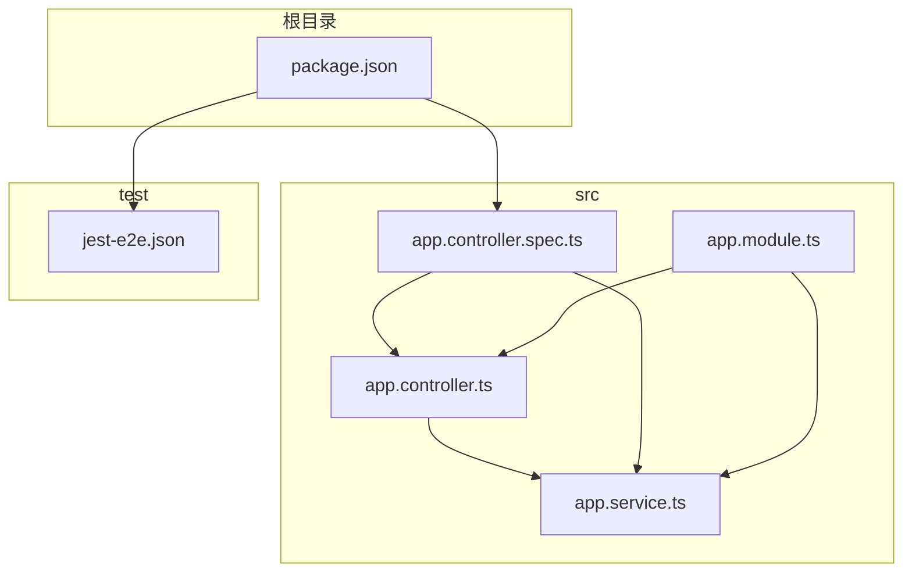
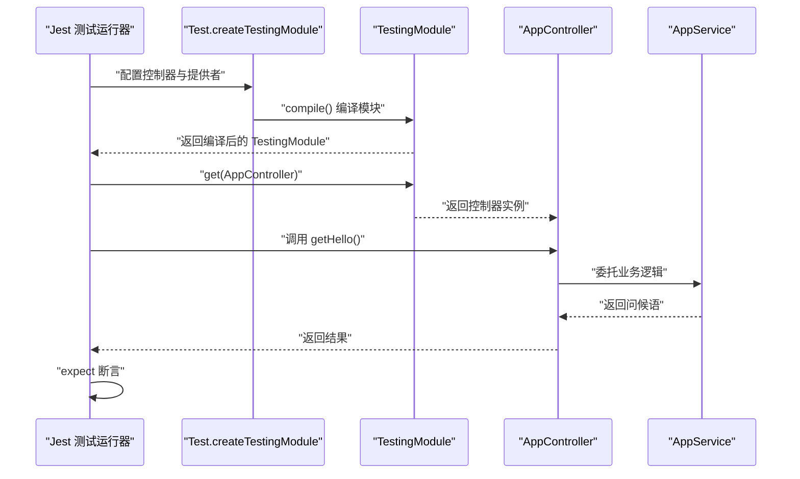
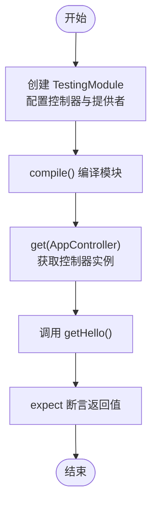
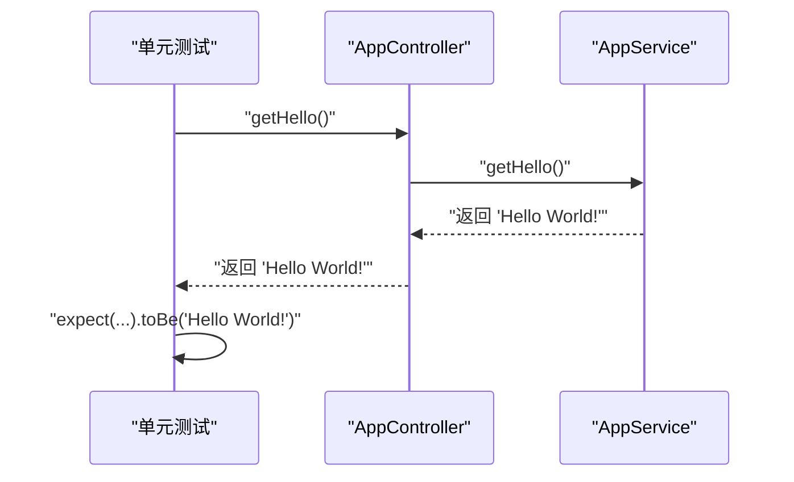
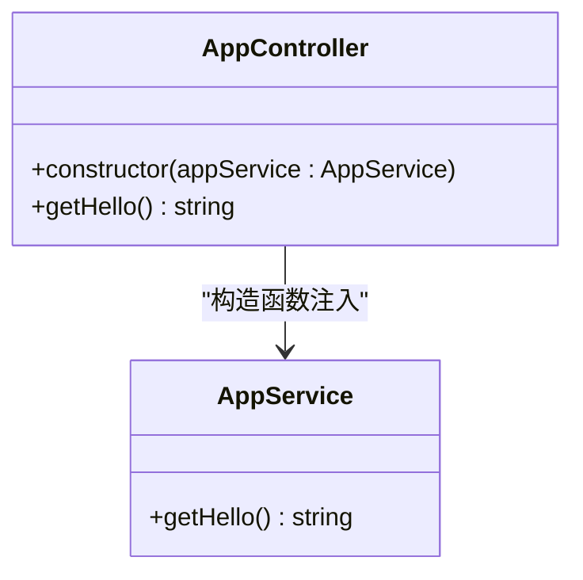
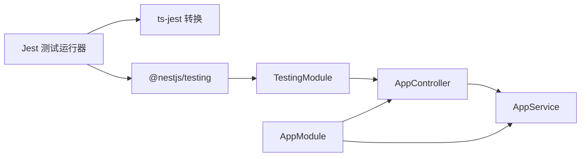

# 单元测试

<cite>
**本文引用的文件**
- [src/app.controller.spec.ts](file://src/app.controller.spec.ts)
- [src/app.controller.ts](file://src/app.controller.ts)
- [src/app.service.ts](file://src/app.service.ts)
- [src/app.module.ts](file://src/app.module.ts)
- [package.json](file://package.json)
- [test/jest-e2e.json](file://test/jest-e2e.json)
</cite>

## 目录
1. [简介](#简介)
2. [项目结构](#项目结构)
3. [核心组件](#核心组件)
4. [架构总览](#架构总览)
5. [详细组件分析](#详细组件分析)
6. [依赖关系分析](#依赖关系分析)
7. [性能考量](#性能考量)
8. [故障排查指南](#故障排查指南)
9. [结论](#结论)
10. [附录](#附录)

## 简介
本文件围绕 src/app.controller.spec.ts 的单元测试展开，系统讲解如何使用 @nestjs/testing 创建 TestingModule，如何在测试中通过 Test.createTestingModule 配置控制器与提供者（AppController 与 AppService），如何在 beforeEach 中编译模块并获取控制器实例，如何利用依赖注入实现测试隔离，以及如何组织 describe/it 结构与使用 expect 断言。同时给出针对该测试用例“root”的解析，说明其如何验证 getHello 方法返回“Hello World!”，并总结编写高效单元测试的最佳实践。

## 项目结构
本仓库采用典型的 NestJS 分层结构：
- 控制器与服务位于 src 目录，分别承担路由分发与业务逻辑职责
- 单元测试位于 src 目录下以 .spec.ts 命名
- E2E 测试位于 test 目录，使用独立的 Jest 配置

图表来源
- [src/app.controller.ts](file://src/app.controller.ts#L1-L42)
- [src/app.service.ts](file://src/app.service.ts#L1-L37)
- [src/app.module.ts](file://src/app.module.ts#L1-L25)
- [src/app.controller.spec.ts](file://src/app.controller.spec.ts#L1-L23)
- [package.json](file://package.json#L55-L71)
- [test/jest-e2e.json](file://test/jest-e2e.json#L1-L9)

章节来源
- [src/app.controller.ts](file://src/app.controller.ts#L1-L42)
- [src/app.service.ts](file://src/app.service.ts#L1-L37)
- [src/app.module.ts](file://src/app.module.ts#L1-L25)
- [src/app.controller.spec.ts](file://src/app.controller.spec.ts#L1-L23)
- [package.json](file://package.json#L55-L71)
- [test/jest-e2e.json](file://test/jest-e2e.json#L1-L9)

## 核心组件
- AppController：负责根路径的 GET 请求处理，委托 AppService 返回问候语
- AppService：提供 getHello 方法，返回固定字符串
- TestingModule：通过 Test.createTestingModule 构建最小化测试环境，仅包含控制器与提供者
- beforeEach：在每个测试用例执行前编译模块并获取控制器实例，确保测试隔离与可重复性

章节来源
- [src/app.controller.ts](file://src/app.controller.ts#L12-L41)
- [src/app.service.ts](file://src/app.service.ts#L19-L36)
- [src/app.controller.spec.ts](file://src/app.controller.spec.ts#L8-L15)

## 架构总览
下面的时序图展示了单元测试的典型流程：创建 TestingModule -> 编译模块 -> 从容器获取控制器实例 -> 执行测试断言。

图表来源
- [src/app.controller.spec.ts](file://src/app.controller.spec.ts#L8-L15)
- [src/app.controller.ts](file://src/app.controller.ts#L35-L41)
- [src/app.service.ts](file://src/app.service.ts#L31-L35)

## 详细组件分析

### AppController 单元测试设计
- TestingModule 配置
  - 控制器：AppController
  - 提供者：AppService
- beforeEach 中的编译与实例获取
  - 使用 compile() 编译模块
  - 使用 get(AppController) 获取控制器实例，从而实现依赖注入隔离
- describe/it 组织
  - 外层 describe('AppController') 标识测试套件
  - 内层 describe('root') 描述具体场景
  - it('should return "Hello World!"') 定义断言点
- 断言 expect
  - 对 appController.getHello() 的返回值进行断言

图表来源
- [src/app.controller.spec.ts](file://src/app.controller.spec.ts#L8-L21)

章节来源
- [src/app.controller.spec.ts](file://src/app.controller.spec.ts#L1-L23)

### “root”测试用例解析
- 场景：验证根路径的 GET 请求处理器
- 行为：AppController.getHello() 将委托 AppService.getHello() 返回问候语
- 断言：期望返回固定字符串“Hello World!”

图表来源
- [src/app.controller.spec.ts](file://src/app.controller.spec.ts#L16-L21)
- [src/app.controller.ts](file://src/app.controller.ts#L35-L41)
- [src/app.service.ts](file://src/app.service.ts#L31-L35)

章节来源
- [src/app.controller.spec.ts](file://src/app.controller.spec.ts#L16-L21)
- [src/app.controller.ts](file://src/app.controller.ts#L35-L41)
- [src/app.service.ts](file://src/app.service.ts#L31-L35)

### 依赖注入与测试隔离
- 通过 TestingModule 仅注册 AppController 与 AppService，避免加载 AppModule 的完整依赖树
- 使用 get(AppController) 从测试容器中获取实例，确保每次测试都获得全新且受控的依赖图
- 由于 AppController 构造函数注入 AppService，测试中无需手动 mock，即可通过容器完成注入

图表来源
- [src/app.controller.ts](file://src/app.controller.ts#L24-L41)
- [src/app.service.ts](file://src/app.service.ts#L19-L36)

章节来源
- [src/app.controller.ts](file://src/app.controller.ts#L24-L41)
- [src/app.service.ts](file://src/app.service.ts#L19-L36)

## 依赖关系分析
- 测试依赖
  - @nestjs/testing：提供 TestingModule 与 Test 工具
  - Jest：测试运行器与断言库
  - ts-jest：TypeScript 转换支持
- 运行时依赖
  - AppModule 将 AppController 与 AppService 注册为模块成员
- 测试与生产模块解耦
  - 单元测试仅加载控制器与服务，不引入外部依赖（如数据库、HTTP 客户端）

图表来源
- [src/app.controller.spec.ts](file://src/app.controller.spec.ts#L1-L3)
- [src/app.module.ts](file://src/app.module.ts#L13-L23)
- [package.json](file://package.json#L55-L71)

章节来源
- [src/app.controller.spec.ts](file://src/app.controller.spec.ts#L1-L3)
- [src/app.module.ts](file://src/app.module.ts#L13-L23)
- [package.json](file://package.json#L55-L71)

## 性能考量
- 最小化测试环境：仅注册必要控制器与提供者，减少启动时间与内存占用
- 避免外部依赖：数据库、网络请求等外部资源应在集成测试或 E2E 测试中验证
- 复用容器：在单个测试文件内复用同一个 TestingModule，避免重复编译
- 并行测试：Jest 默认支持并发，但需确保测试之间无共享状态

## 故障排查指南
- 测试无法编译或找不到模块
  - 检查 TestingModule 是否正确注册了控制器与提供者
  - 确认 get(AppController) 的参数类型与导出一致
- 断言失败
  - 核对 AppService.getHello() 返回值是否符合预期
  - 确保测试用例名称与断言逻辑一致
- Jest 配置问题
  - 根目录 jest 配置用于 src 下的单元测试
  - test/jest-e2e.json 用于 e2e 测试，不要与单元测试混淆

章节来源
- [src/app.controller.spec.ts](file://src/app.controller.spec.ts#L8-L21)
- [package.json](file://package.json#L55-L71)
- [test/jest-e2e.json](file://test/jest-e2e.json#L1-L9)

## 结论
通过对 AppController 的单元测试，我们展示了如何使用 @nestjs/testing 快速构建最小化测试环境，借助依赖注入实现测试隔离与可重复性。测试用例“root”简洁地验证了控制器与服务协作的正确性。遵循本文的最佳实践，可在保证测试效率的同时提升代码质量与稳定性。

## 附录

### 最佳实践清单
- 使用 TestingModule 仅注册必要成员，避免加载完整 AppModule
- 在 beforeEach 中编译模块并获取实例，确保测试隔离
- 使用 describe/it 清晰划分测试场景与断言点
- 使用 expect 进行明确断言，避免模糊匹配
- 避免在单元测试中引入外部依赖；需要外部交互时使用桩对象或模拟
- 保持测试原子性：每个测试只验证一个行为或边界条件
- 使用 ts-jest 与 Jest 配置确保类型安全与转换正确

章节来源
- [src/app.controller.spec.ts](file://src/app.controller.spec.ts#L8-L21)
- [package.json](file://package.json#L55-L71)