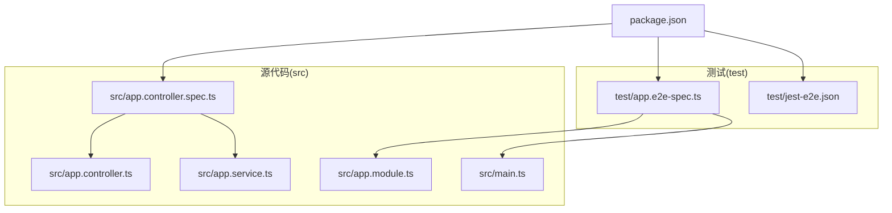
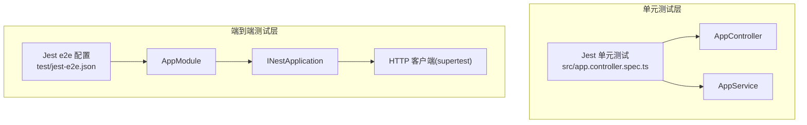
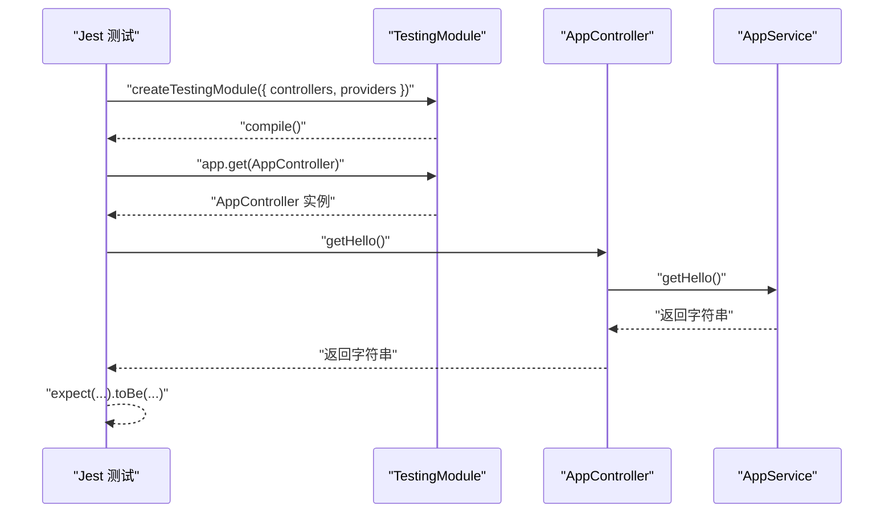
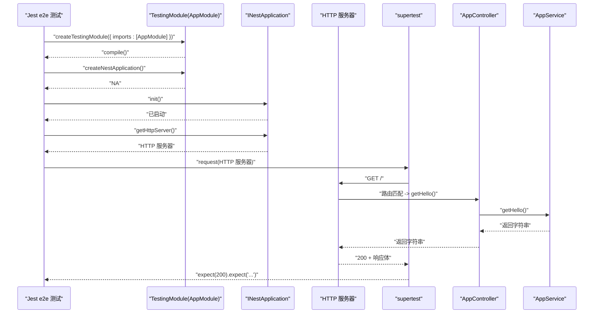
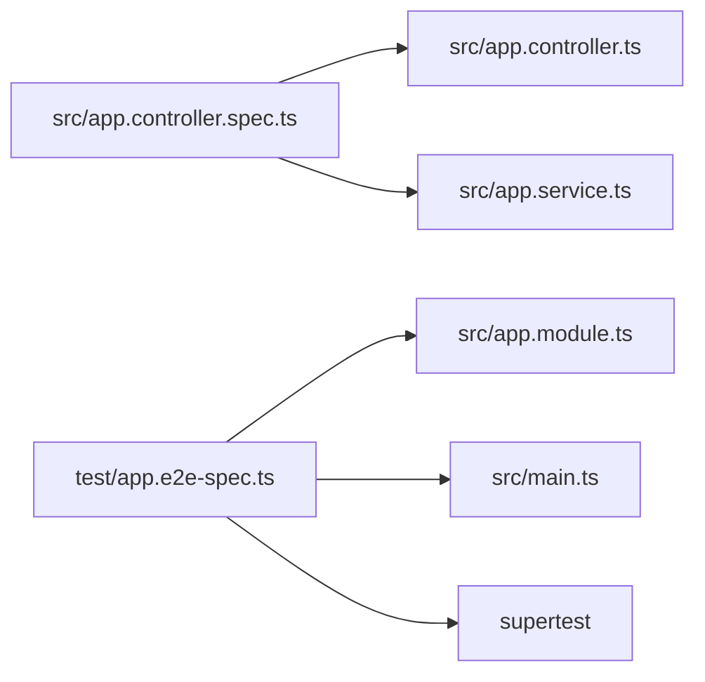

# 测试策略

<cite>
**本文引用的文件**
- [src/app.controller.spec.ts](file://src/app.controller.spec.ts)
- [test/app.e2e-spec.ts](file://test/app.e2e-spec.ts)
- [package.json](file://package.json)
- [test/jest-e2e.json](file://test/jest-e2e.json)
- [src/app.controller.ts](file://src/app.controller.ts)
- [src/app.service.ts](file://src/app.service.ts)
- [src/app.module.ts](file://src/app.module.ts)
- [src/main.ts](file://src/main.ts)
</cite>

## 目录
1. [引言](#引言)
2. [项目结构](#项目结构)
3. [核心组件](#核心组件)
4. [架构总览](#架构总览)
5. [详细组件分析](#详细组件分析)
6. [依赖分析](#依赖分析)
7. [性能考虑](#性能考虑)
8. [故障排查指南](#故障排查指南)
9. [结论](#结论)
10. [附录](#附录)

## 引言
本文件系统性梳理 nest-dome 项目的测试体系，覆盖单元测试与端到端测试两类场景。基于现有测试文件，重点说明：
- 如何使用 Jest 与 @nestjs/testing 对 AppController 进行单元测试，包括模拟服务依赖与断言请求处理逻辑；
- 如何通过 supertest 启动真实服务器并发送 HTTP 请求，完成完整请求-响应链路的端到端验证；
- package.json 中 test、test:e2e、test:cov 等脚本的作用与运行方式；
- 编写与运行测试的最佳实践，以及如何解读测试覆盖率报告。

## 项目结构
项目采用典型的 NestJS 结构，测试相关文件分布如下：
- 单元测试：src/app.controller.spec.ts
- 端到端测试：test/app.e2e-spec.ts
- 端到端测试配置：test/jest-e2e.json
- 测试运行配置与脚本：package.json

图表来源
- [src/app.controller.spec.ts](file://src/app.controller.spec.ts#L1-L23)
- [test/app.e2e-spec.ts](file://test/app.e2e-spec.ts#L1-L26)
- [test/jest-e2e.json](file://test/jest-e2e.json#L1-L10)
- [package.json](file://package.json#L1-L73)
- [src/app.controller.ts](file://src/app.controller.ts#L1-L42)
- [src/app.service.ts](file://src/app.service.ts#L1-L37)
- [src/app.module.ts](file://src/app.module.ts#L1-L25)
- [src/main.ts](file://src/main.ts#L1-L24)

章节来源
- [package.json](file://package.json#L1-L73)

## 核心组件
- AppController：负责根路径的 GET 请求处理，委托给 AppService 返回问候字符串。
- AppService：提供业务逻辑，当前返回固定问候字符串。
- AppModule：声明控制器与服务，作为端到端测试的模块入口。
- main.ts：应用启动入口，用于理解真实服务器的启动流程。

章节来源
- [src/app.controller.ts](file://src/app.controller.ts#L1-L42)
- [src/app.service.ts](file://src/app.service.ts#L1-L37)
- [src/app.module.ts](file://src/app.module.ts#L1-L25)
- [src/main.ts](file://src/main.ts#L1-L24)

## 架构总览
下图展示测试体系在不同层次上的交互关系：单元测试直接依赖控制器与服务；端到端测试通过模块构建真实应用并使用 supertest 发送 HTTP 请求。

图表来源
- [src/app.controller.spec.ts](file://src/app.controller.spec.ts#L1-L23)
- [test/app.e2e-spec.ts](file://test/app.e2e-spec.ts#L1-L26)
- [test/jest-e2e.json](file://test/jest-e2e.json#L1-L10)
- [src/app.module.ts](file://src/app.module.ts#L1-L25)

## 详细组件分析

### 单元测试：AppController
该测试使用 @nestjs/testing 的 Test.createTestingModule 构建 TestingModule，仅加载控制器与服务，避免启动真实 HTTP 服务器，从而快速验证控制器行为与依赖注入是否正确。

- 测试目标
  - 验证 AppController.getHello() 返回期望字符串；
  - 通过 TestingModule 获取控制器实例，确保构造函数注入的服务可用。

- 关键要点
  - 控制器与服务均在 TestingModule 中注册，便于独立测试；
  - 通过 app.get<AppController>(AppController) 获取控制器实例；
  - 断言控制器调用服务并返回预期结果。

图表来源
- [src/app.controller.spec.ts](file://src/app.controller.spec.ts#L1-L23)
- [src/app.controller.ts](file://src/app.controller.ts#L1-L42)
- [src/app.service.ts](file://src/app.service.ts#L1-L37)

章节来源
- [src/app.controller.spec.ts](file://src/app.controller.spec.ts#L1-L23)

### 端到端测试：HTTP 请求-响应链路
该测试通过 @nestjs/testing 创建真实应用实例，使用 supertest 发送 HTTP 请求，验证从路由到控制器再到服务的完整链路。

- 测试目标
  - 以真实服务器为载体，验证根路径 GET 请求返回状态码与响应体；
  - 确保 AppModule 正确装配控制器与服务，main.ts 启动流程正常。

- 关键要点
  - 使用 TestingModule 加载 AppModule 并 createNestApplication；
  - app.init() 初始化应用，随后通过 app.getHttpServer() 获取底层 HTTP 服务器；
  - 使用 supertest 对 HTTP 服务器发起 GET 请求，断言状态码与响应体。

图表来源
- [test/app.e2e-spec.ts](file://test/app.e2e-spec.ts#L1-L26)
- [src/app.module.ts](file://src/app.module.ts#L1-L25)
- [src/app.controller.ts](file://src/app.controller.ts#L1-L42)
- [src/app.service.ts](file://src/app.service.ts#L1-L37)
- [src/main.ts](file://src/main.ts#L1-L24)

章节来源
- [test/app.e2e-spec.ts](file://test/app.e2e-spec.ts#L1-L26)

### 测试配置与脚本
- package.json 中的脚本
  - test：运行 Jest 默认配置下的单元测试；
  - test:e2e：使用 test/jest-e2e.json 配置运行端到端测试；
  - test:cov：运行 Jest 并生成覆盖率报告；
  - test:watch/test:debug：分别支持监听模式与调试模式运行测试。

- Jest 全局配置（jest 字段）
  - moduleFileExtensions/rootDir/testRegex/transform：定义测试文件匹配与转换规则；
  - collectCoverageFrom/coverageDirectory：控制覆盖率收集范围与输出目录；
  - testEnvironment：测试环境为 node。

- 端到端配置（test/jest-e2e.json）
  - rootDir 为 test 根目录；
  - testRegex 限定为 .e2e-spec.ts 文件；
  - transform 使用 ts-jest。

章节来源
- [package.json](file://package.json#L1-L73)
- [test/jest-e2e.json](file://test/jest-e2e.json#L1-L10)

## 依赖分析
- 单元测试依赖
  - @nestjs/testing：构建 TestingModule，获取控制器实例；
  - src/app.controller.ts 与 src/app.service.ts：被测对象与依赖。

- 端到端测试依赖
  - @nestjs/testing：构建真实应用；
  - supertest：对 HTTP 服务器发起请求；
  - src/app.module.ts：作为 e2e 测试的模块入口；
  - src/main.ts：理解真实应用启动流程。

图表来源
- [src/app.controller.spec.ts](file://src/app.controller.spec.ts#L1-L23)
- [test/app.e2e-spec.ts](file://test/app.e2e-spec.ts#L1-L26)
- [src/app.controller.ts](file://src/app.controller.ts#L1-L42)
- [src/app.service.ts](file://src/app.service.ts#L1-L37)
- [src/app.module.ts](file://src/app.module.ts#L1-L25)
- [src/main.ts](file://src/main.ts#L1-L24)

章节来源
- [src/app.controller.spec.ts](file://src/app.controller.spec.ts#L1-L23)
- [test/app.e2e-spec.ts](file://test/app.e2e-spec.ts#L1-L26)

## 性能考虑
- 单元测试优先：对控制器与服务进行快速验证，减少端到端测试的运行时间；
- 端到端测试聚焦关键路径：仅对核心路由与业务逻辑进行 e2e 验证；
- 覆盖率阈值：可在 Jest 配置中增加覆盖率阈值，确保关键路径得到充分测试；
- 并行与监听：利用 test:watch 与 test:e2e 的监听能力，提升开发效率。

## 故障排查指南
- 端到端测试无法连接服务器
  - 确认 app.init() 已执行且未抛出异常；
  - 检查 app.getHttpServer() 是否返回有效服务器实例；
  - 确认 supertest 版本与类型定义兼容。

- 断言失败
  - 单元测试：检查控制器与服务的返回值是否符合预期；
  - 端到端测试：确认路由装饰器与服务返回值一致，状态码与响应体断言正确。

- 覆盖率报告缺失
  - 确认 test:cov 脚本已执行；
  - 检查 collectCoverageFrom 与 coverageDirectory 配置；
  - 确保测试文件扩展名与匹配正则一致。

章节来源
- [test/app.e2e-spec.ts](file://test/app.e2e-spec.ts#L1-L26)
- [package.json](file://package.json#L1-L73)

## 结论
本项目测试体系简洁清晰：单元测试专注于控制器与服务的交互验证，端到端测试通过 supertest 验证真实服务器的请求-响应链路。配合 package.json 中的脚本与 Jest 配置，能够高效地编写、运行与解读测试结果。建议在后续迭代中逐步扩展 e2e 覆盖范围，并引入更细粒度的单元测试断言，以进一步提升质量保障水平。

## 附录
- 最佳实践
  - 将测试文件命名为 *.spec.ts 或 *.e2e-spec.ts，保持命名一致性；
  - 单元测试中尽量使用 TestingModule 注册最小依赖集合；
  - 端到端测试中使用 AppModule 作为模块入口，确保真实启动流程；
  - 使用 test:watch 与 test:debug 提升开发体验；
  - 利用 test:cov 生成覆盖率报告，持续改进测试覆盖。

- 覆盖率解读
  - coverageDirectory 指定输出目录；
  - collectCoverageFrom 控制收集范围；
  - 关注行、分支、函数与语句的覆盖率指标，识别未覆盖的关键路径。

章节来源
- [package.json](file://package.json#L1-L73)
- [test/jest-e2e.json](file://test/jest-e2e.json#L1-L10)