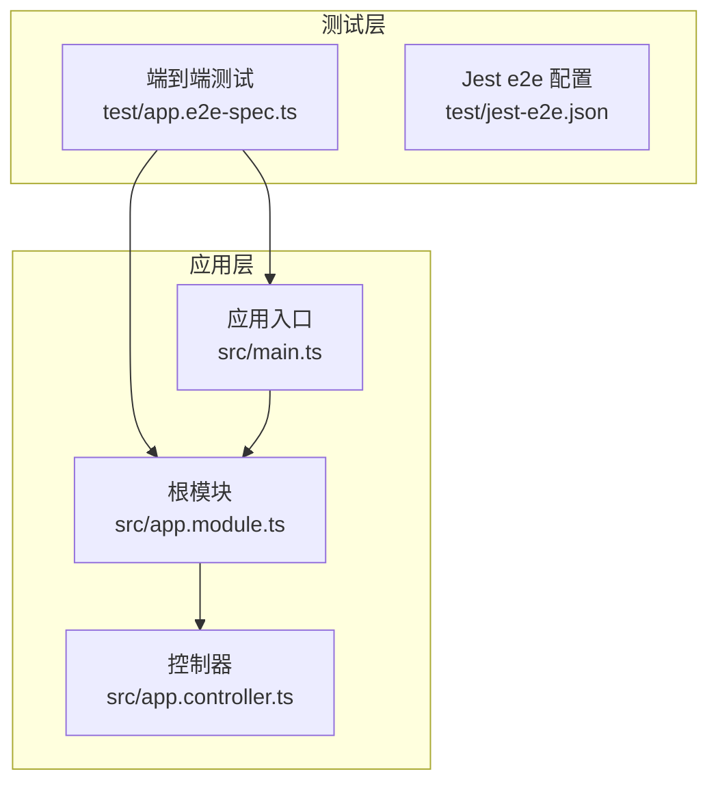
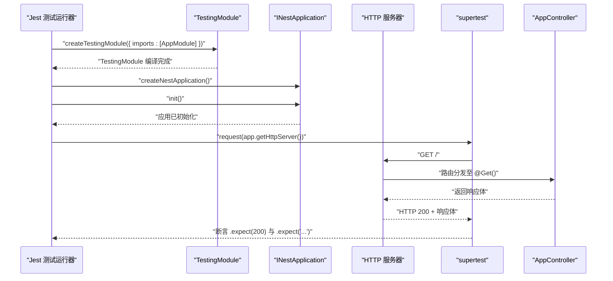
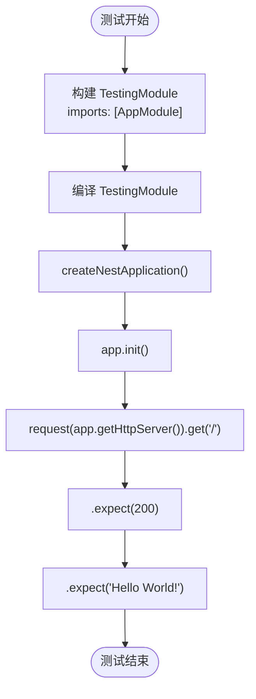
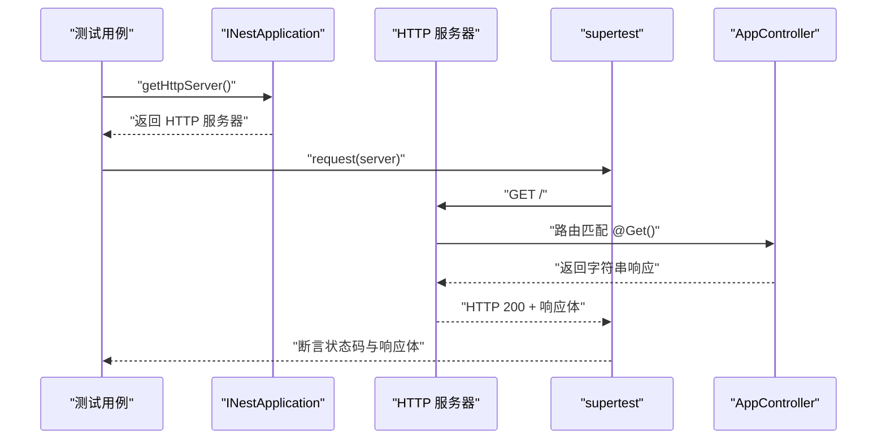
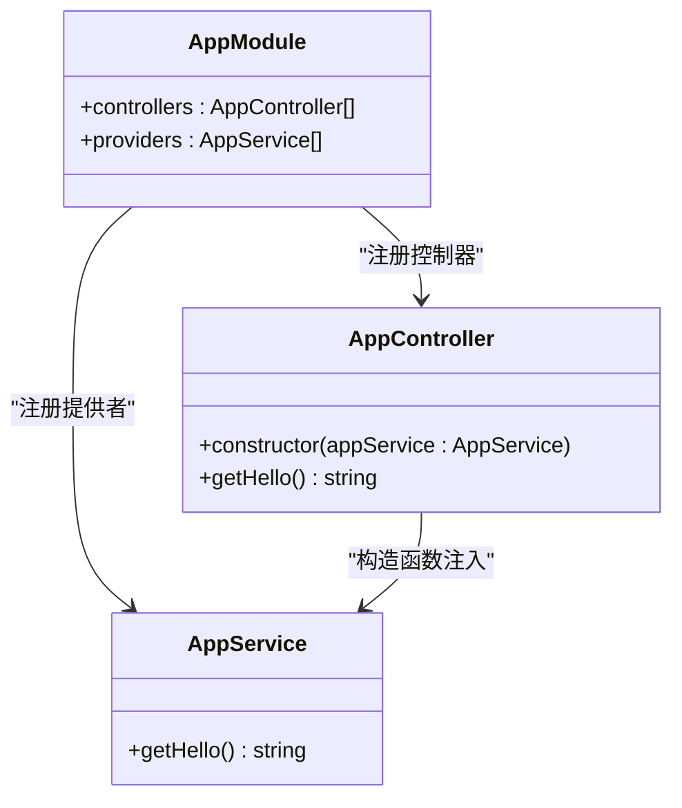
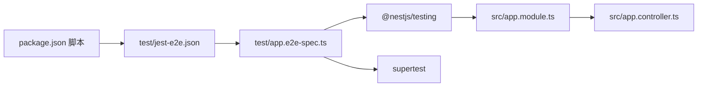

# 端到端测试

<cite>
**本文引用的文件**
- [test/app.e2e-spec.ts](file://test/app.e2e-spec.ts)
- [src/main.ts](file://src/main.ts)
- [src/app.module.ts](file://src/app.module.ts)
- [src/app.controller.ts](file://src/app.controller.ts)
- [test/jest-e2e.json](file://test/jest-e2e.json)
- [package.json](file://package.json)
</cite>

## 目录
1. [简介](#简介)
2. [项目结构](#项目结构)
3. [核心组件](#核心组件)
4. [架构总览](#架构总览)
5. [详细组件分析](#详细组件分析)
6. [依赖关系分析](#依赖关系分析)
7. [性能考量](#性能考量)
8. [故障排查指南](#故障排查指南)
9. [结论](#结论)
10. [附录](#附录)

## 简介
本篇文档围绕项目中的端到端测试文件 test/app.e2e-spec.ts，系统讲解如何在 NestJS 中使用 @nestjs/testing 创建完整的应用实例（INestApplication），并通过 app.init() 启动服务器；同时说明 supertest 如何与 app.getHttpServer() 集成，发送真实 HTTP 请求并断言响应。我们将深入解析测试用例中 .get('/')、.expect(200) 和 .expect('Hello World!') 的链式调用工作原理，并对比端到端测试与单元测试的差异，最后给出编写可靠端到端测试的实践建议。

## 项目结构
本项目采用典型的 NestJS 结构，包含源码目录 src 与测试目录 test。端到端测试位于 test 目录下，使用 Jest 作为测试框架，并通过独立的 Jest 配置文件 test/jest-e2e.json 指定 e2e 测试的匹配规则与运行环境。

图表来源
- [test/app.e2e-spec.ts](file://test/app.e2e-spec.ts#L1-L26)
- [src/main.ts](file://src/main.ts#L1-L24)
- [src/app.module.ts](file://src/app.module.ts#L1-L25)
- [src/app.controller.ts](file://src/app.controller.ts#L1-L42)
- [test/jest-e2e.json](file://test/jest-e2e.json#L1-L10)

章节来源
- [test/app.e2e-spec.ts](file://test/app.e2e-spec.ts#L1-L26)
- [test/jest-e2e.json](file://test/jest-e2e.json#L1-L10)
- [src/main.ts](file://src/main.ts#L1-L24)
- [src/app.module.ts](file://src/app.module.ts#L1-L25)
- [src/app.controller.ts](file://src/app.controller.ts#L1-L42)

## 核心组件
- 测试模块构建与应用实例创建
  - 使用 @nestjs/testing 的 Test.createTestingModule 配置 imports: [AppModule]，编译 TestingModule 并创建 INestApplication 实例。
  - 通过 app.init() 初始化应用，使其进入可接受 HTTP 请求的状态。
- HTTP 客户端与断言
  - 使用 supertest 对 app.getHttpServer() 返回的底层 HTTP 服务器发起真实请求。
  - 断言链 .expect(200) 与 .expect('Hello World!') 分别验证状态码与响应体。
- 应用启动与路由
  - src/main.ts 中通过 NestFactory.create(AppModule) 创建应用并监听端口。
  - src/app.module.ts 将 AppController 注册为根模块控制器。
  - src/app.controller.ts 的 @Controller() 与 @Get() 组合提供根路径的 GET 处理。

章节来源
- [test/app.e2e-spec.ts](file://test/app.e2e-spec.ts#L1-L26)
- [src/main.ts](file://src/main.ts#L1-L24)
- [src/app.module.ts](file://src/app.module.ts#L1-L25)
- [src/app.controller.ts](file://src/app.controller.ts#L1-L42)

## 架构总览
端到端测试的典型流程如下：Jest 执行测试文件 -> 构建 TestingModule -> 创建 INestApplication -> 初始化应用 -> 使用 supertest 发起 HTTP 请求 -> 断言响应。

图表来源
- [test/app.e2e-spec.ts](file://test/app.e2e-spec.ts#L1-L26)
- [src/app.module.ts](file://src/app.module.ts#L1-L25)
- [src/app.controller.ts](file://src/app.controller.ts#L1-L42)

## 详细组件分析

### 测试模块与应用实例生命周期
- 模块配置
  - 在 beforeEach 中，通过 imports: [AppModule] 加载根模块，从而模拟真实运行环境，包含控制器、服务等依赖。
- 应用实例创建与初始化
  - 使用 moduleFixture.createNestApplication() 创建 INestApplication。
  - 调用 app.init() 完成中间件、拦截器、守卫等的注册与启动，使应用具备处理请求的能力。
- 测试用例执行
  - it('/ (GET)') 中，使用 request(app.getHttpServer()).get('/') 发送请求，随后进行断言。

图表来源
- [test/app.e2e-spec.ts](file://test/app.e2e-spec.ts#L1-L26)

章节来源
- [test/app.e2e-spec.ts](file://test/app.e2e-spec.ts#L1-L26)

### supertest 与 HTTP 服务器集成
- 获取底层 HTTP 服务器
  - app.getHttpServer() 返回底层 HTTP 服务器实例，supertest 接受该服务器作为客户端目标。
- 发送真实 HTTP 请求
  - request(server).get('/') 会通过 HTTP 协议向服务器发起请求，绕过应用层的中间件栈，直接命中路由处理器。
- 断言链
  - .expect(200) 验证状态码。
  - .expect('Hello World!') 验证响应体内容。

图表来源
- [test/app.e2e-spec.ts](file://test/app.e2e-spec.ts#L1-L26)
- [src/app.controller.ts](file://src/app.controller.ts#L1-L42)

章节来源
- [test/app.e2e-spec.ts](file://test/app.e2e-spec.ts#L1-L26)

### 路由与控制器行为
- 根模块 AppModule 注册 AppController。
- AppController 的 @Controller() 与 @Get() 组合，使得根路径 '/' 的 GET 请求被该方法处理。
- 控制器通过构造函数注入 AppService，将业务逻辑委托给服务层，控制器仅负责路由分发。

图表来源
- [src/app.module.ts](file://src/app.module.ts#L1-L25)
- [src/app.controller.ts](file://src/app.controller.ts#L1-L42)

章节来源
- [src/app.module.ts](file://src/app.module.ts#L1-L25)
- [src/app.controller.ts](file://src/app.controller.ts#L1-L42)

### 端到端测试与单元测试的差异
- 端到端测试
  - 使用 @nestjs/testing 构建 TestingModule，加载 AppModule，完整运行请求生命周期（路由 -> 中间件 -> 控制器 -> 服务 -> 响应）。
  - 通过 app.getHttpServer() 发送真实 HTTP 请求，覆盖真实网络栈与序列化过程。
- 单元测试
  - 通常仅测试服务层或控制器层的特定方法，不涉及 HTTP 层，也不需要启动完整应用。
  - 更关注业务逻辑正确性，而非端到端流程。

章节来源
- [test/app.e2e-spec.ts](file://test/app.e2e-spec.ts#L1-L26)
- [src/app.module.ts](file://src/app.module.ts#L1-L25)
- [src/app.controller.ts](file://src/app.controller.ts#L1-L42)

## 依赖关系分析
- 测试配置
  - test/jest-e2e.json 指定测试正则为 .e2e-spec.ts$，测试环境为 node，使用 ts-jest 转换器。
- 包脚本
  - package.json 中 scripts.test:e2e 使用 --config ./test/jest-e2e.json 运行 e2e 测试。
- 运行时依赖
  - @nestjs/testing、supertest、@types/supertest 等为 e2e 测试提供基础设施。

图表来源
- [package.json](file://package.json#L1-L73)
- [test/jest-e2e.json](file://test/jest-e2e.json#L1-L10)
- [test/app.e2e-spec.ts](file://test/app.e2e-spec.ts#L1-L26)
- [src/app.module.ts](file://src/app.module.ts#L1-L25)
- [src/app.controller.ts](file://src/app.controller.ts#L1-L42)

章节来源
- [package.json](file://package.json#L1-L73)
- [test/jest-e2e.json](file://test/jest-e2e.json#L1-L10)
- [test/app.e2e-spec.ts](file://test/app.e2e-spec.ts#L1-L26)

## 性能考量
- 测试启动成本
  - 端到端测试每次 beforeEach 都会创建并初始化完整应用，启动成本高于单元测试。建议：
    - 合理拆分测试用例，避免重复初始化。
    - 在同一 describe 内共享 app 实例（注意测试隔离与资源清理）。
- 并发与超时
  - 多个 e2e 测试并发执行时，注意端口冲突与资源竞争。
  - 为长耗时场景设置合理的超时时间，避免误判失败。
- 数据与状态
  - 端到端测试通常涉及数据库或外部服务，需确保测试前后数据清理与状态重置。

[本节为通用建议，无需引用具体文件]

## 故障排查指南
- 测试无法启动或端口占用
  - 确认测试未与开发服务器冲突，必要时调整端口或在测试中使用动态端口。
- 断言失败
  - 先检查路由是否正确（@Controller() 与 @Get() 组合），确认响应体是否符合预期。
  - 使用 .expect(200) 与 .expect('...') 的组合逐步定位问题。
- 异步与初始化顺序
  - 确保 app.init() 已完成后再发起请求；在 beforeEach 中统一初始化。
- 超时与错误诊断
  - 为测试设置合理超时，便于快速定位问题。
  - 使用日志或调试工具观察请求与响应细节，必要时在本地启动应用进行对比验证。

章节来源
- [test/app.e2e-spec.ts](file://test/app.e2e-spec.ts#L1-L26)
- [src/app.controller.ts](file://src/app.controller.ts#L1-L42)

## 结论
本篇文档基于 test/app.e2e-spec.ts，系统阐述了 NestJS 端到端测试的实现要点：通过 @nestjs/testing 构建 TestingModule 并加载 AppModule，创建 INestApplication，调用 app.init() 启动应用，再用 supertest 对 app.getHttpServer() 发起真实 HTTP 请求并断言响应。相比单元测试，端到端测试覆盖完整的请求生命周期，更贴近真实运行环境。结合本文的实践建议，可编写出稳定可靠的端到端测试。

[本节为总结，无需引用具体文件]

## 附录
- 运行命令参考
  - 使用 package.json 中的 scripts.test:e2e 运行 e2e 测试。
- 关键文件清单
  - 端到端测试：test/app.e2e-spec.ts
  - 应用入口：src/main.ts
  - 根模块：src/app.module.ts
  - 控制器：src/app.controller.ts
  - e2e 配置：test/jest-e2e.json

章节来源
- [package.json](file://package.json#L1-L73)
- [test/app.e2e-spec.ts](file://test/app.e2e-spec.ts#L1-L26)
- [src/main.ts](file://src/main.ts#L1-L24)
- [src/app.module.ts](file://src/app.module.ts#L1-L25)
- [src/app.controller.ts](file://src/app.controller.ts#L1-L42)
- [test/jest-e2e.json](file://test/jest-e2e.json#L1-L10)