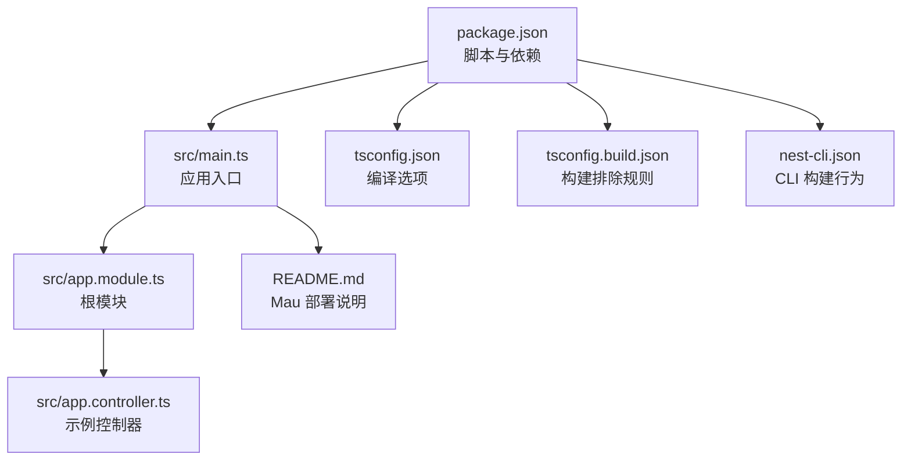
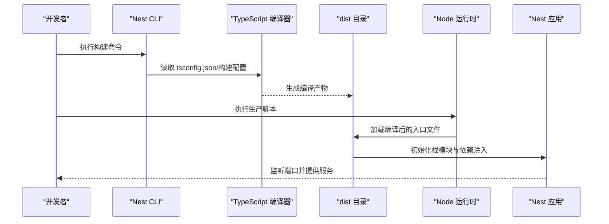
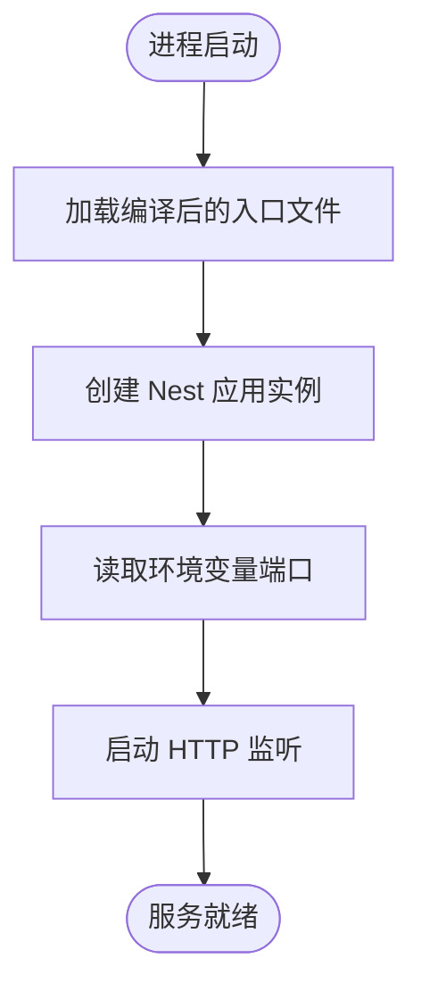
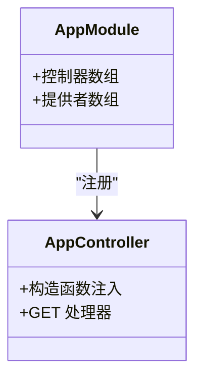
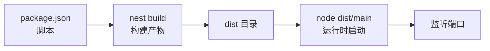

# 部署指南

<cite>
**本文引用的文件**
- [package.json](file://package.json)
- [src/main.ts](file://src/main.ts)
- [README.md](file://README.md)
- [nest-cli.json](file://nest-cli.json)
- [tsconfig.json](file://tsconfig.json)
- [tsconfig.build.json](file://tsconfig.build.json)
- [src/app.module.ts](file://src/app.module.ts)
- [src/app.controller.ts](file://src/app.controller.ts)
</cite>

## 目录
1. [简介](#简介)
2. [项目结构](#项目结构)
3. [核心组件](#核心组件)
4. [架构总览](#架构总览)
5. [详细组件分析](#详细组件分析)
6. [依赖分析](#依赖分析)
7. [性能与稳定性考虑](#性能与稳定性考虑)
8. [故障排查指南](#故障排查指南)
9. [结论](#结论)
10. [附录](#附录)

## 简介
本指南面向从开发到生产的完整部署流程，围绕以下目标展开：
- 基于 package.json 中的生产脚本 start:prod，说明通过 node dist/main 运行编译产物的流程；
- 解释 main.ts 中应用启动配置（如端口监听）在生产环境中的注意事项；
- 结合 README 中的 Mau 平台，介绍官方推荐的自动化部署方案及其优势；
- 探讨传统部署方式（Docker 容器化、PM2 进程管理）的可行性；
- 强调部署前构建（build）的重要性，并给出生产环境配置（日志、错误处理、安全头）的优化建议。

## 项目结构
该仓库采用标准的 NestJS 项目布局，核心文件如下：
- 入口文件：src/main.ts
- 根模块：src/app.module.ts
- 示例控制器：src/app.controller.ts
- 编译配置：tsconfig.json、tsconfig.build.json
- CLI 配置：nest-cli.json
- 包脚本：package.json
- 平台部署说明：README.md

图表来源
- [package.json](file://package.json#L1-L73)
- [src/main.ts](file://src/main.ts#L1-L24)
- [src/app.module.ts](file://src/app.module.ts#L1-L25)
- [src/app.controller.ts](file://src/app.controller.ts#L1-L42)
- [tsconfig.json](file://tsconfig.json#L1-L26)
- [tsconfig.build.json](file://tsconfig.build.json#L1-L5)
- [nest-cli.json](file://nest-cli.json#L1-L9)
- [README.md](file://README.md#L60-L72)

章节来源
- [package.json](file://package.json#L1-L73)
- [src/main.ts](file://src/main.ts#L1-L24)
- [src/app.module.ts](file://src/app.module.ts#L1-L25)
- [src/app.controller.ts](file://src/app.controller.ts#L1-L42)
- [tsconfig.json](file://tsconfig.json#L1-L26)
- [tsconfig.build.json](file://tsconfig.build.json#L1-L5)
- [nest-cli.json](file://nest-cli.json#L1-L9)
- [README.md](file://README.md#L60-L72)

## 核心组件
- 生产启动脚本：package.json 中的 start:prod 使用 node dist/main 直接运行编译后的入口文件。
- 应用入口：src/main.ts 通过 NestFactory 创建应用实例，并监听环境变量 PORT 或默认端口。
- 根模块：src/app.module.ts 声明控制器与服务，作为依赖注入的根容器。
- 构建配置：tsconfig.json 指定输出目录与编译目标；tsconfig.build.json 控制构建时的排除项；nest-cli.json 控制构建清理行为。

章节来源
- [package.json](file://package.json#L8-L21)
- [src/main.ts](file://src/main.ts#L11-L20)
- [src/app.module.ts](file://src/app.module.ts#L13-L23)
- [tsconfig.json](file://tsconfig.json#L13-L16)
- [tsconfig.build.json](file://tsconfig.build.json#L1-L5)
- [nest-cli.json](file://nest-cli.json#L5-L7)

## 架构总览
下图展示了从开发到生产的关键路径：开发者在本地执行构建，生成 dist 目录产物，随后使用生产脚本启动 Node 进程运行编译后的入口文件。

图表来源
- [package.json](file://package.json#L8-L21)
- [tsconfig.json](file://tsconfig.json#L13-L16)
- [tsconfig.build.json](file://tsconfig.build.json#L1-L5)
- [nest-cli.json](file://nest-cli.json#L5-L7)
- [src/main.ts](file://src/main.ts#L11-L20)

## 详细组件分析

### 生产启动流程与 main.ts 配置
- 入口文件通过 NestFactory 创建应用实例，随后调用 listen 方法启动 HTTP 服务器。
- 端口来源：listen 接收环境变量 PORT，若未设置则使用默认端口。生产环境务必通过环境变量显式配置端口，避免冲突与权限问题。
- 启动时机：bootstrap 函数在模块加载时立即执行，确保应用在进程启动后尽快进入监听状态。

图表来源
- [src/main.ts](file://src/main.ts#L11-L20)

章节来源
- [src/main.ts](file://src/main.ts#L11-L20)

### 根模块与控制器关系
- 根模块声明控制器与服务，形成依赖注入的边界。生产部署时，确保 dist 目录包含完整的编译产物，避免运行时因缺失文件导致模块解析失败。

图表来源
- [src/app.module.ts](file://src/app.module.ts#L13-L23)
- [src/app.controller.ts](file://src/app.controller.ts#L12-L41)

章节来源
- [src/app.module.ts](file://src/app.module.ts#L13-L23)
- [src/app.controller.ts](file://src/app.controller.ts#L12-L41)

### 构建与编译配置
- 输出目录：tsconfig.json 将 outDir 设为 dist，保证构建产物集中存放。
- 构建排除：tsconfig.build.json 排除 node_modules、test、dist 与 spec 文件，减少构建时间与产物体积。
- CLI 清理：nest-cli.json 的 deleteOutDir 选项在每次构建前清理 dist 目录，避免旧文件残留。

章节来源
- [tsconfig.json](file://tsconfig.json#L13-L16)
- [tsconfig.build.json](file://tsconfig.build.json#L1-L5)
- [nest-cli.json](file://nest-cli.json#L5-L7)

### 生产脚本与自动化部署
- 生产脚本：package.json 中的 start:prod 使用 node dist/main 直接运行编译后的入口文件，无需 ts-node。
- 自动化部署：README.md 推荐使用 Mau 平台进行一键部署，安装全局工具后执行部署命令即可完成上线。

章节来源
- [package.json](file://package.json#L14-L14)
- [README.md](file://README.md#L60-L72)

## 依赖分析
- 脚本依赖：start:prod 依赖 dist 目录的存在；dist 来源于 nest build，后者受 tsconfig.json 与 nest-cli.json 影响。
- 运行时依赖：生产环境仅需运行时依赖，开发期依赖（如 ts-node、jest）不会随产物一起发布。
- 端口与网络：生产环境需确保容器或主机防火墙开放对应端口，且通过反向代理或负载均衡进行流量转发。

图表来源
- [package.json](file://package.json#L8-L21)
- [tsconfig.json](file://tsconfig.json#L13-L16)
- [nest-cli.json](file://nest-cli.json#L5-L7)
- [src/main.ts](file://src/main.ts#L11-L20)

章节来源
- [package.json](file://package.json#L8-L21)
- [tsconfig.json](file://tsconfig.json#L13-L16)
- [nest-cli.json](file://nest-cli.json#L5-L7)
- [src/main.ts](file://src/main.ts#L11-L20)

## 性能与稳定性考虑
- 构建前置：生产部署必须先执行构建，确保 dist 目录包含完整编译产物，避免运行时动态编译带来的延迟与不确定性。
- 端口与资源：生产环境通过环境变量统一管理端口，避免硬编码；同时合理设置并发连接数与超时参数，提升吞吐能力。
- 日志策略：生产日志建议落盘并按天轮转，避免 stdout 满溢；可结合结构化日志与采样策略降低开销。
- 错误处理：统一异常过滤器与全局拦截器，屏蔽敏感信息，记录上下文与追踪 ID，便于定位问题。
- 安全头：通过中间件或网关层添加安全响应头（如 X-Content-Type-Options、X-Frame-Options、Strict-Transport-Security），增强防护。
- 健康检查：提供 /health 接口用于探针检查，配合进程管理器实现平滑重启与故障恢复。

## 故障排查指南
- 启动失败（端口占用）
  - 现象：应用无法监听端口。
  - 排查：确认环境变量 PORT 是否正确设置；检查宿主机或容器端口映射是否冲突。
  - 参考
    - [src/main.ts](file://src/main.ts#L16-L20)
- 构建缺失 dist
  - 现象：执行 start:prod 报错找不到入口文件。
  - 排查：先执行构建命令，确认 dist 目录存在；检查 tsconfig.json 与 nest-cli.json 的配置。
  - 参考
    - [package.json](file://package.json#L8-L11)
    - [tsconfig.json](file://tsconfig.json#L13-L16)
    - [nest-cli.json](file://nest-cli.json#L5-L7)
- 依赖缺失（运行时）
  - 现象：运行时报模块解析错误。
  - 排查：确认生产包仅包含运行时依赖；检查 dist 内容是否完整。
  - 参考
    - [package.json](file://package.json#L22-L54)
- 自动化部署问题（Mau）
  - 现象：部署命令执行失败或无法访问。
  - 排查：确认已安装全局工具；检查项目配置与网络连通性；查看平台日志。
  - 参考
    - [README.md](file://README.md#L60-L72)

章节来源
- [src/main.ts](file://src/main.ts#L16-L20)
- [package.json](file://package.json#L8-L11)
- [tsconfig.json](file://tsconfig.json#L13-L16)
- [nest-cli.json](file://nest-cli.json#L5-L7)
- [README.md](file://README.md#L60-L72)

## 结论
- 生产部署必须先构建再运行，start:prod 仅负责加载编译产物；
- main.ts 的端口监听逻辑简单直接，生产环境需通过环境变量明确配置；
- Mau 提供官方一键部署体验，适合快速上线与云原生场景；
- Docker 与 PM2 等传统方案同样可行，但需配套完善的镜像构建、健康检查与进程监控；
- 生产环境应优先完善日志、错误处理与安全头等基础设施，保障稳定性与安全性。

## 附录
- 传统部署方式可行性
  - Docker 容器化：建议多阶段构建，缩小镜像体积；使用只读文件系统与非 root 用户；配置健康检查与资源限制。
  - PM2 进程管理：适用于单机多核场景；建议启用集群模式与自动重启；结合日志聚合与告警。
- 生产环境配置建议
  - 日志：结构化日志、按大小/时间轮转、保留周期与归档策略；
  - 错误处理：统一异常过滤器、上下文追踪、敏感信息脱敏；
  - 安全头：内容安全策略、XSS 保护、点击劫持防护、TLS 强化；
  - 监控：指标采集（CPU/内存/请求数）、链路追踪、告警阈值与通知渠道。