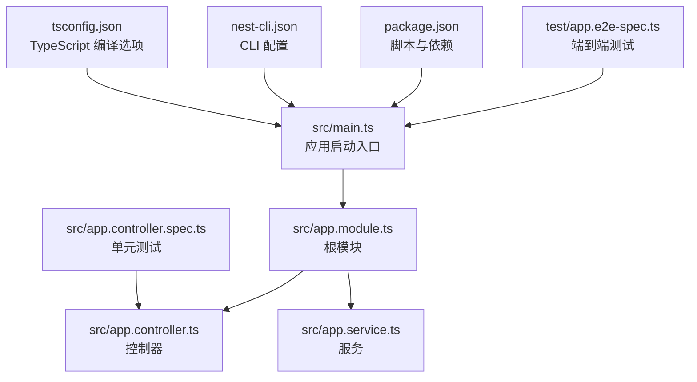
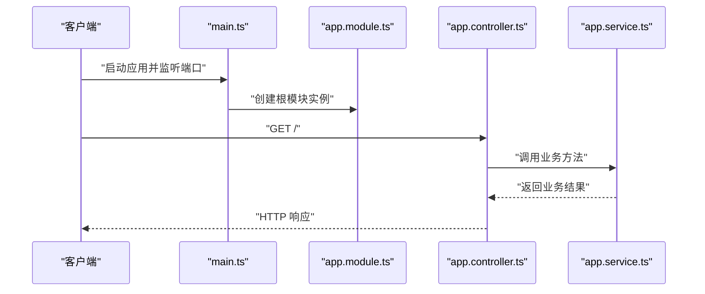
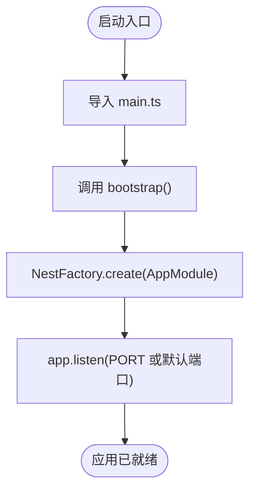
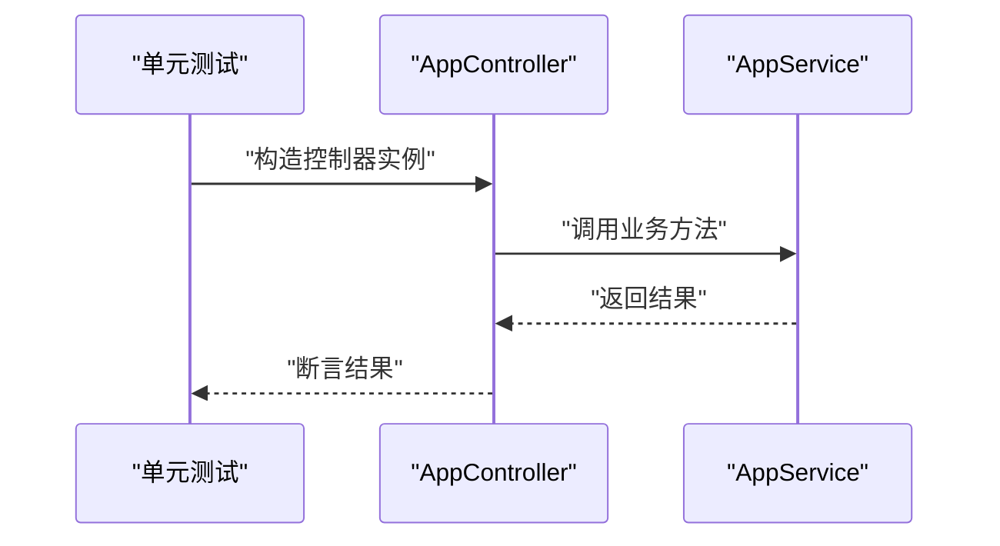
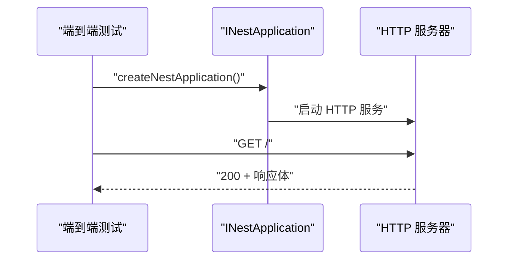
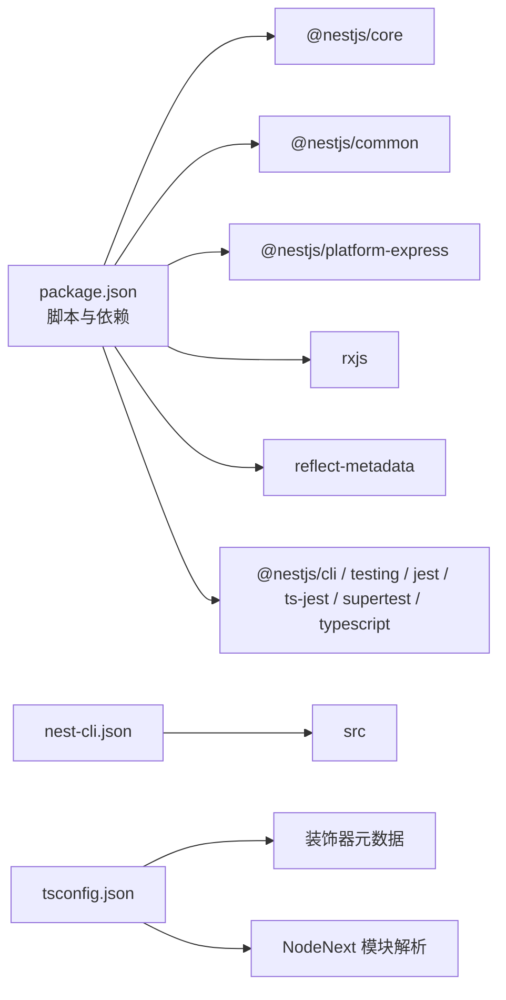

# 项目概述

<cite>
**本文引用的文件**
- [README.md](file://README.md)
- [package.json](file://package.json)
- [nest-cli.json](file://nest-cli.json)
- [tsconfig.json](file://tsconfig.json)
- [src/main.ts](file://src/main.ts)
- [src/app.module.ts](file://src/app.module.ts)
- [src/app.controller.ts](file://src/app.controller.ts)
- [src/app.service.ts](file://src/app.service.ts)
- [src/app.controller.spec.ts](file://src/app.controller.spec.ts)
- [test/app.e2e-spec.ts](file://test/app.e2e-spec.ts)
</cite>

## 目录
1. [引言](#引言)
2. [项目结构](#项目结构)
3. [核心组件](#核心组件)
4. [架构总览](#架构总览)
5. [详细组件分析](#详细组件分析)
6. [依赖关系分析](#依赖关系分析)
7. [性能与工程实践](#性能与工程实践)
8. [故障排查指南](#故障排查指南)
9. [结论](#结论)
10. [附录](#附录)

## 引言
nest-dome 是一个基于 Nest.js 的 TypeScript 后端服务基础模板，旨在为开发者提供一个标准化、可直接上手的起点。它遵循 Nest.js 的模块化架构与依赖注入原则，内置最小但完整的 HTTP 响应链路（根路径 GET），并配套测试、构建与部署指引。该模板既适合初学者快速理解 Nest.js 的“模块—控制器—服务”三层结构，也便于有经验的开发者在此基础上进行扩展与二次开发。

在技术愿景方面，该项目强调“渐进式”与“可扩展”，通过 CLI 工具链、TypeScript 编译配置与 Jest 测试套件，帮助团队建立一致的开发与交付流程。社区支持资源包括官方文档、Discord 社区、课程与企业支持渠道；开源许可采用宽松的 MIT 协议，便于学习与商用场景使用。

## 项目结构
本仓库采用典型的 Nest.js CLI 生成的目录布局，核心源码位于 src 目录，测试位于 test 目录，工具链与配置集中在根目录。关键文件职责如下：
- 入口文件：src/main.ts 负责应用启动与端口监听
- 根模块：src/app.module.ts 定义控制器与服务的装配关系
- 控制器：src/app.controller.ts 处理 HTTP 请求并委派给服务层
- 服务：src/app.service.ts 承载业务逻辑
- 测试：src/app.controller.spec.ts 与 test/app.e2e-spec.ts 分别覆盖单元与端到端测试
- 工具链配置：package.json、nest-cli.json、tsconfig.json 提供脚本、编译与 CLI 行为



图表来源
- [src/main.ts](file://src/main.ts#L1-L24)
- [src/app.module.ts](file://src/app.module.ts#L1-L25)
- [src/app.controller.ts](file://src/app.controller.ts#L1-L42)
- [src/app.service.ts](file://src/app.service.ts#L1-L37)
- [src/app.controller.spec.ts](file://src/app.controller.spec.ts#L1-L23)
- [test/app.e2e-spec.ts](file://test/app.e2e-spec.ts#L1-L26)
- [package.json](file://package.json#L1-L73)
- [nest-cli.json](file://nest-cli.json#L1-L9)
- [tsconfig.json](file://tsconfig.json#L1-L26)

章节来源
- [src/main.ts](file://src/main.ts#L1-L24)
- [src/app.module.ts](file://src/app.module.ts#L1-L25)
- [src/app.controller.ts](file://src/app.controller.ts#L1-L42)
- [src/app.service.ts](file://src/app.service.ts#L1-L37)
- [src/app.controller.spec.ts](file://src/app.controller.spec.ts#L1-L23)
- [test/app.e2e-spec.ts](file://test/app.e2e-spec.ts#L1-L26)
- [package.json](file://package.json#L1-L73)
- [nest-cli.json](file://nest-cli.json#L1-L9)
- [tsconfig.json](file://tsconfig.json#L1-L26)

## 核心组件
- 应用启动器（main.ts）
  - 通过工厂函数创建应用实例，并监听端口对外提供 HTTP 服务
  - 默认端口由环境变量决定，未设置时回退至固定值
- 根模块（app.module.ts）
  - 使用装饰器声明控制器与服务，形成模块边界与依赖注入容器
  - 作为应用的“总指挥部”，承载应用初始化与装配职责
- 控制器（app.controller.ts）
  - 通过装饰器将方法映射到 HTTP GET 请求
  - 仅负责路由分发与调用服务层，保持薄控制器原则
- 服务（app.service.ts）
  - 使用可注入装饰器纳入 Nest IoC 容器
  - 承担业务逻辑处理，示例返回标准问候语
- 测试（app.controller.spec.ts 与 app.e2e-spec.ts）
  - 单元测试验证控制器行为
  - 端到端测试验证完整请求链路与响应状态

章节来源
- [src/main.ts](file://src/main.ts#L1-L24)
- [src/app.module.ts](file://src/app.module.ts#L1-L25)
- [src/app.controller.ts](file://src/app.controller.ts#L1-L42)
- [src/app.service.ts](file://src/app.service.ts#L1-L37)
- [src/app.controller.spec.ts](file://src/app.controller.spec.ts#L1-L23)
- [test/app.e2e-spec.ts](file://test/app.e2e-spec.ts#L1-L26)

## 架构总览
下图展示了从请求进入应用到响应返回的关键步骤，体现“控制器—服务—响应”的典型 Nest.js 流程。



图表来源
- [src/main.ts](file://src/main.ts#L1-L24)
- [src/app.module.ts](file://src/app.module.ts#L1-L25)
- [src/app.controller.ts](file://src/app.controller.ts#L1-L42)
- [src/app.service.ts](file://src/app.service.ts#L1-L37)

## 详细组件分析

### 控制器与服务的协作
控制器负责将 HTTP 请求映射到具体方法，服务负责实现业务逻辑。两者通过依赖注入解耦，便于测试与维护。

```mermaid
classDiagram
class AppModule {
"+controllers : AppController[]"
"+providers : AppService[]"
}
class AppController {
"-appService : AppService"
"+constructor(appService)"
"+getHello() : string"
}
class AppService {
"+getHello() : string"
}
AppModule --> AppController : "装配"
AppModule --> AppService : "装配"
AppController --> AppService : "依赖注入"
```

图表来源
- [src/app.module.ts](file://src/app.module.ts#L1-L25)
- [src/app.controller.ts](file://src/app.controller.ts#L1-L42)
- [src/app.service.ts](file://src/app.service.ts#L1-L37)

章节来源
- [src/app.module.ts](file://src/app.module.ts#L1-L25)
- [src/app.controller.ts](file://src/app.controller.ts#L1-L42)
- [src/app.service.ts](file://src/app.service.ts#L1-L37)

### 启动流程与控制流
应用启动流程体现了 Nest.js 的工厂模式与模块装配机制。



图表来源
- [src/main.ts](file://src/main.ts#L1-L24)

章节来源
- [src/main.ts](file://src/main.ts#L1-L24)

### 测试策略与验证
- 单元测试：针对控制器方法进行断言，验证返回值与依赖注入是否正确
- 端到端测试：通过测试模块构建应用实例，发起真实 HTTP 请求并校验状态码与响应体



图表来源
- [src/app.controller.spec.ts](file://src/app.controller.spec.ts#L1-L23)
- [src/app.controller.ts](file://src/app.controller.ts#L1-L42)
- [src/app.service.ts](file://src/app.service.ts#L1-L37)



图表来源
- [test/app.e2e-spec.ts](file://test/app.e2e-spec.ts#L1-L26)

章节来源
- [src/app.controller.spec.ts](file://src/app.controller.spec.ts#L1-L23)
- [test/app.e2e-spec.ts](file://test/app.e2e-spec.ts#L1-L26)

## 依赖关系分析
- 运行时依赖
  - @nestjs/common、@nestjs/core、@nestjs/platform-express：提供框架核心能力与 HTTP 平台适配
  - reflect-metadata、rxjs：装饰器元数据与响应式编程支持
- 开发时依赖
  - @nestjs/cli、@nestjs/testing、jest、ts-jest、supertest、typescript 等：支撑开发、测试与类型检查
- 工具链配置
  - nest-cli.json：指定源码根目录与编译输出清理策略
  - tsconfig.json：启用装饰器元数据、实验性装饰器、NodeNext 模块解析等编译选项



图表来源
- [package.json](file://package.json#L1-L73)
- [nest-cli.json](file://nest-cli.json#L1-L9)
- [tsconfig.json](file://tsconfig.json#L1-L26)

章节来源
- [package.json](file://package.json#L1-L73)
- [nest-cli.json](file://nest-cli.json#L1-L9)
- [tsconfig.json](file://tsconfig.json#L1-L26)

## 性能与工程实践
- 启动与监听
  - 启动入口采用异步方式创建应用实例并监听端口，建议在生产环境通过进程管理器或容器编排确保稳定性
- 编译与运行
  - TypeScript 编译目标与模块解析策略已优化，配合增量编译与源码映射提升开发体验
- 测试覆盖率
  - Jest 配置包含覆盖率收集，建议在 CI 中开启覆盖率报告以保障质量
- 生产部署
  - README 提供了官方部署文档与云平台链接，建议结合环境变量与健康检查完善生产配置

章节来源
- [src/main.ts](file://src/main.ts#L1-L24)
- [package.json](file://package.json#L1-L73)
- [tsconfig.json](file://tsconfig.json#L1-L26)
- [README.md](file://README.md#L60-L99)

## 故障排查指南
- 启动失败或端口占用
  - 检查环境变量端口设置与默认回退值，确认端口可用
- 控制器无响应
  - 确认根模块已装配控制器，且控制器装饰器与路由映射正确
- 服务未注入
  - 确认服务已添加可注入装饰器并在根模块 providers 中声明
- 测试失败
  - 单元测试关注控制器方法与依赖注入；端到端测试关注 HTTP 状态码与响应体
- 构建或类型错误
  - 检查 TypeScript 编译选项与装饰器元数据开关，确保版本兼容

章节来源
- [src/main.ts](file://src/main.ts#L1-L24)
- [src/app.module.ts](file://src/app.module.ts#L1-L25)
- [src/app.controller.ts](file://src/app.controller.ts#L1-L42)
- [src/app.service.ts](file://src/app.service.ts#L1-L37)
- [src/app.controller.spec.ts](file://src/app.controller.spec.ts#L1-L23)
- [test/app.e2e-spec.ts](file://test/app.e2e-spec.ts#L1-L26)
- [tsconfig.json](file://tsconfig.json#L1-L26)

## 结论
nest-dome 以最小可行实现呈现了 Nest.js 的核心范式：模块化装配、依赖注入与清晰的三层职责分工。它既是入门学习的理想样板，也是快速落地项目的可靠基座。通过完善的脚本、测试与配置，项目为后续的功能扩展、中间件接入、数据库集成与微服务拆分提供了清晰的扩展路径。对于初学者，建议先理解“控制器—服务—模块”的协作关系；对于高级用户，可在现有结构上引入更多模块、拦截器、守卫与管道，逐步构建更复杂的业务体系。

## 附录
- 技术愿景与社区资源
  - 官方文档、Discord 社区、视频课程、企业支持与招聘平台等资源可帮助持续学习与交流
- 开源许可
  - 项目采用宽松的 MIT 许可，便于学习、修改与商用

章节来源
- [README.md](file://README.md#L73-L99)